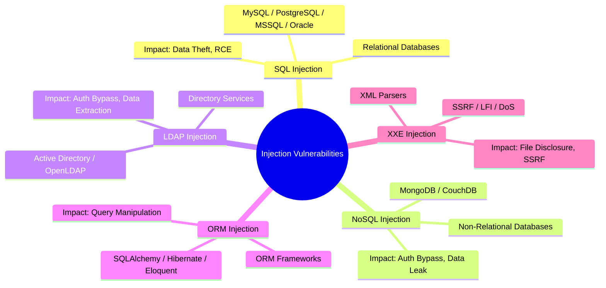
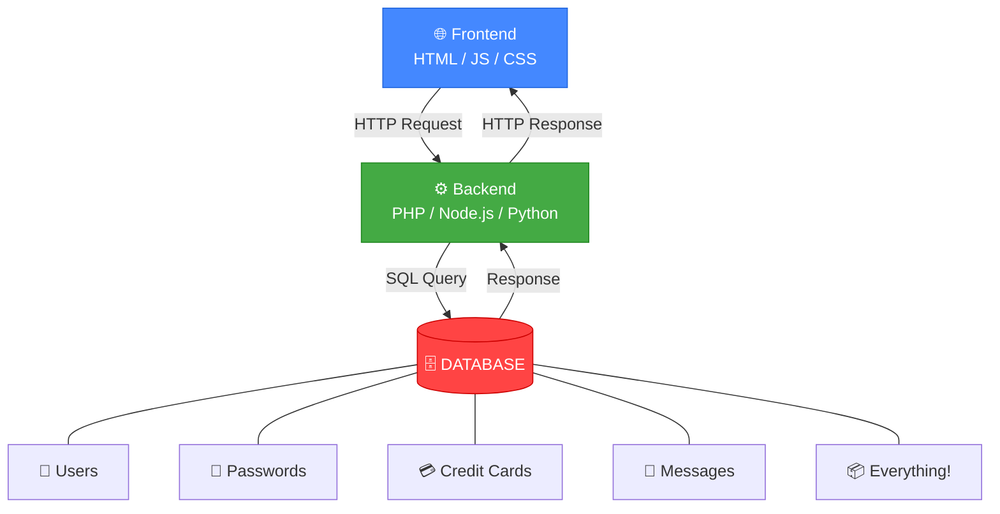

# 🎓 الجزء الأول: مقدمة الكورس + أساسيات SQL Injection
## Slides 1 → 21

---

## 📌 Slide 1: Advanced Injection Attacks Course Overview


أهلاً بيك يا باشا في كورس **Advanced Injection Attacks**! 🔥

> الكورس ده متخصص في واحدة من **أخطر وأقدم ثغرات الويب على الإطلاق**: هجمات الحقن (Injection Attacks). مش بس SQL Injection — لأ، هنغطي كمان NoSQL, LDAP, ORM, و XXE.

### بالمصري كده:
تخيل إنك بتكلم موظف بنك من وراء شباك. أنت بتقوله "عايز أسحب 100 جنيه من حسابي". الموظف بياخد الكلام بتاعك وبيكتبه في النظام. دلوقتي تخيل إنك بدل ما تقوله رقم الحساب، قولتله جملة خلته **يسحب من كل الحسابات**! ده بالظبط اللي بيحصل في Injection — أنت بتزوّد أوامر على كلامك العادي، والنظام بينفذها لأنه مش بيفلتر كلامك.

> في تصنيف OWASP Top 10، ثغرات الـ Injection كانت **#1** في 2017 و **#3** في 2021. يعني دي مش ثغرة عادية — دي **الثغرة الأم**!

---

## 📌 Slide 2: Instructor - Alexis Ahmed

| المعلومة | التفاصيل |
|----------|----------|
| **الاسم** | Alexis Ahmed |
| **المنصب** | Offensive Security / Red Team Instructor في INE |
| **الدور التاني** | Red Team Lead في HackerSploit |
| **التخصص** | اختبار اختراق تطبيقات الويب والـ Red Team Operations |

الراجل ده مش بيقرأ من كتاب — ده بيشتغل في المجال فعلياً. **HackerSploit** من أشهر القنوات على YouTube في مجال الـ Ethical Hacking. لو مشفتهاش قبل كده، تستاهل تعدي عليها — محتوى مجاني يساوي كورسات مدفوعة.

---

## 📌 Slide 3: Key Concepts

### المفاهيم الأساسية اللي هنغطيها في الكورس:

| المحور | الوصف |
|--------|-------|
| **Fundamentals of SQL Injection** | أساسيات الـ SQLi — إيه هي، إزاي بتحصل، وليه خطيرة |
| **Automating Exploitation with SQLMap** | إزاي نستخدم أدوات زي SQLMap عشان نأتمت الاستغلال |
| **Advanced SQLi: OOB & Second-Order** | تقنيات متقدمة مش كل الناس تعرفها — Out-of-Band و Second-Order |
| **NoSQL Injection** | استهداف قواعد بيانات زي MongoDB |
| **LDAP Injection** | التلاعب ببروتوكول الأدلة المستخدم في Active Directory |
| **ORM Injection** | استغلال أطر العمل اللي المفروض تحميك من SQLi |
| **XXE Injection** | حقن كيانات XML خارجية لقراءة ملفات السيرفر |

> الكورس مش بيتكلم عن نوع واحد من الحقن — ده بيغطي **7 أنواع مختلفة**! كل نوع ليه ثغراته وطريقة استغلاله المختلفة.

---

## 📌 Slide 4: Major Topics

### خريطة المواضيع الرئيسية:

```
1. SQL Injection Fundamentals
   └── الأساسيات: إيه هي SQLi وإزاي بتشتغل

2. SQLi Testing Methodology
   └── منهجية منظمة لاختبار أي تطبيق

3. SQLi Attack Automation
   └── SQLMap: الأداة اللي بتعمل كل حاجة تلقائي

4. Advanced SQLi Techniques
   └── Second-Order + Out-of-Band (OOB)

5. NoSQL Injection
   └── MongoDB وأخواته

6. LDAP Injection
   └── Active Directory وبروتوكولات الأدلة

7. ORM Injection
   └── SQLAlchemy, Hibernate, Eloquent

8. XXE Injection
   └── XML External Entities
```

الترتيب ده مش عشوائي — بنبدأ من الأساسيات (SQLi) وبنتدرج في الصعوبة لحد ما نوصل للأنواع المتقدمة. كل موضوع مبني على اللي قبله.

---

## 📌 Slide 5: Learning Outcomes

### في نهاية الكورس، المفروض تقدر:

**1. SQL Injection Essentials:**
تعرف تحدد وتنفذ هجمات Error-based و Union-based و Boolean-based. مش بس تفهمهم نظرياً — لأ، تقدر تنفذهم على تطبيق حقيقي وتكتبهم في تقرير.

**2. Attack Automation:**
تتقن أداة **SQLMap** — من الاكتشاف التلقائي للثغرة لحد استخراج البيانات والسيطرة على السيرفر. SQLMap هو أقوى أداة SQLi موجودة، وهتتعلم تستخدمها كالمحترفين.

**3. Advanced SQL Injection:**
تفهم وتستغل **Out-of-Band (OOB)** و **Second-Order SQLi**. دول هجمات متقدمة بتتخطى الحماية العادية ومعظم الـ WAFs مش بيلحقوها.

**4. NoSQL Injection:**
تعرف تستغل ثغرات **MongoDB** — لأن NoSQL مش معناها "No Injection"! القواعد الحديثة فيها ثغرات مختلفة بس مش أقل خطورة.

**5. LDAP Injection:**
تفهم إزاي بنستغل **بروتوكول LDAP** — اللي بيُستخدم في الشركات الكبيرة للتحقق من المستخدمين عبر Active Directory.

**6. ORM Injection:**
تستغل عيوب في الكود اللي بيستخدم **ORM** (زي SQLAlchemy و Hibernate). المبرمجين فاكرين إن ORM بيحميهم 100% — هتثبتلهم إنهم غلطانين!

**7. XXE Injection:**
تفهم وتستغل ثغرات **XML External Entities** — تقدر تقرأ ملفات السيرفر، تعمل SSRF، أو حتى DoS.

> **في Bug Bounty:** ثغرات الـ Injection بتتصنف عادةً **High** أو **Critical** — يعني المكافآت الكبيرة بتتدفع هنا! Authentication Bypass عبر SQLi ممكن يوصل لـ **$50,000+** على HackerOne.

---

## 📌 Slide 6: Prerequisites

### المتطلبات المسبقة:

الكورس **مش للمبتدئين الجداد**. المفروض يكون عندك:

| المتطلب | يعني إيه عملياً |
|---------|----------------|
| **إلمام بـ OWASP Top 10 و WSTG** | تكون عارف الـ 10 ثغرات الأشهر ودليل الاختبار |
| **خبرة في Web Proxies** | تعرف تستخدم **Burp Suite** أو **ZAP** — تعمل Intercept وتقرأ HTTP History |
| **معرفة بأنواع SQLi** | تكون عارف يعني إيه Error-based و Union-based و Blind |
| **خبرة في اكتشاف واستغلال SQLi** | تكون جربت تلاقي SQLi قبل كده — حتى لو على DVWA أو WebGoat |

> لو بتعرف تفتح Burp Suite وتعمل Intercept لـ Request وتضيف `' OR '1'='1` في حقل اليوزر وتفهم اللي بيحصل — يبقى أنت جاهز. اتفضل كمّل! 🚀

لو حاسس إن حاجة من دول ناقصة، الأفضل تقف وتتعلمها الأول. الـ HTTP والـ SQL Basics بالذات دول الأساس — لو مش فاهمهم كويس، كل اللي جاي هيبقى صعب عليك.

---

## 📌 Slide 7: LET'S GO!

يلا بينا ندخل في المحتوى الفعلي! 🔥

من هنا هنبدأ ندخل في التفاصيل التقنية الحقيقية — ونفهم هجمات الحقن من الألف للياء.

---

## 📌 Slide 8: Introduction to Advanced Injection Attacks

### عنوان القسم: مقدمة لهجمات الحقن المتقدمة

دلوقتي هنبدأ نفهم يعني إيه "هجمات الحقن" بشكل عام — إيه هي، ليه خطيرة، وإيه أنواعها.

القسم ده مهم جداً لأنه **الأساس اللي كل حاجة في الكورس مبنية عليه**. لو فهمت المفهوم العام للحقن، هتفهم كل الأنواع اللي جاية — سواء SQL أو NoSQL أو LDAP أو غيرهم.

---

## 📌 Slide 9: What Are Injection Attacks?

> **هجمات الحقن (Injection Attacks)** بتحصل لما التطبيق يعالج **مدخلات غير موثوقة** (Untrusted Input) بشكل خاطئ، مما يسمح للمهاجم بحقن أكواد خبيثة أو أوامر جوه المسار التنفيذي للتطبيق. الاستغلال ده بيتلاعب بالطريقة اللي التطبيق بيتفاعل بيها مع الأنظمة الخلفية — زي قواعد البيانات، ملفات النظام، أو نظام التشغيل نفسه.

### بالمصري كده:
تخيل إنك بتملا فورم في موقع — اسمك، إيميلك، الباسورد. التطبيق بياخد الكلام ده وبيحطه جوه **أمر** بيبعته للسيرفر (مثلاً أمر SQL للداتابيز). المشكلة إيه؟ لو التطبيق **مش بيفلتر كلامك** ومش بيتأكد إنك كتبت بيانات عادية، أنت ممكن تكتب **أوامر** بدل بيانات!

```
المستخدم العادي بيكتب:     ahmed
المهاجم بيكتب:              ahmed' OR '1'='1' --

التطبيق مش شايف الفرق — بياخد الكلام كله وبيحطه في الأمر 😈
```

### النتيجة:
المهاجم يقدر يتلاعب بالنظام الخلفي:
- **قواعد البيانات** ← يسرق أو يحذف بيانات
- **ملفات النظام** ← يقرأ `/etc/passwd`
- **نظام التشغيل** ← ينفذ أوامر على السيرفر نفسه!

> **🔴 من واقع الـ Pentesting:** في كل Pentest بعمله، أول حاجة بدورها هي **Input Fields** اللي بتتفاعل مع الداتابيز. لو لقيت واحد مش بيفلتر المدخلات — ده المكان اللي ممكن أدخل منه للنظام كله!

---

## 📌 Slide 10: Key Characteristics of Injection Attacks

### الخصائص الرئيسية لهجمات الحقن:

| الخاصية | الشرح | المثال |
|---------|-------|--------|
| **Exploitation of Input Validation** | بتستهدف الأماكن اللي الفلترة فيها ضعيفة أو مش موجودة — أي مكان المدخلات مش بتتنظف (Not Properly Sanitized) | فورم Login مش بيعمل escape للـ `'` |
| **Manipulation of Queries or Commands** | الكود المحقون بيغير **منطق** الاستعلام أو الأمر اللي رايح للسيرفر | `' OR '1'='1` بيغير منطق الـ WHERE |
| **Wide Range of Targets** | مش بس SQL — دي ممكن تضرب **أي حاجة بتفسر كود** | SQL, LDAP, XML Parsers, NoSQL, OS Commands |

### بالمصري كده:

```
الحقن ده زي إنك تبعت جواب لصاحبك وتكتب فيه:
"قول للمدير إني عايز أجازة. أوقف. وكمان ادّيني ترقية. أوقف."

صاحبك المفروض يقول بس "عايز أجازة" —
بس لأنه مش بيقرأ الجواب كويس، قال كل حاجة كلمة بكلمة! 😂

ده بالظبط اللي بيحصل في Injection:
التطبيق بينفذ كل اللي أنت كاتبه من غير ما يفلتره!
```

> الخطير في الموضوع إن هجمات الحقن ممكن تستهدف **أي تقنية**:
> - SQL Database → SQL Injection
> - MongoDB → NoSQL Injection
> - Active Directory → LDAP Injection
> - XML Parser → XXE Injection
> - Operating System → Command Injection

---

## 📌 Slide 11: Types of Injection Vulnerabilities

### الأنواع الخمسة اللي هندرسها في الكورس:



| النوع | التعريف | التأثير |
|-------|---------|---------|
| **SQL Injection (SQLi)** | استغلال ثغرات في بناء استعلامات قواعد البيانات العلاقاتية | سرقة بيانات، وصول غير مصرح، تعديل بيانات |
| **NoSQL Injection** | استهداف قواعد بيانات زي MongoDB عن طريق مدخلات غير مفلترة | وصول للداتا، حذف بيانات، تخطي Authentication |
| **LDAP Injection** | التلاعب باستعلامات LDAP لتخطي الدخول أو سحب معلومات الدليل | وصول لمعلومات حساسة، اختراق Active Directory |
| **ORM Injection** | استغلال أطر العمل (Frameworks) اللي بتترجم الكود لـ SQL | كسر حماية الـ ORM وسرقة البيانات |
| **XXE Injection** | حقن كيانات XML خبيثة في الـ Parsers | قراءة ملفات السيرفر، SSRF، أو DoS |

> **💡 معلومة مهمة:** كل نوع من دول ليه **بيئة مختلفة** و **طريقة استغلال مختلفة**. الـ SQL بيستهدف MySQL/PostgreSQL، والـ NoSQL بيستهدف MongoDB، والـ LDAP بيستهدف Active Directory. عشان كده لازم تفهم كل نوع لوحده.

---

## 📌 Slide 12: Prevalence & Impact

### مدى الانتشار والتأثير:

| الجانب | التفاصيل |
|--------|----------|
| **OWASP Top 10** | الـ Injection كانت **#1** في 2017 و **#3** في 2021 — يعني من **أخطر** الثغرات على مستوى العالم |
| **الانتشار** | بتصيب كل المجالات: تجارة إلكترونية، بنوك، صحة، حكومات. وكمان بتصيب الـ APIs (REST/SOAP) |
| **الأتمتة** | أدوات زي **SQLMap** بتسهل الاكتشاف والاستغلال — يعني حتى المهاجمين المبتدئين يقدروا يستغلوها |

### أمثلة حقيقية مرعبة:

```
📉 TalkTalk (2015):
   └── SQLi أدت لتسريب 157,000 سجل عميل
   └── غرامة £400,000 + خسارة سمعة كارثية

📉 Equifax (2017):
   └── ثغرات منها SQLi أدت لاختراق 147 مليون سجل
   └── بيانات مالية حساسة (Credit Scores, SSN)
   └── واحد من أكبر الاختراقات في التاريخ!
```

> **🔴 من واقع الـ Pentesting:** في تجربتي، **8 من كل 10** تطبيقات ويب داخلية (Internal Apps) فيها على الأقل نقطة واحدة قابلة لـ SQL Injection. الشركات بتركز على حماية التطبيقات الخارجية وبتنسى الداخلية — وده خطأ كبير!

---

## 📌 Slide 13: Our Approach

### نهجنا في الكورس:

> النهج هيكون **عملي وتطبيقي** — مش نظري وبس. كل مفهوم هنتعلمه هنطبقه على **Labs حقيقية**.

الكورس بيتبع المنهجية دي:
1. **نفهم المفهوم** ← شرح نظري واضح
2. **نشوف مثال** ← كود حقيقي فيه ثغرة
3. **نطبق عملي** ← Lab Demo على بيئة حقيقية
4. **نتعلم نكتب تقرير** ← إزاي نوثق الثغرة باحترافية

---

## 📌 Slide 14: Introduction to SQL Injection

### عنوان القسم: مقدمة في SQL Injection

دلوقتي بنبدأ ندخل في الموضوع الأول والأساسي: **SQL Injection** — الأب الروحي لكل هجمات الحقن! 🏆

الـ SQL Injection هي الثغرة اللي كل Pentester لازم يفهمها ويتقنها. هي أقدم ثغرة ويب موجودة وبرضه **لسه أخطر واحدة** لحد النهاردة.

---

## 📌 Slide 15: Introduction to SQL Injection (Concept)

> **SQL Injection (SQLi)** هي ثغرة في تطبيقات الويب بتحصل لما المهاجم يقدر يحقن جمل SQL خبيثة في حقول الإدخال بتاعت التطبيق. السبب الرئيسي هو **عدم التحقق من صحة مدخلات المستخدم** (Input Validation Failure).

### بالمصري كده:
تخيل إن عندك فورم Login — خانة Username وخانة Password. التطبيق بياخد اللي كتبته وبيحطه **جوه جملة SQL** وبيبعتها للداتابيز. لو **مش بيفلتر** اللي كتبته — أنت ممكن تكتب **كود SQL** في خانة الاسم يخليك تدخل من غير باسورد!

### مثال عملي:

```sql
-- الكود العادي اللي المبرمج كاتبه:
SELECT * FROM users WHERE username = '<user_input>' AND password = '<password>'

-- المستخدم العادي بيكتب:
username: ahmed
password: mypassword123

-- الاستعلام بيبقى:
SELECT * FROM users WHERE username = 'ahmed' AND password = 'mypassword123'
-- ✅ عادي، بيتحقق لو الاسم والباسورد صح

-- المهاجم بيكتب:
username: ' OR '1'='1' --
password: أي حاجة

-- الاستعلام بيبقى:
SELECT * FROM users WHERE username = '' OR '1'='1' --' AND password = 'أي حاجة'
-- '1'='1' دايماً TRUE!
-- الـ -- بتعلق باقي الجملة!
-- 💀 دخل من غير باسورد!
```

> **🔴 من واقع الـ Pentesting:** الـ Login Forms مش المكان الوحيد! أي حقل إدخال بيتفاعل مع الداتابيز ممكن يكون Injectable — Search boxes, URL parameters, Hidden fields, حتى Cookies!

---

## 📌 Slide 16: Basics & Context

### السياق والأساسيات:

| الجانب | التفاصيل |
|--------|----------|
| **العواقب** | سرقة بيانات حساسة، أو السيطرة الكاملة على السيرفر |
| **البيئة** | معظم التطبيقات المعقدة (CMS, Web Apps) بتستخدم قواعد بيانات علاقاتية |
| **قواعد البيانات** | MySQL, PostgreSQL, Oracle, MSSQL, SQLite |
| **اللغة** | المطورين بيستخدموا **SQL** (Structured Query Language) للتعامل مع القواعد دي |

### ليه SQLi خطيرة بالذات؟



> **لو المهاجم وصل للـ Database = وصل لكل حاجة! 💀**

---

## 📌 Slide 17: History of SQL Injection Attacks

### تاريخ SQL Injection:

> أول من وثّق ثغرة SQL Injection بشكل علني كان الباحث **Jeff Forristal** (المعروف بـ **Rain Forest Puppy**) في مؤتمر **DefCon 8** سنة **2000**.

| السنة | الحدث |
|-------|-------|
| **1998** | مصطلح "SQL Injection" ظهر لأول مرة |
| **2000** | Jeff Forristal قدم عرض في DefCon 8 شرح فيه إزاي الثغرة بتتستغل |
| **2000+** | الهجمات بدأت تنتشر على نطاق واسع |

### ليه التاريخ ده مهم؟

لأن SQLi عمرها **أكتر من 25 سنة** ولسه موجودة ومنتشرة! ده بيقولك حاجة مهمة: **المبرمجين لسه بيعملوا نفس الأخطاء من 25 سنة**. وده بيخلي شغلنا كـ Pentesters مطلوب دايماً.

---

## 📌 Slide 18: Timeline of Notable Attacks

### محطات تاريخية في هجمات الـ SQL Injection:

```
1998  ┃ 🔓 Rain Forest Puppy اخترق شبكة وزارة الطاقة الأمريكية
      ┃    عبر SQL Injection
      ┃
2000  ┃ 💳 أول سرقة بطاقات ائتمان عبر SQLi
      ┃    من موقع CD Universe
      ┃
2002  ┃ 🏛️ فريق "The Helldiggers" الروس اخترقوا
      ┃    داتابيز الأمم المتحدة
      ┃
2012  ┃ 🔑 اختراق LinkedIn
      ┃    تسريب 6.5 مليون باسورد
      ┃
2015  ┃ 💔 فضيحة Ashley Madison
      ┃    سرقة بيانات المستخدمين ونشرها
```

> **💡 لاحظ:** كل الهجمات دي كانت على **شركات كبيرة** عندها ميزانيات أمنية ضخمة. يعني لو الكبار بيتاخدوا، تخيل التطبيقات الصغيرة! عشان كده ثغرات الـ SQLi لسه من أخطر الثغرات.

---

## 📌 Slide 19: SQL Injection Impact

### التأثيرات الأربعة الرئيسية (CIA Triad + Auth):

| التأثير | الوصف | مثال عملي |
|---------|-------|-----------|
| **Confidentiality (السرية)** | سرقة بيانات حساسة — إيميلات، باسوردات، بيانات مالية | `UNION SELECT username, password FROM users` |
| **Integrity (النزاهة)** | التعديل على البيانات أو حذف جداول بالكامل | `'; DROP TABLE users; --` |
| **Authentication (المصادقة)** | الدخول كـ Admin أو أي مستخدم آخر بدون باسورد | `' OR '1'='1' --` في فورم Login |
| **Availability (التوافر)** | حذف البيانات أو تدمير الداتابيز ممكن يوقع الموقع كله | حذف جدول الـ Users = الموقع وقع! |

### بالمصري كده:

```
تخيل بنك — المهاجم عبر SQLi يقدر:
🔴 السرية:    يشوف أرصدة كل العملاء
🔴 النزاهة:   يغير رصيده من 100 لـ 1,000,000
🔴 المصادقة:  يدخل حساب المدير من غير باسورد
🔴 التوافر:   يمسح كل الحسابات — البنك يقف!
```

> **ده معناه إن ثغرة SQLi واحدة ممكن تدمر شركة كاملة** — عشان كده بتتصنف دايماً **Critical** في تقارير الـ Pentesting.

---

## 📌 Slide 20: SQL Injection Consequences

### النتائج المترتبة على الهجوم:

**1. Sensitive Data Exposure (تسريب بيانات حساسة):**
المهاجم يقدر يوصل لبيانات المستخدمين — إيميلات، كلمات سر، أرقام بطاقات، معلومات شخصية. في حالات زي Equifax، اتسرب **147 مليون** سجل!

**2. Data Manipulation (التلاعب بالبيانات):**
مش بس يشوف البيانات — لأ، يقدر يعدلها أو يحذفها. تخيل مهاجم يغير أسعار المنتجات في موقع E-Commerce أو يحذف سجلات مالية!

**3. Code Execution (تنفيذ أكواد على السيرفر):**
في بعض الحالات (زي `xp_cmdshell` في MSSQL)، المهاجم ممكن ينفذ **أوامر على نظام التشغيل نفسه**!

```sql
-- مثال خطير: تنفيذ أوامر على السيرفر عبر MSSQL
'; EXEC xp_cmdshell 'whoami'; --
-- النتيجة: المهاجم بيعرف اسم اليوزر اللي السيرفر شغال بيه!

'; EXEC xp_cmdshell 'net user hacker P@ss123 /add'; --
-- النتيجة: المهاجم عمل يوزر جديد على السيرفر! 💀
```

**4. Business Disruption (توقف العمل):**
الهجمة ممكن توقف الموقع أو الخدمة بالكامل. الشركة بتخسر فلوس كل ثانية الموقع واقف + بتخسر سمعتها + ممكن تتعرض لغرامات قانونية (GDPR).

> **🔴 من واقع الـ Pentesting:** أخطر SQLi لقيتها كانت في تطبيق بنك — كنت بستغل Union-Based SQLi وقدرت أطلع أرقام حسابات وأرصدة عملاء حقيقيين في بيئة Production. لو مهاجم حقيقي وصلها قبلي، كان ممكن يحول فلوس كل العملاء!

---

## 📌 Slide 21: Demo - SQL Injection Risks

### ديمو عملي: مخاطر SQL Injection

في الفيديو الأصلي، المحاضر بيستعرض سيناريو سريع لخطورة الثغرة — بيوري إزاي ثغرة SQLi واحدة ممكن تتحول من مجرد "شوفت بيانات" لـ "سيطرة كاملة على السيرفر".

### اللي المفروض تاخده من الديمو:

```
مسار الاستغلال النموذجي:
1. 🔍 لقينا حقل إدخال (Search Box/Login Form)
2. 💉 جربنا ' أو " — طلع Error
3. ✅ أكدنا إن فيه SQLi
4. 📊 استخرجنا أسماء الجداول والأعمدة
5. 🔓 سحبنا بيانات حساسة (Users + Passwords)
6. 💀 في بعض الحالات: تنفيذ أوامر على السيرفر!
```

> **النقطة المهمة:** الـ Demo بيوريك إن الرحلة من "لقيت ثغرة" لـ "سيطرت على النظام" ممكن تبقى **في دقايق**! عشان كده لازم تختبر كويس وتبلغ بسرعة.

---

## 🎯 ملخص الجزء الأول

| المفهوم | الشرح | الصلة بالـ Pentesting |
|---------|-------|-----------------------|
| **Injection Attacks** | حقن أكواد خبيثة في مدخلات التطبيق | أي حقل إدخال = هدف محتمل |
| **SQL Injection** | حقن جمل SQL في حقول الإدخال | الثغرة الأشهر والأخطر |
| **5 أنواع Injection** | SQLi, NoSQL, LDAP, ORM, XXE | كل نوع ليه بيئته وطريقة استغلاله |
| **CIA Triad Impact** | Confidentiality + Integrity + Availability | ثغرة واحدة ممكن تدمر كل حاجة |
| **Code Execution** | في بعض الحالات SQLi بتوصل لـ RCE | `xp_cmdshell` في MSSQL مثلاً |
| **التاريخ** | من 1998 لحد النهاردة | 25+ سنة والثغرة لسه موجودة! |

### 🔧 أهم الـ Key Takeaways:

```
✅ Injection Attacks = أي وقت التطبيق مش بيفلتر المدخلات
✅ SQL Injection = أقدم وأشهر نوع — بتستهدف قواعد البيانات العلاقاتية
✅ التأثير = من سرقة بيانات لحد السيطرة الكاملة على السيرفر
✅ الانتشار = لسه #1 أو #3 في OWASP Top 10
✅ الأمثلة الحقيقية = TalkTalk, Equifax, LinkedIn, Ashley Madison
```

> 📝 **الجزء الجاي:** هندخل بالتفصيل في **أنواع SQL Injection** (In-Band, Blind, OOB) وهنتعلم إزاي **نصطاد** ثغرات SQLi بشكل منهجي — من Common Injectable Fields لحد الـ Payloads الفعلية. جهز Burp Suite! 🛠️
