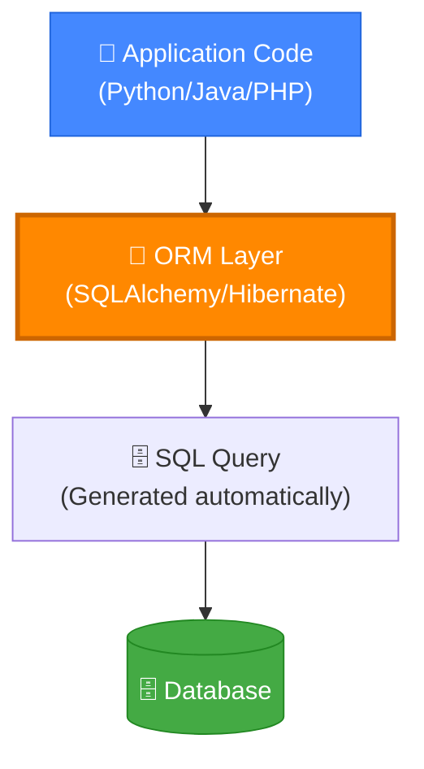
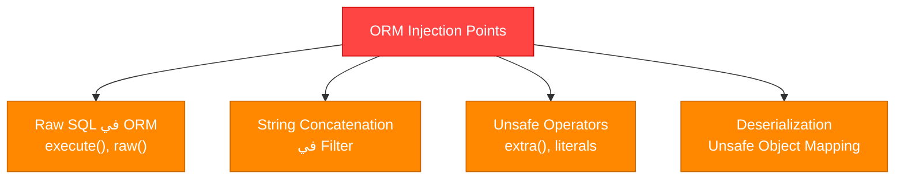
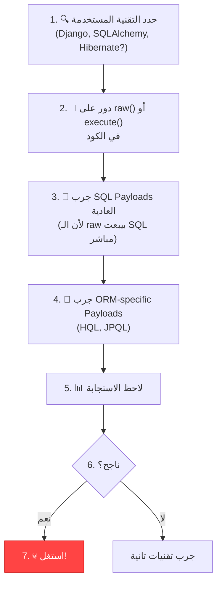

# 🎓 الجزء التاسع: ORM Injection
## Slides 192 → 213

---

## 📌 Slide 192: ORM Injection
### عنوان القسم: ORM Injection

خلصنا SQL, NoSQL, LDAP — دلوقتي بندخل في **ORM Injection**! 🔥

> **المبرمجين فاكرين إن ORM بيحميهم من SQLi — هتثبتلهم إنهم غلطانين!** 😈

---

## 📌 Slide 193: What is ORM?

> **ORM** (Object-Relational Mapping) هو طبقة وسيطة بين الكود البرمجي وقاعدة البيانات. بيحول الـ Objects في الكود (Classes) لـ Tables في الداتابيز، والعكس.

### لغات وأطر ORM الشهيرة:

| اللغة | الـ ORM | الاستخدام |
|-------|---------|-----------|
| **Python** | SQLAlchemy, Django ORM | Web apps, APIs |
| **Java** | Hibernate, JPA | Enterprise apps |
| **PHP** | Eloquent (Laravel), Doctrine | Web apps |
| **Ruby** | ActiveRecord (Rails) | Web apps |
| **Node.js** | Sequelize, TypeORM, Prisma | APIs |
| **C#** | Entity Framework | .NET apps |

### رسم توضيحي:



---

## 📌 Slide 194: How ORM Works

### إزاي ORM بيشتغل:

```python
# بدون ORM (SQL مباشر):
cursor.execute("SELECT * FROM users WHERE name = 'admin'")

# مع ORM (SQLAlchemy):
user = session.query(User).filter(User.name == 'admin').first()

# الـ ORM بيترجم الكود لـ SQL تلقائي:
# → SELECT users.id, users.name, users.password 
#   FROM users WHERE users.name = 'admin'
```

### بالمصري كده:
الـ ORM هو "مترجم" — أنت بتكتب كود Python عادي وهو بيترجمه لـ SQL. المبرمجين فاكرين إن ده بيحميهم من SQLi لأنهم مش بيكتبوا SQL مباشرةً. بس **المشكلة لما يستخدموا الـ ORM غلط**!

---

## 📌 Slide 195: ORM Injection - Concept

> **ORM Injection** بيحصل لما المبرمج بيستخدم الـ ORM بطريقة غير آمنة — مثلاً بيحط مدخلات المستخدم مباشرةً في الـ Filter أو بيستخدم **Raw SQL** جوه الـ ORM.

### الحالات اللي فيها ORM بيكون Vulnerable:



---

## 📌 Slide 196: ORM Injection - Raw SQL Vulnerability

> أشهر سبب لـ ORM Injection هو **استخدام Raw SQL جوه الـ ORM**!

```python
# ❌ VULNERABLE - Raw SQL in ORM:
from sqlalchemy import text

# المبرمج بيكتب SQL مباشر من غير Parameterization:
user_input = request.args.get('name')
result = session.execute(text(f"SELECT * FROM users WHERE name = '{user_input}'"))
# ده زي ما يكون مفيش ORM أصلاً! 💀

# ❌ VULNERABLE - Django raw():
User.objects.raw(f"SELECT * FROM users WHERE name = '{user_input}'")

# ❌ VULNERABLE - Eloquent (Laravel) raw():
DB::select("SELECT * FROM users WHERE name = '" . $user_input . "'")
```

### بالمصري كده:
المبرمج جاب ORM عشان يحميه — وبعدين قعد يكتب SQL مباشر جوه الـ ORM! 😂 ده زي ما تشتري باب حديد وتسيبه مفتوح!

---

## 📌 Slide 197: ORM Injection - String Concatenation

### الخطأ التاني: String Concatenation في الـ Filter:

```python
# ❌ VULNERABLE - SQLAlchemy:
name = request.args.get('name')
session.query(User).filter("name = '" + name + "'").all()
# الـ Filter بياخد String مش Expression → Injectable!

# ✅ SAFE - SQLAlchemy:
session.query(User).filter(User.name == name).all()
# بيستخدم الـ ORM Expression → Parameterized!

# ❌ VULNERABLE - Django:
User.objects.extra(where=["name = '%s'" % name])
# extra() بيقبل Raw SQL!

# ✅ SAFE - Django:
User.objects.filter(name=name)
# بيستخدم الـ QuerySet API → Safe!
```

---

## 📌 Slide 198: ORM Injection Examples

### أمثلة عملية لكل ORM:

**SQLAlchemy (Python):**
```python
# ❌ Vulnerable:
session.execute(text(f"SELECT * FROM users WHERE id = {user_id}"))

# ✅ Safe:
session.query(User).filter(User.id == user_id).first()
# أو:
session.execute(text("SELECT * FROM users WHERE id = :id"), {"id": user_id})
```

**Django ORM (Python):**
```python
# ❌ Vulnerable:
User.objects.raw(f"SELECT * FROM users WHERE name = '{name}'")

# ✅ Safe:
User.objects.filter(name=name)
# أو بـ Parameterized raw:
User.objects.raw("SELECT * FROM users WHERE name = %s", [name])
```

**Hibernate (Java):**
```java
// ❌ Vulnerable (HQL Injection):
String hql = "FROM User WHERE name = '" + userInput + "'";
Query query = session.createQuery(hql);

// ✅ Safe:
String hql = "FROM User WHERE name = :name";
Query query = session.createQuery(hql);
query.setParameter("name", userInput);
```

**Eloquent (PHP/Laravel):**
```php
// ❌ Vulnerable:
DB::select("SELECT * FROM users WHERE name = '" . $name . "'");

// ✅ Safe:
User::where('name', $name)->get();
// أو:
DB::select("SELECT * FROM users WHERE name = ?", [$name]);
```

---

## 📌 Slide 199: ORM Injection - Attack Scenarios

### سيناريوهات الهجوم:

**سيناريو 1: Auth Bypass عبر SQLAlchemy:**
```python
# الكود الضعيف:
login_filter = f"username = '{username}' AND password = '{password}'"
user = session.query(User).filter(text(login_filter)).first()

# الهجوم:
username: admin' --
password: أي حاجة

# الاستعلام:
# username = 'admin' --' AND password = 'أي حاجة'
# → دخل كـ admin! 💀
```

**سيناريو 2: Data Extraction عبر Hibernate:**
```java
// الكود الضعيف:
String hql = "FROM User WHERE name = '" + input + "'";

// الهجوم:
input: ' OR '1'='1

// HQL:
// FROM User WHERE name = '' OR '1'='1'
// → كل الـ Users!
```

---

## 📌 Slide 200: ORM Injection - HQL/JPQL Injection

### حقن HQL و JPQL (Java):

> **HQL** (Hibernate Query Language) و **JPQL** (Java Persistence Query Language) ليهم **Syntax خاص** بيهم — بس برضه قابلين للحقن!

```java
// HQL Injection:
// HQL مش بيدعم UNION — بس بيدعم تقنيات تانية:

// Boolean-Based:
String hql = "FROM User WHERE name = '" + input + "'";
// input: admin' AND (SELECT COUNT(*) FROM User) > 0 AND '1'='1

// Subquery-Based:
// input: admin' AND (SELECT SUBSTRING(password,1,1) FROM User WHERE name='admin')='a' AND '1'='1
```

---

## 📌 Slide 201: ORM Injection vs SQL Injection

### المقارنة:

| الجانب | SQL Injection | ORM Injection |
|--------|-------------|---------------|
| **السبب** | مدخلات في SQL مباشر | مدخلات في ORM بطريقة غلط |
| **الـ Payloads** | SQL Syntax (UNION, SELECT) | ORM Query Language (HQL, JPQL) |
| **الأدوات** | SQLMap | يدوي في الغالب |
| **الانتشار** | عالي جداً | متوسط |
| **الخطورة** | عالية جداً | عالية |
| **الحماية** | Parameterized Queries | استخدام الـ ORM API بشكل صحيح |

---

## 📌 Slide 202: Demo - ORM Injection with SQLAlchemy

### ديمو عملي:

```python
# التطبيق الضعيف:
from flask import Flask, request
from sqlalchemy import create_engine, text

app = Flask(__name__)
engine = create_engine('sqlite:///users.db')

@app.route('/search')
def search():
    name = request.args.get('name')
    # ❌ VULNERABLE!
    result = engine.execute(text(f"SELECT * FROM users WHERE name = '{name}'"))
    return str(result.fetchall())

# الهجوم:
# /search?name=' UNION SELECT 1,username,password FROM admin_users --
# → سحب بيانات من جدول admin_users! 💀
```

---

## 📌 Slide 203: ORM Injection - Testing Methodology

### منهجية الاختبار:



---

## 📌 Slide 204: ORM Injection Prevention

### الحماية:

| القاعدة | الشرح | المثال |
|---------|-------|--------|
| **استخدم ORM API** | متكتبش SQL مباشر — خلي الـ ORM يعملها | `User.objects.filter(name=name)` |
| **Parameterized Raw SQL** | لو لازم تكتب Raw SQL — استخدم Parameters | `execute("... WHERE id = :id", {"id": val})` |
| **تجنب extra() و raw()** | Functions خطرة جداً | بدل `extra()` استخدم `annotate()` |
| **Input Validation** | تحقق من نوع المدخل | `int(user_id)` |
| **Code Review** | راجع الكود ودور على raw SQL | `grep -r "raw\|execute\|extra" .` |

---

## 📌 Slides 205-210: Additional ORM Labs

### Labs إضافية:

**Lab: Django ORM Injection:**
```python
# الكود الضعيف:
User.objects.extra(where=[f"name = '{user_input}'"])

# الحقن:
# user_input = admin' OR '1'='1
# → كل الـ Users!

# الإصلاح:
User.objects.filter(name=user_input)
```

**Lab: Sequelize (Node.js) Injection:**
```javascript
// ❌ Vulnerable:
const users = await sequelize.query(
    `SELECT * FROM users WHERE name = '${req.query.name}'`
);

// ✅ Safe:
const users = await User.findAll({
    where: { name: req.query.name }
});
```

---

## 📌 Slide 211: ORM Injection Summary

### ملخص ORM Injection:

```
ORM Injection يحصل لما:
├── 1. المبرمج يستخدم raw() أو execute() مع String Concatenation
├── 2. المبرمج يستخدم extra() أو literal() بدون Parameterization  
├── 3. المبرمج يكتب SQL مباشر جوه الـ ORM 
└── 4. المبرمج يستخدم ORM Query Language (HQL) بشكل غير آمن

الحماية:
├── ✅ استخدم الـ ORM API بشكل صحيح
├── ✅ لو لازم Raw SQL → Parameterize!
├── ✅ Input Validation
└── ✅ Code Review
```

---

## 📌 Slide 212: All Injection Types Comparison

### مقارنة شاملة لكل الأنواع:

| النوع | الهدف | الـ Payload | الأداة | الحماية |
|-------|-------|-----------|--------|---------|
| **SQLi** | MySQL, MSSQL | `' OR '1'='1` | SQLMap | Parameterized Queries |
| **NoSQLi** | MongoDB | `{"$ne":""}` | NoSQLMap | Type Check + Sanitize |
| **LDAPi** | Active Directory | `*)(&)` | Manual | Escape chars |
| **ORMi** | ORM Layer | SQL/HQL Payloads | Manual | Use ORM API correctly |
| **XXE** | XML Parsers | `<!ENTITY>` | Manual/Burp | Disable DTD |

---

## 📌 Slide 213: What's Next - XXE Injection

### القادم والأخير: XML و XXE Injection


---

## 🎯 ملخص الجزء التاسع

### 🔧 Key Takeaways:

```
✅ ORM مش حماية تلقائية — لو استُخدم غلط بيبقى Vulnerable
✅ أشهر سبب: raw() و execute() مع String Concatenation
✅ HQL/JPQL Injection = SQLi بس بـ Syntax مختلف
✅ الحل: استخدم ORM API + Parameterized raw SQL
✅ Code Review مهم — دور على raw() و execute() و extra()
```

> 📝 **الجزء الأخير:** هندخل في **XML و XXE Injection** — آخر نوع من هجمات الحقن وبعديها ملخص الكورس! 🛠️
