# الجزء 1: مقدمة الكورس + أساسيات الـ Authentication
## Slides 1 → 15

---

## Slide 1: Authentication & Session Management Testing Course Overview

الكورس ده متخصص في اختبار اختراق **آليات المصادقة (Authentication)** و**إدارة الجلسات (Session Management)** في تطبيقات الويب.

### مثال كده:
تخيل إنك Security Guard في بنك. شغلتك مش إنك تحمي البنك — شغلتك إنك **تلاقي الثغرات** في نظام الأمان بتاع البنك قبل ما اللي نيته وحشة يلاقيها. الكورس ده بيعلمك إزاي تعمل كده بس في تطبيقات الويب.

> هنتعلم إزاي نختبر كل حاجة ليها علاقة بتسجيل الدخول وإدارة الجلسات — من ثغرات الباسوردات الضعيفة لحد تخطي الـ 2FA وكسر الـ JWT.

---

## Slide 2: المحاضر - Alexis Ahmed

| المعلومة | التفاصيل |
|----------|----------|
| **الاسم** | Alexis Ahmed |
| **المنصب** | Offensive Security / Red Team Instructor في INE |
| **الدور التاني** | Red Team Lead في HackerSploit |
| **التخصص** | اختبار اختراق تطبيقات الويب والـ Red Team Operations |

الراجل ده مش بيقرأ من كتاب — ده بيشتغل في المجال فعلياً. HackerSploit من أشهر القنوات على YouTube في مجال الـ Ethical Hacking، وعندها محتوى مجاني يساوي كورسات مدفوعة. لو مشفتهاش قبل كده، تستاهل تعدي عليها.

---

## Slide 3: Key Concepts - المفاهيم الأساسية

الكورس بيغطي 4 محاور أساسية:

| المحور | يعني إيه |
|--------|----------|
| **آليات الـ Authentication والـ Session Management الحديثة** | إزاي التطبيقات بتتأكد من هوية المستخدم وبتتعامل مع جلساته |
| **تقنيات اختبار الـ Authentication** | الطرق العملية لاكتشاف ثغرات تسجيل الدخول |
| **تقنيات اختبار الـ Session Management** | إزاي نلاقي مشاكل في إدارة الجلسات (Cookies، Session IDs، إلخ) |
| **مواضيع متقدمة: JWT و OAuth و 2FA** | التكنولوجيا الحديثة اللي بتتستخدم في معظم التطبيقات اللي على الساحة دلوقتي |

> الفكرة هنا إن الكورس مش بيتكلم عن Authentication بشكل نظري بس. كل موضوع هيكون مربوط بـ **اختبار عملي** وأدوات بنستخدمها فعلاً في المشاريع.

---

## Slide 4: Major Topics - المواضيع الرئيسية

خريطة المواضيع اللي هنمر عليها في الكورس كله:

```mermaid
graph LR
    %% العقدة الرئيسية
    Core("🔐 <b>Auth & Session<br>Security Testing</b>")

    %% الفروع الرئيسية
    Sec1("1. Methodology")
    Sec2("2. Auth Testing")
    Sec3("3. Session Mgmt")
    Sec4("4. Token-Based")
    Sec5("5. 2FA & OTP")

    %% التفاصيل الفرعية
    Det1("📘 <b>OWASP WSTG</b><br>Standard Guide")
    
    Det2("🕵️ <b>Techniques</b><br>- Username Enumeration<br>- Brute Force<br>- CAPTCHA Bypass<br>- Auth Bypass")
    
    Det3("🍪 <b>Techniques</b><br>- Session Hijacking<br>- Session Fixation<br>- Cookie Security<br>- CSRF")
    
    Det4("🎫 <b>JWT & OAuth</b><br>- JWT Attacks<br>- OAuth Flows<br>- Token Manipulation")
    
    Det5("📱 <b>Bypass</b><br>- 2FA Bypass<br>- OTP Manipulation")

    %% التوصيلات
    Core ==> Sec1 & Sec2 & Sec3 & Sec4 & Sec5
    
    Sec1 -.-> Det1
    Sec2 -.-> Det2
    Sec3 -.-> Det3
    Sec4 -.-> Det4
    Sec5 -.-> Det5

    %% --- تنسيق الألوان (Neon Cyberpunk) ---
    classDef default fill:#1a1a1a,stroke:#fff,stroke-width:1px,color:#fff;

    %% العقدة الرئيسية (ذهبي)
    style Core fill:#3e2723,stroke:#ffab00,stroke-width:4px,font-size:16px

    %% الفروع (ألوان نيون مختلفة)
    style Sec1 fill:#001a3d,stroke:#00bcd4,stroke-width:2px
    style Det1 fill:#0d1b2a,stroke:#00bcd4,stroke-width:1px,stroke-dasharray: 5 5

    style Sec2 fill:#1a0033,stroke:#d500f9,stroke-width:2px
    style Det2 fill:#1a0033,stroke:#d500f9,stroke-width:1px,stroke-dasharray: 5 5

    style Sec3 fill:#003300,stroke:#00e676,stroke-width:2px
    style Det3 fill:#002200,stroke:#00e676,stroke-width:1px,stroke-dasharray: 5 5

    style Sec4 fill:#330000,stroke:#ff1744,stroke-width:2px
    style Det4 fill:#220000,stroke:#ff1744,stroke-width:1px,stroke-dasharray: 5 5

    style Sec5 fill:#331a00,stroke:#ff6d00,stroke-width:2px
    style Det5 fill:#261400,stroke:#ff6d00,stroke-width:1px,stroke-dasharray: 5 5

    %% تنسيق الخطوط
    linkStyle default stroke:#666,stroke-width:2px;
```



الترتيب ده مش عشوائي — كل موضوع مبني على اللي قبله. الـ Authentication بييجي الأول لأنه الأساس، وبعدين الـ Sessions لأنها بتيجي بعد ما المستخدم يسجل دخول، وبعدين الـ Tokens لأنها البديل الحديث للـ Sessions، وأخيراً الـ 2FA لأنها طبقة إضافية فوق كل اللي فات.

---

## Slide 5: Learning Outcomes - إيه اللي هتطلع بيه

بعد ما تخلص الكورس، المفروض تقدر:

**1. تفهم Authentication و Session Management:**
مش بس تعرف يعني إيه Authentication — لأ، تفهم إزاي بيشتغل تحت الكواليس، إيه العلاقة بينه وبين الـ Sessions، وفين الأماكن اللي ممكن تبقى فيها ثغرات.

**2. تختبر الـ Authentication بشكل عملي:**
تعرف تعمل Username Enumeration على Login Page، تختبر الـ Password Policy، تتخطى الـ CAPTCHA، وتحاول تعمل Brute Force. وكمان تعرف تكتب ده في تقرير بشكل احترافي.

**3. تختبر إدارة الجلسات:**
Session Fixation، Session Hijacking، CSRF، ومشاكل الـ Cookies — كل واحدة فيهم ليها طريقة اختبار مختلفة وأدوات مختلفة. هتتعلمهم كلهم.

**4. تختبر JWT و OAuth:**
دول بقوا في كل حتة — كل API حديث بيستخدم JWT أو OAuth. هتتعلم تفحص الـ Token Structure، تختبر الـ Signing Algorithm، وتدور على Token Leakage.

**5. تتخطى الـ 2FA:**
الناس فاكرة إن الـ 2FA أمان مطلق. الحقيقة إن فيه طرق كتير لتخطيه: OTP Interception، Replay Attacks، Logic Flaws في الـ Implementation.

> في Bug Bounty، ثغرات الـ Authentication والـ Session Management بتتصنف عادةً **High** أو **Critical**. يعني ده المكان اللي المكافآت الكبيرة فيه.

---

## Slide 6: Prerequisites - المتطلبات الأساسية

الكورس **مش للمبتدئين الجداد**. المفروض يكون عندك:

| المتطلب | يعني إيه عملياً |
|---------|----------------|
| **إلمام بـ HTTP/HTTPS** | تعرف الفرق بين GET و POST، تفهم Status Codes (200, 301, 403, 404, 500)، تعرف يعني إيه Headers |
| **خبرة في Web App Pentesting** | تكون جربت DVWA أو Juice Shop أو WebGoat — مش لازم تكون محترف بس تكون عارف الأساسيات |
| **إلمام بـ OWASP Top 10 و WSTG** | تكون عارف الـ 10 ثغرات الأشهر (Injection, XSS, Broken Auth, إلخ) |
| **خبرة في Burp Suite أو ZAP** | تعرف تعمل Intercept لـ Request، تستخدم Repeater، تقرأ HTTP History |
| **فهم أساسي للـ Auth والـ Sessions** | تكون فاهم إن لما بتسجل دخول بيحصل حاجة على السيرفر بتخليه يفتكرك |

> لو بتعرف تشغل Burp Suite وتعمل Intercept لـ Request وتفهم اللي بيحصل — يبقى أنت جاهز. اتفضل كمّل.

لو حاسس إن حاجة من دول ناقصة، الأفضل تقف وتتعلمها الأول. الـ HTTP بالذات ده الأساس — لو مش فاهمه كويس، كل اللي جاي هيبقى صعب عليك.

---

## Slide 7: LET'S GO!

يلا بينا ندخل في المحتوى الفعلي.

---

## Slide 8: Authentication in Web Applications - عنوان القسم

دلوقتي بنبدأ ندخل في تعريف الـ Authentication بالتفصيل وليه هو مهم في سياق تطبيقات الويب تحديداً.

---

## Slide 9: تعريف الـ Authentication

> **Authentication** هي عملية التحقق من هوية المستخدم أو النظام اللي بيحاول يوصل لموارد معينة. هدفها الأساسي: التأكد إن **بس المستخدمين الشرعيين** يقدروا يوصلوا للبيانات والأنظمة والوظائف الحساسة.

### بشكل أبسط:
الـ Authentication في تطبيقات الويب معناها: **"إثبات إنك أنت اللي أنت بتقول إنك هو."**

لما بتروح صفحة Login وبتكتب الإيميل والباسورد، السيرفر بياخد البيانات دي، بيقارنها بالمخزن عنده في الداتابيز، ولو طابقوا بيقولك "أهلاً بيك" وبيديك Session أو Token تمشي بيه.

### في الحياة اليومية:
- بتفتح الموبايل بالبصمة ← Authentication
- بتدخل إيميلك بالباسورد ← Authentication
- بتسحب فلوس من ATM بالكارت والـ PIN ← Authentication

### ليه الـ Authentication مهم جداً في الـ Web Applications تحديداً؟

في الحياة الحقيقية، لو حد عايز يدخل مكان مش بتاعه محتاج يروح هناك **فيزيائياً**. بس في الويب، أي حد في أي مكان في العالم يقدر يحاول يدخل حسابك — كل اللي محتاجه لابتوب وإنترنت. عشان كده الـ Authentication في الويب **أهم بكتير** من نظيره في العالم الحقيقي.

---

## Slide 10: Authentication vs. Authorization - الفرق اللي لازم يكون واضح

> **Authentication** = إثبات **مين أنت**
> **Authorization** = تحديد **إيه اللي مسموحلك تعمله**

ده من أكتر الأسئلة اللي بتيجي في Interviews وكتير ناس بتخلط بينهم. خلينا نوضحه بمثال.

### مثال عملي:
بتروح مبنى شركة كبيرة. عند البوابة الأمن بيسألك على البطاقة وبيتأكد إنك موظف — **ده Authentication**. بعد ما دخلت، البطاقة بتاعتك بتفتحلك الدور الأول والتاني (قسم الـ IT) بس الدور التالت (المالية) مش هيفتحلك — **ده Authorization**.

### في الكود:
```http
# خطوة 1: Authentication — بتثبت مين أنت
POST /api/login
{"username": "ahmed", "password": "MyP@ss123"}

# السيرفر بيرد بـ Token
{"token": "eyJhbGci..."}

# خطوة 2: Authorization — السيرفر بيشوف صلاحياتك
GET /api/admin/dashboard
Authorization: Bearer eyJhbGci...

# لو أنت Admin → 200 OK — اتفضل
# لو أنت User عادي → 403 Forbidden — مش مكانك
```

### ليه الفرق ده مهم أوي في الـ Pentesting؟

لأن **نوع الثغرة بيختلف تماماً:**

- مشكلة في الـ **Authentication** = حد يقدر يدخل النظام **من غير ما يكون ليه حساب أصلاً**. الأمن عند البوابة مش موجود. ده Critical.

- مشكلة في الـ **Authorization** = حد عنده حساب عادي بس قدر يوصل لحاجات مش مسموح بيها. الموظف بتاع IT قدر يفتح الدور بتاع المالية ويشوف المرتبات. ده برضه Critical بس بشكل مختلف.

> في الـ OWASP Top 10 (2021)، **Broken Access Control** (اللي بيشمل مشاكل الـ Authorization) موجود في **المركز الأول**!

---

## Slide 11: جدول مقارنة - Authentication vs. Authorization

| | Authentication | Authorization |
|---|---|---|
| **التعريف** | التحقق من هوية المستخدم أو النظام | تحديد إيه اللي المستخدم المصادق عليه مسموح يعمله |
| **الغرض** | إثبات **مين** المستخدم | تحديد **إيه** الموارد والإجراءات المتاحة ليه |
| **العملية** | فحص الـ Credentials (باسوردات، توكنات) | فحص الصلاحيات والـ Roles مقابل الموارد |
| **النتيجة** | هوية مؤكدة (مسجل دخول أو لأ) | وصول مسموح أو مرفوض لموارد معينة |
| **مثال** | تسجيل الدخول بيوزر وباسورد | تحديد هل المستخدم المسجل يقدر يوصل لمورد معين ولا لأ |

### الربط بالـ Pentesting:
لما بتلاقي ثغرة في مشروع، لازم تفرق: هل دي مشكلة **Authentication** (حد دخل من غير ما يسجل دخول أصلاً) ولا مشكلة **Authorization** (حد مسجل دخول بس وصل لحاجة مش من حقه). التصنيف ده بيأثر على الـ Severity في التقرير وعلى التوصيات اللي هتقدمها.

---

## Slide 12: Importance of Authentication - ليه الـ Authentication حرج

> الـ Authentication هو **خط الدفاع الأول** ضد الوصول غير المصرح به للبيانات والموارد الحساسة في أي تطبيق ويب.

### المخاطر لو الـ Authentication ضعيف:

| الخطر | التأثير |
|-------|---------|
| **Data Breaches** | تسريب بيانات المستخدمين (إيميلات، باسوردات، بيانات مالية) |
| **Account Takeover** | المهاجم يستولي على حسابات المستخدمين |
| **Privilege Escalation** | المهاجم يوصل لصلاحيات Admin |
| **الضرر المادي والسمعة** | غرامات قانونية (GDPR) + فقدان ثقة العملاء |

### أرقام من الواقع:
- **80%** من الـ Data Breaches في 2023 كانت بسبب Credentials مسروقة أو ضعيفة (تقرير Verizon DBIR)
- شركة **Yahoo** اتسرب منها **3 مليار** حساب — والسبب الرئيسي كان ضعف في الـ Authentication
- هجوم **SolarWinds** في 2020 اللي أثر على وكالات حكومية أمريكية — بدأ بـ Compromised Credentials

> عشان كده لما بتعمل Pentest لأي تطبيق، الـ Authentication بيكون من أول الحاجات اللي بتتفحص. لو حد قدر يتخطاه، كل الحمايات اللي بعده (Authorization، Encryption، Logging) مبقتش مهمة.

---

## Slide 13: Types of Authentication Mechanisms - عنوان القسم

دلوقتي هندخل في الأنواع المختلفة من الـ Authentication Mechanisms — لأن مش كلهم زي بعض ومش كلهم بيتكسروا بنفس الطريقة.

---

## Slide 14: مقدمة عن أنواع الـ Authentication

> **Authentication Mechanisms** هي الطرق أو العمليات المستخدمة للتحقق من هوية المستخدم أو النظام اللي بيحاول يوصل لتطبيق ويب أو خدمة.

كل تطبيق بيختار نوع أو أكتر من الأنواع دي حسب مستوى الأمان المطلوب وطبيعة البيانات اللي بيحميها.

### ليه مهم نفهم كل نوع؟
لأن **كل نوع ليه ثغراته المختلفة**:
- الـ Password-Based — بتتكسر بالـ Brute Force
- الـ MFA — بتتكسر بالـ SIM Swapping أو Real-Time Phishing
- الـ Token-Based — بتتكسر بالتلاعب في الـ JWT
- الـ SSO — بتتكسر بثغرات الـ OAuth

فكل ما فهمت النوع أحسن، عرفت تهاجمه أحسن.

---

## Slide 15: أنواع الـ Authentication - الجزء الأول

### 1. Password-Based Authentication

أقدم وأبسط نوع: يوزر وباسورد، السيرفر بيقارنهم باللي عنده.

```http
POST /login HTTP/1.1
Host: example.com
Content-Type: application/x-www-form-urlencoded

username=ahmed&password=P@ssw0rd123!
```

**المشكلة:** الناس كسالى — بيستخدموا باسوردات ضعيفة زي `123456` أو `password`، وبيستخدموا **نفس الباسورد** في كل المواقع. فلو موقع واحد اتسرب، كل حساباتهم راحت.

**الهجمات الأساسية عليه:**
- Brute Force — تخمين كل الاحتمالات
- Dictionary Attack — تجربة قائمة باسوردات شائعة
- Credential Stuffing — استخدام بيانات مسربة من موقع تاني
- Password Spraying — تجربة باسورد واحد على كل اليوزرات

### 2. Multi-Factor Authentication (MFA)

بتجمع **أكتر من عامل** عشان تتأكد من هوية المستخدم:

| العامل | المعنى | أمثلة |
|--------|--------|-------|
| **Something You Know** | حاجة أنت تعرفها | باسورد، PIN، إجابة سؤال أمني |
| **Something You Have** | حاجة معاك فيزيائياً | موبايل (كود SMS)، YubiKey، Smart Card |
| **Something You Are** | حاجة بيولوجية فيك | بصمة صباع، Face ID، بصمة العين |

**مثال عملي:** بتفتح حساب البنك من الموبايل — بتكتب الباسورد (Know) + بييجي كود على تليفونك (Have) + بتعمل بصمة (you are).

المهاجم عشان يدخل حسابك محتاج يعرف الباسورد **و** يسرق الموبايل **و** يحصل على بصمتك. صعبة أكتر من باسورد لوحده.

> بس الـ MFA مش أمان مطلق. فيه تقنيات متقدمة لتخطيه زي SIM Swapping و Real-Time Phishing Proxies (أداة Evilginx مثلاً). هنتكلم عن كل ده بالتفصيل في الTopics المتقدمة.

---

## ملخص الجزء الأولى

| المفهوم | الشرح | الصلة بالـ Pentesting |
|---------|-------|----------------------|
| **Authentication** | إثبات هوية المستخدم | أول حاجة بنختبرها — لو اتكسر كل حاجة راحت |
| **Authorization** | تحديد صلاحيات المستخدم | بنختبره بعد ما نسجل دخول |
| **Password Auth** | يوزر وباسورد | Brute Force, Dictionary, Credential Stuffing |
| **MFA / 2FA** | أكتر من عامل للتحقق | SIM Swapping, Real-Time Phishing, Replay |

> الجزء الجاي هنتكلم عن **Session Management** — إزاي التطبيق بيفتكرك بعد ما تسجل دخول، وإيه الفرق بين الـ Sessions والـ Tokens، وهنبدأ ندخل في **منهجية OWASP WSTG** اللي هتكون الخريطة بتاعتنا لباقي الكورس.
