# الجزء 3: OWASP WSTG Authentication Tests + Username Enumeration + Weak Password Policy
## Slides 31 → 45

---

## Slide 31-32: جدول اختبارات OWASP WSTG للـ Authentication

في الجزء اللي فات اتعرفنا على OWASP WSTG كدليل منهجي. دلوقتي هنشوف الجدول الكامل لاختبارات الـ Authentication — ده هيبقى المرجع بتاعنا لباقي الكورس.

### الجدول الكامل:

| الـ ID | اسم الاختبار | الوصف |
|--------|-------------|-------|
| **WSTG-ATHN-01** | Testing for Credentials Transported over an Encrypted Channel | التأكد إن بيانات الدخول بتتنقل عبر HTTPS مش HTTP |
| **WSTG-ATHN-02** | Testing for Default Credentials | البحث عن بيانات دخول افتراضية لسه شغالة |
| **WSTG-ATHN-03** | Testing for Weak Lock Out Mechanism | تقييم آليات القفل (CAPTCHA، Account Lockout) |
| **WSTG-ATHN-04** | Testing for Bypassing Authentication Schema | اكتشاف طرق تخطي الـ Authentication بالكامل |
| **WSTG-ATHN-05** | Testing for Vulnerable Remember Password Function | فحص أمان وظيفة "تذكرني" |
| **WSTG-ATHN-06** | Testing for Browser Cache Weaknesses | التأكد إن بيانات حساسة مش مخزنة في الـ Cache |
| **WSTG-ATHN-07** | Testing for Weak Password Policy | فحص هل الموقع بيقبل باسوردات ضعيفة |
| **WSTG-ATHN-08** | Testing for Weak Authentication in Alternative Channels | اختبار قنوات بديلة (API، Mobile) لحماية أضعف |

### الربط:

الـ 8 اختبارات دول مش منفصلين — بيكملوا بعض. مثلاً:
- لو لقيت **Default Credentials** (ATHN-02)، مش محتاج تعمل **Brute Force** (ATHN-07) — أنت دخلت أصلاً
- لو الـ **Lockout Mechanism** ضعيف (ATHN-03)، ده بيسهل استغلال **Weak Password Policy** (ATHN-07) لأنك تقدر تخمن بحرية
- لو الـ **Alternative Channel** (ATHN-08) حمايته أضعف، ممكن تهاجم من هناك بدل الـ Login Page

في الجلسة دي هنتعمق في الـ **Username Enumeration** (مرتبطة بـ ATHN-02 و ATHN-07) والـ **Weak Password Policy** (ATHN-07).

---

## Slide 33: Username Enumeration - عنوان القسم
### Authentication Testing

---

## Slide 34: تعريف الـ Username Enumeration

> **Username Enumeration** هي تقنية بتسمح للمهاجم يعرف هل يوزر معين **موجود في النظام ولا لأ**، وده عن طريق ملاحظة الفرق في استجابة التطبيق.

### فين بنختبرها؟

| المكان | إزاي بنختبره |
|--------|-------------|
| **صفحة Login** | بنجرب يوزر موجود مع باسورد غلط ← بنشوف الرسالة |
| **صفحة التسجيل** | بنجرب نسجل بإيميل موجود ← "الإيميل ده مستخدم" |
| **صفحة استعادة الباسورد** | بنكتب إيميل ← "تم إرسال رابط" أو "الإيميل ده مش موجود" |

### ليه دي مشكلة أمنية؟

لأنها بتدي المهاجم **معلومات مجانية** عن المستخدمين الموجودين في النظام. المعلومات دي ممكن يستخدمها في:
1. **Brute Force مستهدف** — عنده اليوزر، محتاج يخمن الباسورد بس
2. **Credential Stuffing** — يجرب الـ Username ده مع باسوردات مسربة من مواقع تانية
3. **Social Engineering** — يعرف إن شخص معين عنده حساب في الموقع ده

---

## Slide 35-36: إزاي بتحصل الـ Username Enumeration

### السيناريو الكلاسيكي:

```http
# محاولة 1: يوزر مش موجود
POST /login
{"username": "nonexistent_user", "password": "anything"}

# الرد:
HTTP/1.1 200 OK
{"error": "Invalid username"}     ← الموقع قالك إن اليوزر مش موجود!

# محاولة 2: يوزر موجود + باسورد غلط
POST /login
{"username": "admin", "password": "wrongpass"}

# الرد:
HTTP/1.1 200 OK
{"error": "Invalid password"}     ← الموقع أكدلك إن اليوزر موجود!
```

### الفرق ده ممكن يظهر بأشكال مختلفة:

| نوع الفرق | مثال |
|-----------|------|
| **رسالة الخطأ المختلفة** | "Invalid username" مقابل "Invalid password" |
| **HTTP Status Code مختلف** | 404 ليوزر مش موجود مقابل 401 لباسورد غلط |
| **وقت الرد (Response Time)** | الرد أسرع ليوزر مش موجود (السيرفر ما بحثش عن الباسورد) |
| **عنصر في الـ HTML مختلف** | CSS class مختلف أو عنصر HTML إضافي |
| **Redirect مختلف** | توجيه لصفحة مختلفة حسب صحة اليوزر |

### مثال على الـ Timing-Based Enumeration:

```
Username: nonexistent_user → Response: 50ms    (السيرفر قال "مش موجود" فوراً)
Username: admin            → Response: 200ms   (السيرفر راح يتحقق من الباسورد وبعدين رد)
```

الفرق في الوقت ده ولو كان ميلي ثواني، أداة زي Burp Suite Intruder بتقدر تكتشفه عبر إرسال مئات الطلبات وتحليل أوقات الرد.

### الحل الصحيح:

```http
# الموقع لازم يرد برسالة واحدة موحدة في كل الحالات:
{"error": "Invalid username or password"}

# ونفس وقت الرد — حتى لو اليوزر مش موجود
```

> من واقع الـ Pentesting: كتير من المواقع بتعمل الرسالة صح بس بتنسى **وقت الرد**. السيرفر لما بيلاقي يوزر موجود بيروح يعمل Password Hashing Comparison (عملية بتاخد وقت)، بس لما اليوزر مش موجود بيرد فوراً. الحل: حتى لو اليوزر مش موجود، اعمل Dummy Password Comparison عشان الوقت يبقى زي بعضه.

---

## Slide 37: How it Works - رسم توضيحي

السلايد دي فيها رسم بياني يوضح عملية الـ Username Enumeration:

```mermaid
graph TD
    %% العقدة الأساسية: المهاجم
    Attacker("🕵️‍♂️ <b>المهاجم (Attacker)</b><br>بيجرب Usernames عشوائية")

    %% السيرفر
    System("🖥️ <b>النظام (System)</b><br>بيتحقق من قاعدة البيانات")

    %% الطلبات (Requests)
    Req1("Request 1: user=ahmed")
    Req2("Request 2: user=sara")
    Req3("Request 3: user=admin")
    Req4("Request 4: user=test123")

    %% الردود (Responses)
    ResExist("⚠️ <b>Response: 'Invalid Password'</b><br>(معناه اليوزر موجود)")
    ResNoExist("❌ <b>Response: 'Invalid User'</b><br>(معناه اليوزر مش موجود)")

    %% النتيجة
    Result("✅ <b>النتيجة (Enumerated Users)</b><br>عرفنا إن admin و ahmed موجودين")
    Next("🔥 <b>الخطوة الجاية</b><br>Brute Force Attack عليهم")

    %% العلاقات - المسار الأول (مستخدمين موجودين)
    Attacker --> Req1 & Req3
    Req1 & Req3 --> System
    System ==>|User Found| ResExist
    ResExist --> Result

    %% العلاقات - المسار الثاني (مستخدمين غير موجودين)
    Attacker --> Req2 & Req4
    Req2 & Req4 --> System
    System -.->|User Not Found| ResNoExist

    %% الخطوة النهائية
    Result --> Next

    %% --- تنسيق الألوان (Neon Dark Mode) ---
    classDef default fill:#1a1a1a,stroke:#fff,stroke-width:1px,color:#fff;

    %% المهاجم (لون أحمر غامق)
    style Attacker fill:#3b0000,stroke:#ff2a2a,stroke-width:2px
    
    %% الطلبات (لون أزرق باهت)
    style Req1 fill:#0d1b2a,stroke:#415a77,stroke-width:1px
    style Req2 fill:#0d1b2a,stroke:#415a77,stroke-width:1px
    style Req3 fill:#0d1b2a,stroke:#415a77,stroke-width:1px
    style Req4 fill:#0d1b2a,stroke:#415a77,stroke-width:1px

    %% السيرفر (لون بنفسجي)
    style System fill:#240046,stroke:#7b2cbf,stroke-width:2px

    %% الردود (أصفر للخطر، رصاصي للتجاهل)
    style ResExist fill:#3e2723,stroke:#ffab00,stroke-width:2px
    style ResNoExist fill:#212121,stroke:#616161,stroke-width:1px,stroke-dasharray: 5 5

    %% النتيجة (أخضر هاكر)
    style Result fill:#002b15,stroke:#00e676,stroke-width:2px
    
    %% الخطوة القادمة (برتقالي ناري)
    style Next fill:#4a1c00,stroke:#ff6d00,stroke-width:2px

    %% تنسيق الخطوط الرابطة
    linkStyle default stroke:#888,stroke-width:2px;
```





### أدوات بنستخدمها:

```bash
# Burp Suite Intruder:
# 1. ابعت Login Request للـ Intruder
# 2. حط Payload على الـ username field
# 3. استخدم قائمة usernames (مثلاً من SecLists)
# 4. شغّل وراقب الفرق في الردود

# أو باستخدام ffuf:
ffuf -w /usr/share/seclists/Usernames/top-usernames-shortlist.txt \
     -X POST \
     -d "username=FUZZ&password=invalid" \
     -H "Content-Type: application/x-www-form-urlencoded" \
     -u https://target.com/login \
     -fr "Invalid username"    # فلتر الردود اللي فيها "Invalid username"
```

---

## Slide 38: Lab Demo - Username Enumeration

### خطوات الـ Lab:

#### Step 1: Reconnaissance
```
1. افتح صفحة الـ Login في المتصفح
2. جرب تسجيل دخول بيوزر عشوائي وباسورد عشوائي
3. لاحظ رسالة الخطأ بالظبط
4. جرب يوزر تاني (مثلاً admin) وباسورد غلط
5. لاحظ: هل رسالة الخطأ **نفسها** ولا مختلفة؟
```

#### Step 2: تحليل في Burp Suite
```
1. شغل Burp Suite وخليه يعترض الـ Traffic
2. جرب تسجيل دخول بيوزر غلط
3. ابعت الـ Request للـ Intruder
4. حط Payload Position على الـ username
5. حط قائمة Usernames (مثلاً top-usernames-shortlist.txt من SecLists)
6. شغّل الـ Attack
```

#### Step 3: تحليل النتائج
```
1. رتّب النتائج حسب:
   - Length (طول الرد) — لو مختلف، فيه Username Enumeration
   - Status Code — لو مختلف
   - Response Time — لو فيه فرق ملحوظ
2. اليوزرات اللي ردها مختلف = موجودين في النظام
```

#### Step 4: الاستغلال
```
1. خد قائمة اليوزرات المكتشفة
2. استخدمها في Brute Force Attack (هنتعلمه في الجزء الجاي)
3. وثّق كل حاجة في التقرير
```

---

## Slide 39: Testing for Weak Password Policy - عنوان القسم
### Authentication Testing

---

## Slide 40: تعريف اختبار الـ Weak Password Policy

> **WSTG-ATHN-07**: الاختبار ده بيركز على تقييم هل التطبيق **بيفرض سياسة باسوردات قوية** لحماية حسابات المستخدمين ولا بيقبل أي باسورد.

### ليه الموضوع ده بالذات مهم؟

لأن أغلب المستخدمين بيختاروا أسهل باسورد ممكن. لو الموقع سايبهم يعملوا كده من غير ما يمنعهم، يبقى عملياً بيسلمهم للمهاجمين.

| باسوردات شائعة | عدد المستخدمين (من تسريبات حقيقية) |
|----------------|-----------------------------------|
| `123456` | 23 مليون حساب |
| `password` | 8 مليون حساب |
| `123456789` | 7.7 مليون حساب |
| `qwerty` | 3.8 مليون حساب |
| `abc123` | 2.8 مليون حساب |

> الأرقام دي من تحليل بيانات مسربة فعلية. يعني ملايين الناس بيستخدموا نفس الباسوردات الضعيفة.

---

## Slide 41: تقنيات الهجوم الأساسية

### 1. Dictionary Attack

بتستخدم قائمة جاهزة من الباسوردات الشائعة وبتجربهم واحد واحد:

```bash
# استخدام Hydra مع قائمة باسوردات:
hydra -l admin -P /usr/share/wordlists/rockyou.txt \
      target.com http-post-form \
      "/login:username=^USER^&password=^PASS^:Invalid"

# rockyou.txt فيها أكتر من 14 مليون باسورد شائع
```

### 2. Brute Force Attack

بتجرب **كل** الاحتمالات الممكنة بشكل منظم:

```
a, b, c, ... z
aa, ab, ac, ... zz
aaa, aab, aac, ... zzz
... وهكذا
```

| طول الباسورد | عدد الاحتمالات (حروف + أرقام) | الوقت التقريبي |
|-------------|------------------------------|--------------|
| 4 حروف | 1.6 مليون | ثواني |
| 6 حروف | 2.2 مليار | ساعات |
| 8 حروف | 218 تريليون | سنين |
| 8 (مع رموز) | 6.6 كوادريليون | عقود |

> عشان كده الباسوردات الطويلة المعقدة صعب جداً كسرها بالـ Brute Force. بس الـ Dictionary Attack بتنجح مع أي باسورد شائع بغض النظر عن طوله.

### الهدف من الاختبار:
> تحديد هل التطبيق بيقبل باسوردات ضعيفة، وهل عنده حماية (زي Account Lockout أو CAPTCHA) بتمنع الهجمات دي.

---

## Slide 42: مجالات التركيز في الاختبار

### Focus Areas:

**1. Password Complexity (تعقيد الباسورد):**
هل التطبيق بيفرض معايير معينة؟

```
# سياسة قوية (مثال):
- الحد الأدنى: 8 حروف
- لازم يحتوي على حرف كبير (A-Z)
- لازم يحتوي على حرف صغير (a-z)
- لازم يحتوي على رقم (0-9)
- لازم يحتوي على رمز خاص (!@#$%)
- مش مسموح يكون من الباسوردات الشائعة

# سياسة ضعيفة:
- الحد الأدنى: 4 حروف ← يقبل "1234"!
- مفيش متطلبات تانية
```

**كيفية الاختبار:**
```
1. جرب تسجيل حساب بباسوردات ضعيفة مختلفة:
   - "123456" ← لو اتقبل = Finding!
   - "password" ← لو اتقبل = Finding!
   - "aaa" ← لو اتقبل = Finding!
   - "aaaa" ← لتحديد الحد الأدنى للطول
2. وثّق كل باسورد جربته والنتيجة
```

**2. Account Lockout / Rate Limiting:**
هل التطبيق بيحد من عدد المحاولات الفاشلة؟

```
1. جرب 10-20 محاولة تسجيل دخول فاشلة متتالية
2. لاحظ:
   - هل الحساب اتقفل؟ بعد كام محاولة؟
   - هل ظهرت CAPTCHA؟
   - هل فيه Rate Limiting (بطء في الاستجابة)؟
   - هل فيه رسالة تحذير؟
```

**3. Error Messages:**
هل رسائل الخطأ بتكشف معلومات ممكن تساعد المهاجم؟

```http
# رسالة سيئة (بتكشف معلومات):
"The password for user 'admin' is incorrect"

# رسالة كويسة (آمنة):
"Invalid username or password"
```

---

## Slide 43: الأهداف الرئيسية للاختبار

### Primary Objectives:

| الهدف | الوصف | كيفية الاختبار |
|-------|-------|---------------|
| **اكتشاف سياسات الباسورد الضعيفة** | هل الموقع بيقبل باسوردات بسيطة؟ | تجربة تسجيل بباسوردات ضعيفة |
| **اختبار حماية Brute Force** | هل فيه حد لعدد المحاولات؟ | محاولات تسجيل دخول متتالية فاشلة |
| **تقييم متطلبات التعقيد** | هل بيفرض حد أدنى للطول وتنوع الحروف؟ | تجربة باسوردات بأطوال وتركيبات مختلفة |
| **فحص رسائل الخطأ** | هل الرسائل بتكشف معلومات؟ | تحليل الردود ومقارنتها |

---

## Slide 44: النتائج المتوقعة (Outcomes)

لما بتختبر سياسة الباسوردات، النتائج اللي ممكن تلاقيها:

| النتيجة | التصنيف | التأثير |
|---------|---------|---------|
| **الموقع بيقبل باسوردات شائعة** | High | المهاجم يقدر يدخل أي حساب باسورده ضعيف بـ Dictionary Attack |
| **مفيش حماية من Brute Force** | High | المهاجم يقدر يجرب ملايين الباسوردات بدون ما يتوقف |
| **رسائل خطأ بتكشف معلومات** | Medium | بتسهل الـ Username Enumeration والهجمات المستهدفة |
| **تم تخطي أمان تسجيل الدخول** | Critical | وصول غير مصرح به للحسابات |

### كيفية كتابة الـ Finding في التقرير:
### انا كاتب بالعربي للتوضيح ولكن لازم الreport يكون بالانجليزي
```
Title: Weak Password Policy Allows Common Passwords
Severity: High
CVSS: 7.5

Description:
التطبيق بيقبل باسوردات ضعيفة وشائعة بدون أي restrictions.
جربنا تسجيل حساب بالباسوردات التالية وكلها اتقبلت:
- "123456"
- "password"
- "abc123"

Impact:
المهاجم يقدر يعمل Dictionary Attack على أي حساب ويكتشف
الباسورد لو المستخدم اختار باسورد شائع. في اختبارنا، قدرنا
نكتشف باسورد حساب الأدمن في 3 دقايق باستخدام rockyou.txt.

Recommendation:
- تطبيق سياسة باسوردات قوية (8+ حروف، حرف كبير وصغير ورقم ورمز)
- منع الباسوردات الشائعة باستخدام قائمة سوداء
- تفعيل Account Lockout بعد 5 محاولات فاشلة
- إضافة CAPTCHA بعد 3 محاولات فاشلة
```

---

## Slide 45: Lab Demo - Testing for Weak Password Policy

### خطوات الـ Lab:

#### Step 1: اختبار سياسة التعقيد
```
1. حاول تسجل حساب جديد بباسوردات ضعيفة مختلفة:

   اختبار الطول:
   - "a"        ← اتقبل؟
   - "aa"       ← اتقبل؟
   - "aaaa"     ← اتقبل؟
   - "aaaaaa"   ← اتقبل؟

   اختبار التعقيد:
   - "123456"   ← أرقام بس
   - "abcdef"   ← حروف صغيرة بس
   - "ABCDEF"   ← حروف كبيرة بس
   - "Pa$$w0rd" ← الكل

2. سجّل أضعف باسورد اتقبل — ده بيحدد الـ Minimum Policy
```

#### Step 2: اختبار حماية Brute Force
```
1. اختار حساب معروف (admin مثلاً)
2. جرب تسجيل دخول بباسوردات غلط 10 مرات متتالية
3. لاحظ:
   - هل الحساب اتقفل؟
   - هل ظهرت CAPTCHA؟
   - هل الـ Response Time اتغير؟
   - هل فيه Rate Limiting؟
```

#### Step 3: Brute Force عملي (لو مفيش حماية)
```bash
# باستخدام Hydra:
hydra -l admin -P /usr/share/wordlists/rockyou.txt \
      target.com http-post-form \
      "/login:username=^USER^&password=^PASS^:Invalid credentials"

# أو باستخدام Burp Intruder:
# 1. ابعت Login Request للـ Intruder
# 2. حط Payload على الـ password field
# 3. حمّل قائمة rockyou.txt
# 4. شغّل وراقب الفرق في الردود
```

#### Step 4: التوثيق
```
1. وثّق كل الباسوردات الضعيفة اللي اتقبلت
2. وثّق عدد المحاولات قبل ما يحصل Lockout (لو حصل)
3. لو نجحت في الـ Brute Force، وثّق:
   - الوقت اللي أخده
   - عدد المحاولات
   - الباسورد اللي اكتشفته
   - الـ Impact (إيه اللي قدرت توصله بعد الدخول)
```

---

## ملخص الجزء التالت 

| المفهوم | الشرح | الربط بالـ OWASP |
|---------|-------|-----------------|
| **OWASP WSTG Auth Tests** | 8 اختبارات محددة للـ Authentication | WSTG-ATHN-01 → WSTG-ATHN-08 |
| **Username Enumeration** | اكتشاف يوزرات موجودة من خلال فرق الردود | مرتبط بـ ATHN-02 و ATHN-07 |
| **مصادر الـ Enumeration** | Login, Registration, Password Reset | كل واحدة ممكن تكشف معلومات |
| **أنواع الفروقات** | رسائل خطأ, Status Codes, Response Time | كلهم مؤشرات على Enumeration |
| **Weak Password Policy** | الموقع بيقبل باسوردات ضعيفة | WSTG-ATHN-07 |
| **Dictionary Attack** | تجربة قائمة باسوردات شائعة | أول طريقة لاستغلال Weak Policy |
| **Brute Force Attack** | تجربة كل الاحتمالات | أبطأ بس أشمل |

> الجزء الجاي هنتكلم عن **تخطي الـ CAPTCHA** (WSTG-ATHN-03) و**تجاوز مخطط المصادقة** (WSTG-ATHN-04) — وهي من أخطر الثغرات اللي ممكن تلاقيها.
