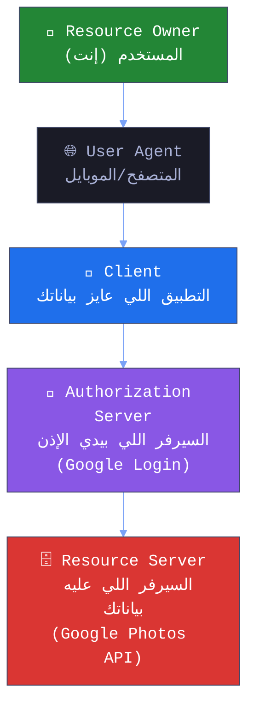
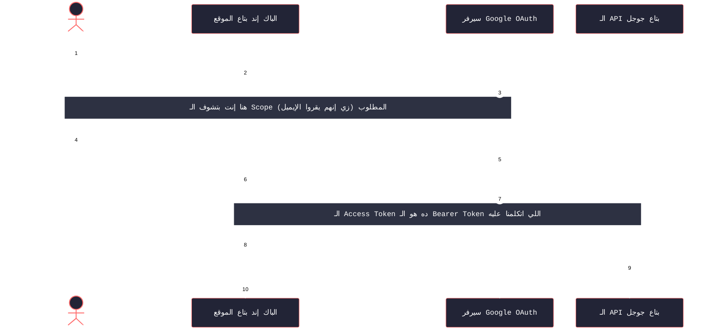
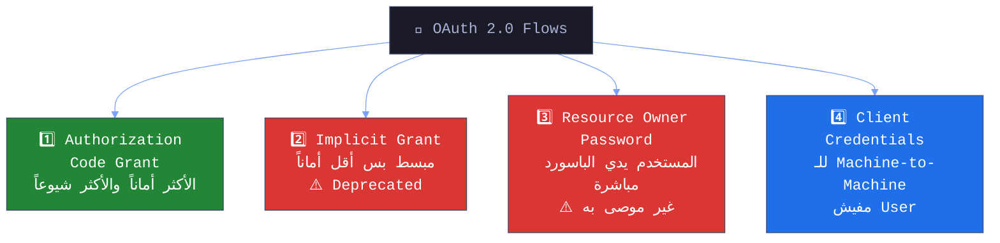
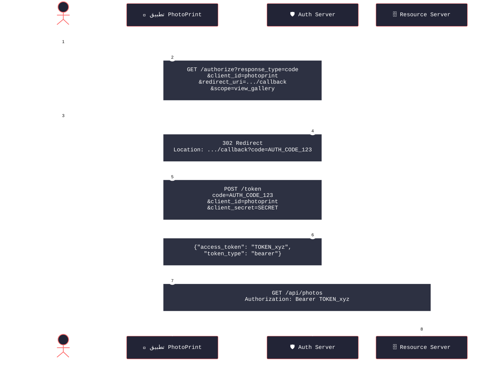
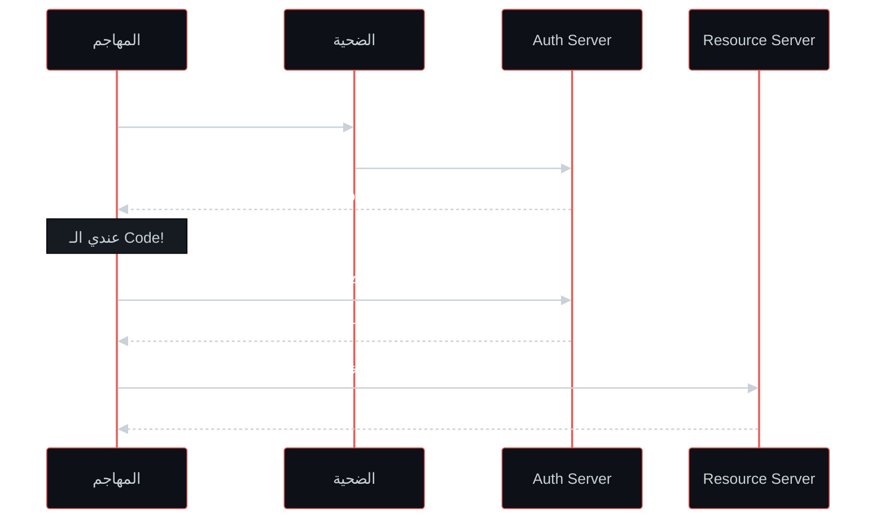

# 🎓 الجزء 11: OAuth 2.0 — المفاهيم والـ Flows
## Slides 156 → 168

---

## Slide 156: عنوان القسم — Introduction to OAuth
### سلايد 156:

هنخش دلوقتي علي  — **OAuth 2.0**.

لو فتحت أي موقع ولقيت زرار "Login with Google" أو "Sign in with Facebook" — ده **OAuth** اللي شغال ورا الكواليس.

---

## Slide 157: تعريف OAuth 2.0
### سلايد 157:

### إيه هو OAuth 2.0؟

> **OAuth 2.0** هو **المعيار الرئيسي للـ Authorization** بين الخدمات على الويب. بيسمح لتطبيقات تانية (Third-Party Apps) تدخل على بياناتك في خدمة معينة **بدون ما تعرف الباسورد بتاعك**.

---

## Slide 158: مكونات OAuth 2.0
### سلايد 158:

### OAuth Components — الأطراف المشاركة



### شرح كل مكون:

| المكون | الشرح | المثال |
|--------|-------|--------|
| **Resource Owner** | المستخدم — صاحب البيانات | إنت |
| **Client** | التطبيق اللي عايز يوصل لبياناتك  | موقع e-commerce  / تطبيق تاني |
| **Resource Server** | السيرفر اللي عليه البيانات (الـ API) | Google Photos API |
| **Authorization Server** | السيرفر اللي بيتحقق من هويتك ويدي الإذن ( اسمه برضو Identity Provider - IdP) | Google Login/Accounts |
| **User Agent** | المتصفح أو تطبيق الموبايل | Chrome / Safari |

---

## Slide 159: الـ OAuth Scopes
### سلايد 159:

### OAuth Scopes — إيه الصلاحيات المطلوبة؟

الـ **Scope** بيحدد **إيه بالظبط** التطبيق يقدر يعمله. مش بيدي وصول كامل!

```
أمثلة على Scopes:

 read → يقدر يقرأ البيانات بس
 write → يقدر يكتب/يعدل
 access_contacts → يقدر يشوف جهات الاتصال
 email → يقدر يشوف الإيميل
 profile → يقدر يشوف بيانات البروفايل
```

### ناخد مثال مثلا علي موقع e-commerce
## هرسم diagram هنشوفه تاني كمان سلايد بس بشكل متعمق اكتر 

لما تعمل "Login with Google":

بيظهرلك:




> **🔴 كـ Pentester:** بندور على:
> - هل الـ Scope أوسع من المطلوب؟ (مثلاً التطبيق بيطلب `write` وهو محتاج `read` بس)
> - هل الـ Scope parameter ممكن يتعدل في الـ Request؟
> - هل فيه Scopes حساسة مش المفروض تتاح؟

---

## Slide 160-162: الـ OAuth Flows الأربعة
### سلايد 160-162:

### OAuth Flows — الأربع طرق للحصول على Token



### 1️⃣ Authorization Code Grant (الأشهر والأكثر أماناً): الي كنت عامله فوق بالظبط



### 2️⃣ Implicit Grant (مبسط بس deprecated):
```
بدل خطوتين (Code ثم Token) — الـ Token بيجي مباشرة في الـ URL!
❌ مش آمن — الـ Token بيظهر في Browser History
⚠️ مش مستخدم في التطبيقات الحديثة
```

### 3️⃣ Resource Owner Password Credentials:
```
المستخدم بيدي الـ Username والـ Password مباشرة للتطبيق!
POST /token
username=ahmed&password=secret123&grant_type=password

❌ مش موصى به — التطبيق بيعرف الباسورد!
```

### 4️⃣ Client Credentials Grant:
```
مفيش مستخدم في الموضوع — Machine-to-Machine
التطبيق بيستخدم بياناته هو (client_id + client_secret)
POST /token
client_id=app1&client_secret=SECRET&grant_type=client_credentials
```

### ملاحظات مهمة:
- الـ **Access Token** عادةً بيكون **Bearer Token** (أو JWT أحياناً)
- بعض التطبيقات بتستخدم **JWT كـ Access Token** — وده بيخلي الثغرات اللي اتكلمنا عنها في الجزء اللي فات applicable

---

## Slide 163: عنوان القسم — Common OAuth Attacks
### سلايد 163:

خلينا ندخل في **الهجمات** على OAuth 2.0!

### السيناريو:
عندنا موقع لإدارة الصور اسمه **gallery** (زي Flickr)، وموقع تاني لطباعة الصور اسمه **photoprint**. الـ OAuth بيسمح لـ photoprint يوصل لصور المستخدم على gallery.

---

## Slide 164-165: الهجمة الأولى — Unvalidated Redirect URI
### سلايد 164-165:

### 1. Unvalidated Redirect URI

### إيه المشكلة؟

لما المستخدم يوافق على إدخال التطبيق — الـ Authorization Server بيعمل Redirect للمستخدم على `redirect_uri` ومعاه الـ Authorization Code. المشكلة لو الـ Authorization Server **مش بيتحقق** إن الـ redirect_uri ده فعلاً بتاع التطبيق!

### الـ Request الشرعي:
```
http://gallery:3005/OAuth/authorize?response_type=code&redirect_uri=http%3A%2F
%2Fphotoprint%3A3000%2Fcallback&scope=view_gallery&client_id=photoprint
```

### الـ Request المزور (المهاجم غير الـ redirect_uri):
```
http://gallery:3005/OAuth/authorize?response_type=code&redirect_uri=http%3A%2F
%2Fattacker%3A1337%2Fcallback&scope=view_gallery&client_id=photoprint
```

### إيه اللي بيحصل:



**شرح الـ Diagram:**
المهاجم بيبعت اللينك للضحية بعد ما غير الـ `redirect_uri` لموقعه. الضحية يفتحه ويوافق. الـ Authorization Server بيعمل Redirect **لموقع المهاجم** ومعاه الـ Authorization Code. المهاجم بيستخدم الـ Code عشان ياخد Access Token ويوصل لبيانات الضحية.

### طرق Bypass الـ redirect_uri Validation:
```
لو الـ Authorization Server بيعمل Validation بسيط:

○ http://example.com%2f%2f.victim.com
○ http://example.com%5c%5c.victim.com
○ http://example.com%3F.victim.com
○ http://example.com%23.victim.com
○ http://victim.com:80%40example.com
○ http://victim.com%2eexample.com
```

---

## Slide 166: الهجمة التانية — Weak Authorization Codes
### سلايد 166:

### 2. Weak Authorization Codes

### إيه المشكلة؟

لو الـ Authorization Codes **ضعيفة** (مش عشوائية كفاية) — المهاجم يقدر **يخمنها**!

### إزاي بنختبر:

```
1. في Burp Suite — امسك الـ Request اللي فيه Authorization Code
2. ابعته لـ Burp Sequencer
3. اعمل "Live Capture" → "Analyze Now"
4. Sequencer هيقولك مستوى العشوائية

لو النتيجة:
"Excellent" أو "Good" → عشوائية كافية
"Poor" أو "Reasonable" → ممكن يتخمن! 
```

> **💡 ملاحظة:** الهجمة دي أسهل لو الـ `client_secret` مسرب أو مش موجود أو مش بيتحقق منه.

---

## Slide 167: الهجمة التالتة — Everlasting Authorization Codes
### سلايد 167:

### 3. Everlasting Authorization Codes

### إيه المشكلة؟

الـ Authorization Codes المفروض تنتهي بسرعة (دقايق). لو مش بتنتهي أو عمرها طويل — المهاجم عنده نافذة أكبر لاستخدامها.

### إزاي بنختبر:

```
1. احصل على Authorization Code
2. استنى 30 دقيقة (أو أكتر)
3. حاول تبادله بـ Access Token
4. لو نجح بعد 30 دقيقة → ممكن تبلغها

المعيار:
Code بينتهي بعد 1-5 دقائق → آمن
Code بيفضل صالح لساعات أو أيام → خطر!
```

---

## Slide 168: الهجمة الرابعة — Authorization Codes Not Bound to Client
### سلايد 168:

### 4. Authorization Codes Not Bound to Client

### إيه المشكلة؟

لو الـ Authorization Code **مش مربوط** بالـ Client اللي طلبه — المهاجم يقدر ياخد Code من Client شرعي ويستخدمه مع Client تاني (خبيث)!

### إزاي بنختبر:

```http
# احصل على Authorization Code للـ Client الشرعي (photoprint):
code=9

# جرب تستخدمه مع Client تاني (malicious):
POST /token HTTP/1.1
Host: gallery:3005
Content-Type: application/x-www-form-urlencoded

code=9
&redirect_uri=http://photoprint:3000/callback
&grant_type=authorization_code
&client_id=maliciousclient       ← Client مختلف!
&client_secret=secret

# لو السيرفر أعطاك Access Token → Finding!
```

---

## 🎯 ملخص الجزء الحادي عشر

| المفهوم | الشرح |
|---------|-------|
| **OAuth 2.0** | بروتوكول Authorization بيسمح لتطبيقات توصل لبياناتك بدون الباسورد |
| **المكونات** | Resource Owner, Client, Auth Server, Resource Server, User Agent |
| **Scopes** | بتحدد إيه بالظبط التطبيق يقدر يعمله (read, write, etc.) |
| **Authorization Code** | الـ Flow الأشهر والأكثر أماناً — Code يتبادل بـ Token |
| **Unvalidated redirect_uri** | المهاجم يغير الـ redirect_uri ويسرق الـ Code |
| **Weak Codes** | Authorization Codes ممكن تتخمن (عشوائية ضعيفة) |
| **Everlasting Codes** | Codes مش بتنتهي — نافذة هجوم أكبر |
| **Unbound Codes** | Code مش مربوط بالـ Client — ممكن يتستخدم مع Client تاني |

> **📝 الجزء الجاي (Session 12):** هنكمل **هجمات OAuth المتقدمة** — الـ Weak Access Tokens وسيناريوهات واقعية.
