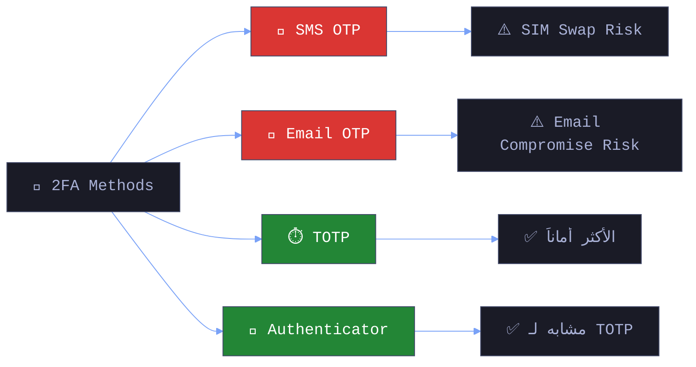

# 🎓 الجزء 13: 2FA Bypass — تخطي المصادقة الثنائية
## Slides 181 → 193

---

## Slide 181: عنوان القسم — Two-Factor Authentication (2FA) Bypassing
### سلايد 181:

يلا ندخل في آخر موضوع في الكورس — **تخطي الـ 2FA** (Two-Factor Authentication Bypass).

الـ 2FA المفروض يكون آخر خط دفاع — حتى لو المهاجم سرق الباسورد بتاعك. بس زي أي حاجة في الأمن السيبراني — **التنفيذ الضعيف بيبطل أي حماية**.

---

## Slide 182: تعريف الـ 2FA
### سلايد 182:

### إيه هي الـ Two-Factor Authentication (2FA)؟

> **2FA** هو إجراء أمني بيطلب من المستخدم يثبت هويته باستخدام **عاملين مختلفين** قبل ما يدخل النظام:
> 1. **Something you know** (حاجة تعرفها): الباسورد أو الـ PIN
> 2. **Something you have** (حاجة معاك): الموبايل أو Hardware Token

### ليه 2FA مهم؟

```
بدون 2FA:
المهاجم يسرق الباسورد (Phishing/Breach) → يدخل حسابك! 

مع 2FA:
المهاجم يسرق الباسورد → يحتاج كمان الكود اللي على موبايلك → مش هيعرف! 
```

### بس... الحماية بتعتمد على التنفيذ!

```
2FA ضعيف:
→ OTP من 4 أرقام بدون Rate Limiting = 10,000 احتمال بس!
→ OTP مش بينتهي = المهاجم عنده وقت يخمن!
→ OTP بيتبعت في الـ Response = ليه أصلاً بتبعته!!

2FA قوي:
→ OTP من 6 أرقام + Rate Limiting + Expiry = صعب جداً
→ TOTP (زي Google Authenticator) + حماية ضد Brute Force
```

---

## Slide 183: أنواع الـ 2FA
### سلايد 183:

### أنواع الـ Two-Factor Authentication

### 1️⃣ SMS-Based 2FA 

```
الطريقة: OTP بيتبعت كرسالة SMS على الموبايل
 المميزات: سهل الاستخدام — معظم الناس عندها موبايل
 العيوب:
   → SIM Swapping: المهاجم ينقل رقمك لبطاقة تانية
   → Interception: ممكن يتداخل مع الـ SMS Protocol (SS7)
   → Phishing: المهاجم يعمل صفحة Login مزيفة ويسألك عن الكود
```

### 2️⃣ Email-Based 2FA 

```
الطريقة: OTP أو لينك تأكيد على الإيميل
المميزات: مش محتاج جهاز إضافي
 العيوب:
   → لو الإيميل مخترق = الـ 2FA كأنها مش موجودة!
   → أبطأ من SMS
```

---

## Slide 184: أنواع الـ 2FA (تكملة)
### سلايد 184:

### 3️⃣ TOTP (Time-Based One-Time Password) ⏱

```
الطريقة: كود بيتولد كل 30 ثانية بناءً على Shared Secret Key
التطبيقات: Google Authenticator, Authy, Microsoft Authenticator
 المميزات: أكثر أماناً من SMS — مش معروض لـ SIM Swapping
 العيوب: لو ضاع الموبايل = مشكلة!
```

### 4️⃣ Authenticator Apps 

```
الطريقة: تطبيقات زي Microsoft Authenticator أو Authy
 المميزات: مش معتمد على قنوات خارجية (SMS/Email)
 العيوب: لو الموبايل اتسرق أو ضاع = محتاج Recovery
```

### مقارنة شاملة:



---

## Slide 185: تقنيات تخطي الـ 2FA — Social Engineering
### سلايد 185:

### 2FA Bypass Techniques

### الفئة 1: Social Engineering (الهندسة الاجتماعية)

**1. Phishing:**
```
المهاجم يعمل صفحة Login مزيفة (Reverse Proxy):
1. الضحية يدخل Username + Password في الصفحة المزيفة
2. المهاجم يبعتهم للموقع الحقيقي
3. الموقع يبعت OTP للضحية
4. الضحية يدخل الـ OTP في الصفحة المزيفة
5. المهاجم ياخد الـ OTP ويستخدمه فوراً!

أدوات: Evilginx2, Modlishka
```

**2. Vishing (Voice Phishing):**
```
المهاجم يتصل بالضحية 
انا من البنك الفلاني و عايزين نحدث البيانات والا هيتقفل الحساب بتاعك كمان نص ساعة زي ما بيحصل دلوقتي 
```

**3. SMiShing (SMS Phishing):**
```
رسالة SMS مزيفة:
"تم اكتشاف محاولة دخول مشبوهة. اضغط هنا لتأمين حسابك: [لينك مزيف]"
```

### الفئة 2: ثغرات في التنفيذ (Implementation Flaws)

**1. Weak Backup Mechanisms:**
```
لو الـ Recovery Process ضعيف:
→ "أجب على سؤال الأمان" = ممكن يتخمن!
→ Backup Codes مش عشوائية = ممكن تتخمن!
→ Reset عن طريق إيميل = لو الإيميل مخترق...
```

**2. Session Fixation بعد الـ 2FA:**
```
المهاجم يثبت Session ID قبل الـ 2FA
الضحية يعدي الـ 2FA بالـ Session ID ده
المهاجم يستخدم نفس الـ Session!
```

**3. Poor Token Validation:**
```
الـ OTP Token مش بيتحقق منه Server-Side
أو ممكن يتعاد استخدامه (Replay)
أو ممكن يتلاعب بيه Client-Side
```

---

## Slide 186: تقنيات تخطي الـ 2FA — Token Interception
### سلايد 186:

### الفئة 3: Token Interception (اعتراض الـ OTP)

**1. Man-in-the-Middle (MitM):**
```
لو الـ OTP بيتبعت عبر قناة مش مشفرة:
المهاجم على نفس الشبكة → يعترض الـ OTP
```

**2. SIM Swapping:**
```
المهاجم بيتواصل مع شركة الاتصالات:
"أنا [اسم الضحية] — موبايلي ضاع ومحتاج أنقل الرقم لبطاقة جديدة"

لو الشركة عملت ده:
→ كل الـ SMS بتروح للمهاجم!
→ بما فيها الـ OTP! 
```

**3. SSL Stripping:**
```
المهاجم بيعمل Downgrade لـ HTTPS لـ HTTP
الـ OTP بيتبعت Plain Text
المهاجم يشوفه ويستخدمه!
```

---

## Slide 187: منهجية اختبار الـ 2FA
### سلايد 187:

### 2FA Testing Methodology

### المرحلة 1: جمع المعلومات


1. حدد نوع الـ 2FA:
   ← SMS? Email? TOTP? Authenticator? Hardware Token?

2. افهم الـ Flow:
    Login Flow → Registration Flow → 2FA Enrollment → Recovery

3. راجع الإعدادات:
   ← طول الـ OTP (4? 6? 8 أرقام؟)
   ← مدة صلاحية الـ OTP (30 ثانية? 5 دقائق? مش بينتهي?)
   ← فيه Rate Limiting?
  ← فيه Lockout بعد محاولات فاشلة?


### المرحلة 2: اختبار الـ Authentication Flow


1. اختبر قوة الـ OTP:
   ← هل الـ OTP قصير (4 أرقام)? = ممكن Brute Force
   ← هل الـ OTP متوقع? = ممكن يتخمن
   ← هل بينتهي بعد الاستخدام? = لو لأ = Replay!
←
2. اختبر Token Replay:
  ← خد OTP صحيح
   ← استخدمه ← نجح 
   ← استخدمه تاني ← لو نجح تاني = Finding! 

3. اختبر الشبكة:
   ← الـ OTP بيتنقل عبر HTTPS?
   ← لو HTTP = Finding!


---

## Slide 188: اختبارات متقدمة
### سلايد 188:

### المرحلة 3: Rate Limiting و Lockout


1. Brute Force OTP:
   ← استخدم Burp Intruder
   ← لو الـ OTP 4 أرقام = 10,000 محاولة فقط!
   ← لو مفيش Rate Limiting = هنخمنه! 

2. تمييز الـ OTP الصحيح:
   ← هل الـ Response مختلف لـ OTP صح vs غلط?
   ← فرق في Status Code? حجم الـ Response? الوقت?


### المرحلة 4: تقنيات Bypass متقدمة


1. OAuth/OpenID Bypass:
   ← هل فيه طريقة تدخل عن طريق OAuth بدون 2FA?
   ← بعض التطبيقات بتطبق 2FA على Login العادي بس!

2. Replay Attacks:
   ← خد OTP واستخدمه في أماكن تانية (Login, Payment, etc.)

3. Client-Side Validation:
   ← هل الـ 2FA بيتحقق منه Server-Side?
   ← ادور في JavaScript — ممكن الكود يعمل Check Client-Side!
   
4. Direct Navigation:
   ← بعد ما تدخل Username + Password
   → بدل ما تدخل الـ OTP — روح مباشرة لـ /dashboard
   ← لو فتحت = 2FA Bypass! 


> **🔴 من واقع الـ Pentesting:** واحدة من أشهر ثغرات 2FA : بعد ما تدخل الباسورد — السيرفر بيعمل Session صالح **قبل** ما تدخل الـ OTP! يعني لو عرفت الـ Session Cookie وروحت مباشرة لـ /dashboard — بتدخل بدون OTP. الضعف ده شائع أكتر مما تتخيل.

---

## Slide 189: عنوان القسم — Attacking Login Forms With OTP Security
### سلايد 189:

### Attacking Login Forms With OTP Security

خلينا نركز على الهجمات العملية على الـ OTP.

---

## Slide 190: تعريف الـ OTP
### سلايد 190:

### OTP Security — المفاهيم

> **OTP** (One-Time Password) كود مؤقت بيتستخدم مرة واحدة للتحقق من هوية المستخدم.

### خصائص الـ OTP:

1. بيتستخدم مرة واحدة (Single Use)
2. بينتهي بسرعة (Time-Sensitive)
3. بيتبعت على جهاز المستخدم (Separate Channel)

### المشكلة:
كل الخصائص دي **بتعتمد على التنفيذ**. لو المبرمج نسي يطبق واحدة فيهم = ثغرة.

---

## Slide 191: طرق الـ OTP
### سلايد 191:

### OTP Security Methods

### 1. TOTP (Time-Based):
```python
# إزاي TOTP بيشتغل في الـ Backend:
import pyotp

# المستخدم يسجل 2FA — السيرفر يولد Secret Key:
secret = pyotp.random_base32()  # "JBSWY3DPEHPK3PXP"

# كل 30 ثانية — الكود بيتغير:
totp = pyotp.TOTP(secret)
current_code = totp.now()  # "482917"

# التحقق:
is_valid = totp.verify("482917")  # True (لو في الـ 30 ثانية)
is_valid = totp.verify("482917")  # False (بعد 30 ثانية)
```

### 2. SMS-Based:
```javascript
// في الـ Backend:
app.post('/send-otp', async (req, res) => {
    const otp = Math.floor(100000 + Math.random() * 900000); // 6 أرقام
    
    // حفظ في الـ Database مع وقت انتهاء:
    await db.otps.create({
        userId: req.user.id,
        code: otp,
        expiresAt: Date.now() + 5 * 60 * 1000  // 5 دقائق
    });
    
    // بعته عبر SMS:
    await smsService.send(req.user.phone, `Your OTP: ${otp}`);
    res.json({ message: 'OTP sent' });
});
```

---

## Slide 192: OTP Rate Limiting
### سلايد 192:

### OTP Rate Limiting — خط الدفاع الأهم

> **Rate Limiting** بيمنع المهاجم من تجربة كل الاحتمالات (Brute Force).

### بدون Rate Limiting:

```
OTP من 4 أرقام = 10,000 احتمال
المهاجم يعمل 100 Request في الثانية
→ كل الاحتمالات في 100 ثانية! (أقل من دقيقتين!)

OTP من 6 أرقام = 1,000,000 احتمال
المهاجم يعمل 100 Request في الثانية
→ كل الاحتمالات في ~3 ساعات!
 لو مفيش Rate Limiting = ممكن يخمنه!
```

### مع Rate Limiting:

```javascript
//  حماية في الـ Backend:
const rateLimit = require('express-rate-limit');

const otpLimiter = rateLimit({
    windowMs: 15 * 60 * 1000,  // 15 دقيقة
    max: 5,                     // 5 محاولات بس!
    message: 'محاولات كتير. حاول تاني بعد 15 دقيقة.'
});

app.post('/verify-otp', otpLimiter, (req, res) => {
    // التحقق من الـ OTP...
});

// كمان — Lockout بعد محاولات كتير:
app.post('/verify-otp', async (req, res) => {
    const attempts = await db.getOtpAttempts(req.user.id);
    
    if (attempts >= 5) {
        // قفل الحساب مؤقتاً
        return res.status(429).json({ 
            error: 'Account locked. Try again in 30 minutes.' 
        });
    }
    
    // ...
});
```

---

## Slide 193: Lab Demo — OTP Brute Force
### سلايد 193:

### Lab Demo: Attacking Login Forms With OTP Security

### السيناريو:
التطبيق بيستخدم OTP من 4 أرقام بدون Rate Limiting.

### الخطوات:

**1. سجل دخول بالباسورد — هيطلب OTP**
```http
POST /login HTTP/1.1
Host: target.com

username=testuser&password=password123

# Response:
# 200 OK — "Please enter OTP sent to your phone"
```

**2. ابعت OTP غلط وشوف الـ Request في Burp**
```http
POST /verify-otp HTTP/1.1
Host: target.com
Cookie: session_id=abc123

otp=0000
```

**3. ابعت الـ Request لـ Burp Intruder**
```
Position: otp=§0000§
Attack Type: Sniper
Payload: Numbers → From 0000 to 9999
```

**4. ابدأ الهجوم واتابع الـ Responses**
```
بدور على:
→ Response مختلف في الحجم (Length)
→ Response مختلف في الـ Status Code (200 vs 302)
→ Response فيه "Success" أو Redirect

لو لقيت واحد مختلف = ده الـ OTP الصح! 
```


---

## 🎯 ملخص الجزء الثالث عشر

| المفهوم | الشرح |
|---------|-------|
| **2FA** | Two-Factor Authentication — عاملين (باسورد + OTP/Token) |
| **SMS 2FA** | أضعف نوع — معروض لـ SIM Swap و Phishing |
| **TOTP** | أقوى — كود بيتغير كل 30 ثانية (Google Authenticator) |
| **Phishing 2FA** | صفحة مزيفة بتسرق الباسورد والـ OTP مع بعض (Evilginx2) |
| **SIM Swapping** | نقل رقم الضحية لبطاقة تانية — كل الـ SMS بتروح للمهاجم |
| **OTP Brute Force** | لو مفيش Rate Limiting — 4 أرقام = أقل من دقيقتين |
| **Direct Navigation** | تخطي خطوة الـ OTP بالذهاب مباشرة للـ Dashboard |
| **Rate Limiting** | أهم حماية — تحدد عدد المحاولات في فترة زمنية |

> **📝 الجزء الجاي (Session 14):** الخلاصة — مراجعة شاملة لكل المفاهيم والخطوات القادمة.
