# 🎓 الجزء 14: الخلاصة والخطوات القادمة
## Slides 194 → 200

---

## Slide 194: عنوان القسم — Course Summary ياريت تقرأ للاخر خالص مهم!
### سلايد 194:

### Authentication & Session Management Testing — الملخص الختامي

صلي علي سيدنا محمد 
احنا كدا انتهينا من الموديول هنعمل بس ريكاب سريع جدا   — من أول الـ Authentication Testing لحد الـ 2FA Bypass.

---

## Slide 195: المفاهيم الأساسية — مراجعة
### سلايد 195:

### Key Concepts Recap

```mermaid
%%{init: {'theme': 'base', 'themeVariables': { 'fontSize': '18px', 'primaryColor': '#1a1b26', 'primaryTextColor': '#a9b1d6', 'primaryBorderColor': '#414868', 'lineColor': '#7aa2f7', 'secondaryColor': '#24283b', 'tertiaryColor': '#1a1b26', 'fontFamily': 'monospace'}}}%%
graph TD
    A["🎓 Authentication & Session<br/>Management Testing"] --> B["🔐 Authentication Testing"]
    A --> C["🍪 Session Management"]
    A --> D["🪙 Token-Based Auth"]
    A --> E["🔑 2FA Testing"]

    B --> B1["Username Enumeration"]
    B --> B2["Password Policy"]
    B --> B3["CAPTCHA Bypass"]
    B --> B4["Auth Schema Bypass"]

    C --> C1["Cookies & Parameters"]
    C --> C2["Session Hijacking"]
    C --> C3["Session Fixation"]
    C --> C4["CSRF"]

    D --> D1["JWT Structure"]
    D --> D2["JWT Attacks"]
    D --> D3["OAuth 2.0"]
    D --> D4["OAuth Attacks"]

    E --> E1["OTP Security"]
    E --> E2["Brute Force"]
    E --> E3["Bypass Techniques"]

    style A fill:#8957e5,color:#fff
    style B fill:#1f6feb,color:#fff
    style C fill:#238636,color:#fff
    style D fill:#da3633,color:#fff
    style E fill:#f0883e,color:#fff
```



### اللي اتعلمناه:

| الموضوع | إيه اللي غطيناه |
|---------|-----------------|
| **Authentication Mechanisms** | آليات المصادقة الحديثة في تطبيقات الويب |
| **Authentication Testing** | تقنيات اختبار وتقييم آليات المصادقة |
| **Session Management Testing** | اكتشاف واستغلال ثغرات إدارة الجلسات |
| **Token-Based Auth (JWT & OAuth)** | اختبار JWT و OAuth للثغرات |
| **2FA Bypass** | تقنيات تخطي المصادقة الثنائية |

---

## Slide 196: نتائج التعلم
### سلايد 196:

### Learning Outcomes — إيه اللي المفروض تقدر تعمله دلوقتي

بعد ما خلصت الكورس ده — المفروض تقدر تعمل الآتي:

**1. فهم الـ Authentication و Session Management:**
```
 تشرح المفاهيم الأساسية للمصادقة وإدارة الجلسات
 تفهم دورهم في أمان تطبيقات الويب
 تعرف الفرق بين Session-Based و Token-Based
```

**2. اختبار المصادقة:**
```
 تحدد ثغرات المصادقة الشائعة
 تطبق التقنيات المناسبة لاختبارها
 Username Enumeration + Password Policy + CAPTCHA Bypass
```

**3. اختبار إدارة الجلسات:**
```
 تكتشف وتستغل ثغرات Session Management
 Session Fixation + Hijacking + CSRF
 Cookie Security Testing
```

**4. اختبار Token-Based Auth:**
```
 تفهم وتختبر JWT و OAuth
 None Algorithm + Exposed Claims
 OAuth Redirect URI + Code Leakage
```

**5. تخطي الـ 2FA:**
```
 تحدد تقنيات تخطي 2FA
 OTP Interception + Replay Attacks
 Brute Force + Rate Limiting Testing
```

---
---

## Slide 198: الخطوات القادمة
### سلايد 198:

### Next Steps — إيه اللي تعمله بعد الكورس

###  التطبيق العملي
```
→ CTF Challenges (Capture The Flag)
→ Bug Bounty Programs (HackerOne, Bugcrowd)
→ INE Sonar Labs (بيئات محاكاة)
→ PortSwigger Web Security Academy (مجانية)
```

###  المصادر الإضافية
```
→ OWASP Web Security Testing Guide (WSTG)
   خصوصاً الأقسام المتعلقة بالـ Authentication و Session Management
→ OWASP Top 10
→ HackerOne Hacktivity (تقارير عامة حقيقية)
```

###  التعمق أكتر
```
→ JWT Specifications (RFC 7519)
→ OAuth 2.0 Specifications (RFC 6749)
→ OAuth Security Best Practices (RFC 6819)
→ Real-world JWT/OAuth Implementations
```

###  ابدأ طبق
```
→ Bug Bounty Programs: HackerOne, Bugcrowd, Intigriti
→ اقرأ التقارير العامة واتعلم منها
→ اكتب تقارير مفصلة مع خطوات Remediation
→ ركز على Authentication و Session Management
```

---

## Slide 199-200: الختام
### سلايد 199-200:

### 🎉 كدا خلصنا اول موديول الحمد الله 


---

> **🔴 كلمة أخيرة:** لو استفد ادعي دعوة حلوة ليا و ان ربنا يوفقني و يوفقك ولو شايف ان فيه اي اخطاء في الشرح طبيعي احنا بشر و بنغلط فسعتها ياريت تبعتلي الجزء الغلط و تفهمني الصح و ننزل التعديل بإسم الشخص الي عدله 
دا Linkedin : https://www.linkedin.com/in/khaled-ahmed-1958b3249/
instgram : https://www.instagram.com/khaledahmed_16/
Facebook : https://www.facebook.com/khaledvoc11
